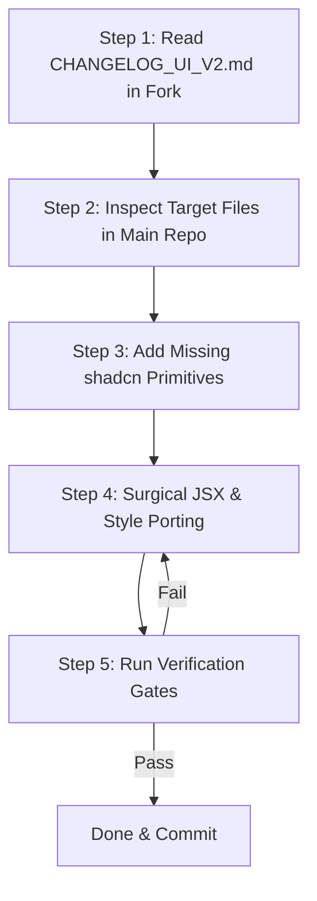

# UI/UX Handoff Guide for Main Repository AI Agent

> **Document Type**: AI Agent Execution Manual & Developer Handoff  
> **Source Fork**: `bayanhealth-frontend` (UI/UX Redesign Fork)  
> **Destination**: Main Repository (`BayanHealthMVP`)  
> **Primary Goal**: Enable the AI agent and lead developer in the main repo to port UI/UX changes cleanly, accurately, and with **ZERO code bloat or logic breakage**.

---

## 1. Executive Summary & Why This File Exists

In multi-repo or fork-based workflows, AI agents in the target repository often make critical mistakes when "copying" code:
- **Blind Overwrites**: Overwriting whole files, which deletes active backend wiring, API contracts, auth checks, and data mutations.
- **Logic Desync**: Introducing mock data or dummy state from the fork into production components.
- **Dependency Bloat**: Accidentally copying untracked files, temp configs, or incompatible package versions.

**This guide solves that.** It serves as the exact instruction protocol that the main developer can pass directly to their AI agent (e.g., Cursor, Claude Code, Antigravity) to cherry-pick and port visual changes with surgical precision.

---

## 2. The Golden Rule of Porting

```
┌─────────────────────────────────────────────────────────────┐
│  REPLACE the Visual Shell & Styling (JSX & Tailwind)        │
│  PRESERVE the Data Plumbing & Business Logic (Hooks & Props)│
└─────────────────────────────────────────────────────────────┘
```

When porting any component from the UI fork:
1. **KEEP**: 
   - React Hook Form bindings (`{...register("field")}`, `handleSubmit`, schema resolvers).
   - TanStack Query hooks (`useQuery`, `useMutation`), Zustand store hooks (`useAuthStore`, etc.).
   - API endpoints, fetch calls, error handlers, and business logic callbacks.
   - `data-testid` attributes and accessibility keys needed by tests.
2. **PORT**:
   - Layout architecture (Flexbox, CSS Grid, responsive container widths).
   - Tailwind utility classes and CSS variables.
   - Component composition (replacing ad-hoc HTML with shadcn primitives like `Dialog`, `Sheet`, `Card`, `Badge`).
   - Mobile-first touch improvements (Patient) and desktop density grids (Doctor).
   - Semantic tokens (Bayan Teal, Brand Navy, Cream canvas).

---

## 3. Step-by-Step AI Porting Algorithm

When instructed to sync a component or surface, the main repo AI agent **MUST follow this 5-step loop**:



### Step 1: Read `CHANGELOG_UI_V2.md`
Before touching code, consult [`CHANGELOG_UI_V2.md`](./CHANGELOG_UI_V2.md) (or [`CHANGELOG_UI.md`](./CHANGELOG_UI.md) for historical entries prior to 2026-09-26) in this fork.  
Find the entry for the component or route being synced. Review:
- Files modified.
- Design intent and device optimizations applied.
- Upstream porting notes.

### Step 2: Compare and Map Props
Open the corresponding file in the main repository:
- Does the main repo have newer props, analytics tags, or extra form fields?
- **Rule**: Never delete a prop or parameter that the main repo expects. If the fork added an optional UI prop, port it with its default value.

### Step 3: Install Required UI Primitives (If Any)
If the fork introduced a new shadcn component (e.g., `vaul` drawer, `sheet`, `separator`):
```bash
# In frontend/bayan-health-mvp:
npx shadcn@latest add <component-name>
```
*Never hand-copy code from `src/components/ui/` if the standard shadcn CLI can install it cleanly.*

### Step 4: Perform Surgical JSX Replacement
- Extract the new markup hierarchy and Tailwind classes from the fork component.
- Inject the existing main repo's state variables, handlers, and form registration directly into the new JSX elements.
- Ensure that no hardcoded hex colors bypass the token layer (must use semantic classes or tokens like `--teal-700`, `--navy-700`).

### Step 5: Verification & Anti-Bloat Check
Run the project's quality checks in `frontend/bayan-health-mvp`:
```bash
npm run typecheck
npm run test
npm run lint
```
Specifically verify that:
- `theme-hardcoded-color-scan.test.ts` passes (no rogue hex colors).
- Existing unit and smoke tests (`route-render-smoke.test.tsx`, `shell-render-smoke.test.tsx`) pass without regressions.

---

## 4. Layer-by-Layer Porting Matrix

| Layer | Source Fork Location | Main Repo Destination | Porting Strategy |
| :--- | :--- | :--- | :--- |
| **Brand Tokens** | `frontend/bayanhealth-tokens.css` | `frontend/bayanhealth-tokens.css` | **Safe to Mirror Directly**: Contains authoritative Figma tokens (Cream, Navy, Teal). |
| **Global Theme** | `src/app/globals.css` | `src/app/globals.css` | **Diff & Merge**: Port `@theme inline` additions and CSS variables. Do not overwrite custom main-repo overrides. |
| **Shared Primitives** | `src/components/ui/**` | `src/components/ui/**` | **CLI First, then Diff**: Install via `npx shadcn@latest add`, then apply any custom token tweaks made in the fork. |
| **Patient Views** | `src/features/patient/**`<br>`src/app/patient/**` | Same relative path | **Surgical JSX Port**: Ensure bottom action sheets, large tap targets (>=48px), and mobile ergonomics are preserved while maintaining existing form schemas. |
| **Doctor Views** | `src/features/doctor/**`<br>`src/app/doctor/**` | Same relative path | **Surgical JSX Port**: Preserve dense desktop grid, clinical cockpit panels, and TipTap note-editor hooks. |
| **Intake / Forms** | `src/features/intake/**` | Same relative path | **STRICT CAUTION**: Never alter Zod validation schemas or field names in `src/schemas/`. Only port the card wrappers, inputs, and step navigators. |

---

## 5. Ready-to-Use Prompt for the Main Repo AI Agent

The main developer can copy and paste this exact prompt into Cursor, Claude Code, or Antigravity in the main repository when ready to sync a feature:

```markdown
You are updating the UI of the main BayanHealth repository based on the UI/UX fork repository (`BayanHealthMVP-ui-fork-tite`).

I want you to port the UI changes for: <SPECIFY COMPONENT OR ROUTE, e.g. Patient Doctor Card & Booking Flow>.

Follow these strict rules from `UI_HANDOFF.md`:
1. Check `CHANGELOG_UI_V2.md` (or `CHANGELOG_UI.md` for historical entries) in the fork for the exact list of files modified and the design intent.
2. Port ONLY the visual styling, JSX layout, and Tailwind CSS classes.
3. PRESERVE all existing business logic, TanStack Query hooks, React Hook Form registrations, and API calls in the main repo.
4. Do NOT introduce any arbitrary hex colors; ensure all colors use semantic tokens (Brand Teal `#18a58c`, Brand Navy `#074972`, Cream `#f3eac5`).
5. Ensure mobile touch targets remain >= 48px on patient screens and desktop density is preserved on doctor screens.
6. After applying the changes, run `npm run typecheck` and `npm run test` to guarantee zero regressions.
```

---

## 6. What to Do If Merge Conflicts or Desync Occur

- **If the Main Repo Has New Backend Fields**: Wrap the new fields using the fork's input/card styling patterns instead of dropping them.
- **If the Main Repo Uses Different State Selectors**: Bind the fork's new UI trigger to the main repo's existing selector.
- **If Tests Fail on Hardcoded Colors**: Check for arbitrary hex strings (e.g., `#ffffff` instead of `bg-card` or `#333333` instead of `text-foreground`) and replace them with semantic tokens.
