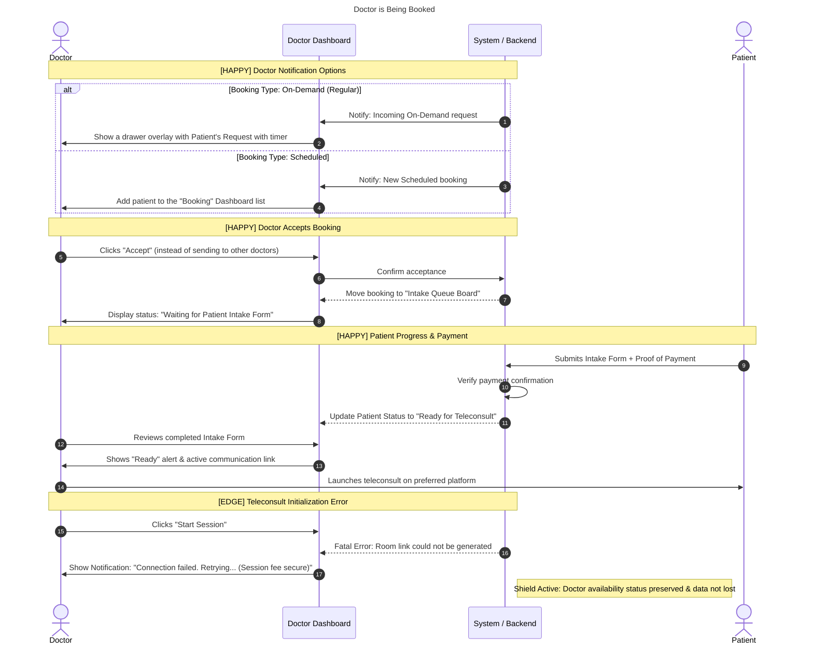

# Title / Flow : Doctor is being booked

## Narrative

AS a Doctor
I WANT to teleconsult with patient
SO THAT I can earn money and help more patient

## Background:

GIVEN the system is online
AND I am available and within my preferred schedule

## Scenarios

### Scenario outline [HAPPY] : Doctor is picked for a BOOKING_TYPE booking

GIVEN I am available
WHEN I have been notified by the system WHEN_SCENARIO
THEN I should be THEN_SCENARIO
AND I can decide whether to accept it or send to other doctors

| BOOKING_TYPE | WHEN_SCENARIO | THEN_SCENARIO |
| --- | --- | --- |
| On-demand (Regular) | for an on-demand booking | See the patient’s booking request |
| Scheduled | for scheduled booking  | See them in my “Booking” dashboard |

### Scenario outline [HAPPY] : Doctor accepts a BOOKING_TYPE booking

GIVEN I am picked for a BOOKING_TYPE booking
WHEN I accept the patient’s booking request
THEN It should be added to my Intake queue board
AND I am to wait until the patient submits their intake form

| BOOKING_TYPE  |
| --- |
| On-demand (Regular) |
| Scheduled |

### Scenario [HAPPY] : Patient Payment is confirmed

GIVEN my patients sent their payment proof after submitting their intake forms
WHEN I look at their intake forms
THEN It should state that the patients are ready for teleconsult
AND I am can proceed with the teleconsult on their preferred communication platform

### Scenario [EDGE] : System Error

GIVEN I am paying for the session fee
WHEN I get failed booking error
THEN my money should not get deducted

