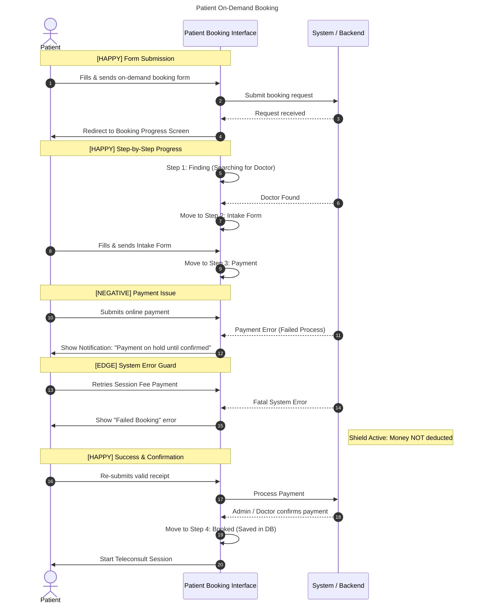

# Title / Flow : Patient On-Demand Booking

## Narrative

AS a Patient
I WANT to avail an on-demand booking
SO THAT I can consult with a doctor within the day I avail a teleconsult

## Background:

GIVEN the system is online
AND I am on the booking page

## Scenarios

### Scenario [HAPPY] : Patient fills up on-demand booking form

GIVEN I selected available services in booking page
WHEN I fill up the pre-on-demand booking form
**THEN** I should be able to send my booking request
AND redirected to my booking progress

### Scenario outline [HAPPY] : Patient PROCESS the CURRENT_STEP in on-demand booking

GIVEN I am on my booking progress
WHEN the CURRENT_STEP is successful in PROCESS
THEN I should be able to get to the NEXT_STEP
AND I can go back to previous CURRENT_STEP to review

Example:

| CURRENT_STEP | PROCESS | NEXT_STEP |
| --- | --- | --- |
| Finding | Doctor Found | Intake |
| Intake | Form filled and sent | Payment |
| Payment | Valid receipt / online payment | Confirmation |
| Confirmation | Admin / Doctor confirming payment | Booked |
| Booked | Booking progress saved in DB | Teleconsult |

### Scenario outline [NEGATIVE] : Patient FAILED_PROCESS the CURRENT_STEP in on-demand booking

GIVEN I am on my booking progress
WHEN the CURRENT_STEP got FAILED_PROCESS
THEN I should get notified and SOLUTION will be in progress

Example:

| CURRENT_STEP | FAILED_PROCESS | SOLUTION |
| --- | --- | --- |
| Finding | Doctor cancelled the booking  | Re-find another doctor |
| Payment | Online payment Errors | Payment is only on hold until confirmed |

### Scenario [EDGE] : System Error

GIVEN I am paying for the session fee
WHEN I get failed booking error
THEN my money should not get deducted

