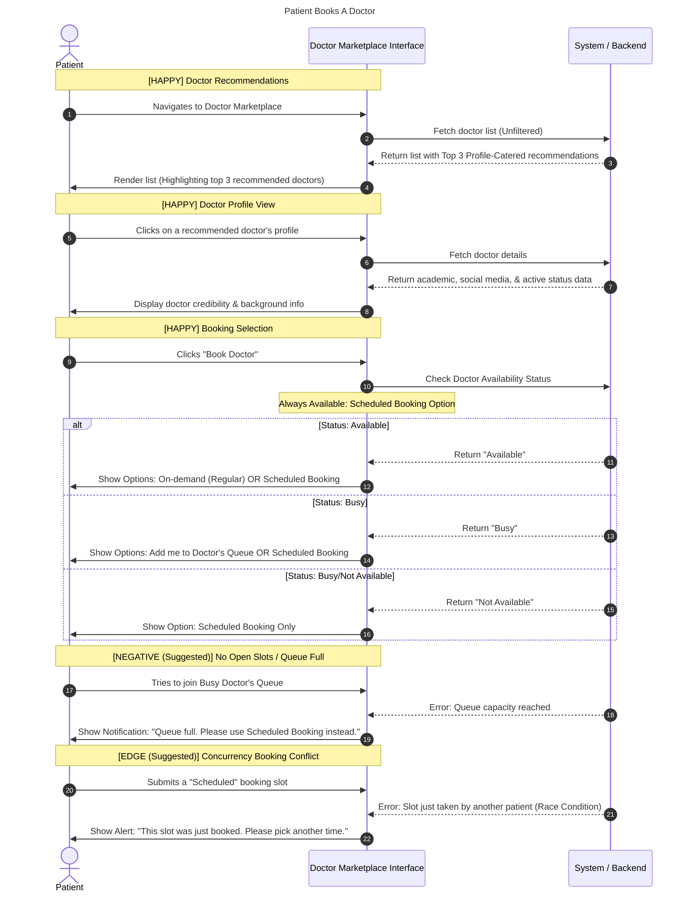

# Title / Flow : Patient Books Doctor

## Narrative

AS a Patient
I WANT to browse doctors
SO THAT I can book doctor to my specific needs

## Background:

GIVEN I am on the doctor marketplace page

## Scenarios

### Scenario [HAPPY] : Doctors Recommendations

GIVEN I have not filtered the doctor list
WHEN I see the first three doctors among the list
**THEN** it should be the highly recommendation of the system that is catered to my profile
AND I am encouraged to look at these doctors pages.

### Scenario [HAPPY] : Doctor Page

GIVEN I have found the doctor I want
WHEN I visit the doctor page
**THEN** I should be able to get more information about the doctor’s credibility in academic, social media, and current status as doctor.

### Scenario outline [HAPPY] : Doctor Booking

GIVEN I am booking a specific doctor
WHEN I am on the doctor booking page
**THEN** I am notified by the system that the doctor is AVAILABILITY_STATUS
AND I am able to choose between BOOKING_TYPE to book

| AVAILABILITY_STATUS | BOOKING_TYPE |
| --- | --- |
| Available | On-demand (Regular) |
| Busy | Add me to doctor’s Queue |
| Busy/Not Available | Scheduled |

### Scenario [NEGATIVE] : ?

GIVEN ?
WHEN?
THEN ?
AND?

### Scenario [EDGE] : ?

GIVEN ?
WHEN ?
THEN ?

