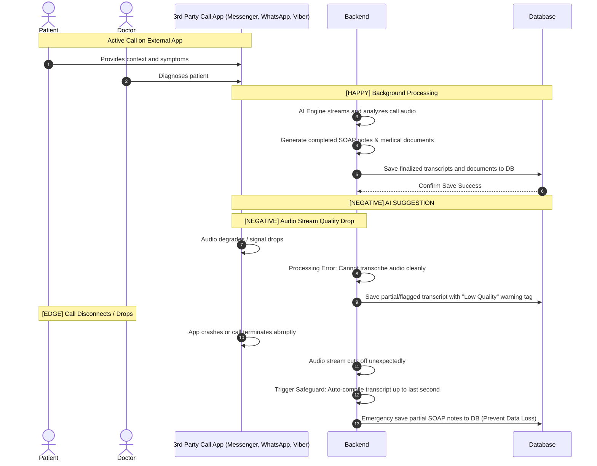

# Title / Flow : During Consultation

## Narrative

AS a ROLE
I WANT to ACTION during consultation
SO THAT I can communicate with OTHER_ROLE

Example:

| ROLE | ACTION | OTHER_ROLE |
| --- | --- | --- |
| Doctor | diagnose | Patient |
| Patient | provide context | Doctor |

## Background:

GIVEN the system is online
And Patient and Doctor are teleconsulting in third-party communication application

## Scenarios

### Scenario outline [HAPPY] : SOAP notes and other patient’s medical documents are being drafted by AI in background

GIVEN I am a ROLE
WHEN I am on a consultation session with OTHER_ROLE
**THEN** I should get notified that AI is working in background for SOAP notes and other patient’s medical  documents

Example:

| ROLE | OTHER_ROLE |
| --- | --- |
| Doctor | Patient |
| Patient | Doctor |

### Scenario [NEGATIVE] : ?

GIVEN ?
WHEN?
THEN ?
AND ?

### Scenario [EDGE] : ?

GIVEN ?
WHEN ?
THEN ?

