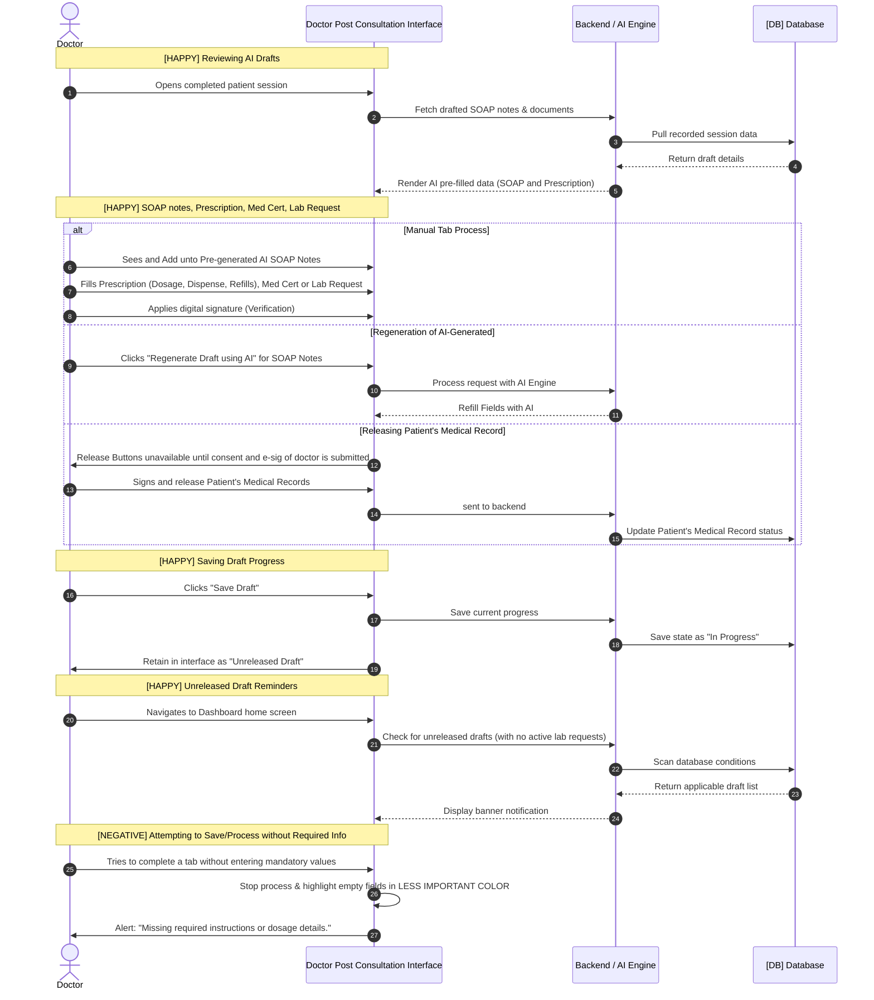

# Title / Flow : Post-Consultation

## Narrative

AS a ROLE
I WANT to ACTION after the consultation
SO THAT I can fulfill goal of the consultation

Example:

| ROLE | ACTION |
| --- | --- |
| Doctor | Review Patient’s SOAP notes and other Medical documents |
| Patient | Wait for Doctor’s Findings |

## Background:

GIVEN the system is online
And Patient and Doctor have finished their consultation

## Scenarios

### Scenario [HAPPY] : Doctor reviews SOAP Notes and Patient’s other medical documents

GIVEN Doctor have finished consultation with Patient
WHEN Doctor look at the Patient’s SOAP Notes and other medical documents
**THEN** It should be pre-filled by AI to give pre-diagnosis of Patient

### Scenario outline [HAPPY] : Doctor process the Patient’s DIAGNOSIS_TAB

GIVEN Doctor have clear findings about my Patient’s request
WHEN Doctor process the Patient’s DIAGNOSIS_TAB
**THEN** Doctor should be able to ACTION
OR generate a draft for Patient’s DIAGNOSIS_TAB using AI
AND each DIAGNOSIS_TAB requires my verification and signature

Example:

| DIAGNOSIS_TAB | ACTION |
| --- | --- |
| Prescription | Prescribe medications with its [Dosage, Dispense amount, Refills] and write instructions |
| Medical Certificate | Attach a medical certificate with e-sig, Give Patient’s Diagnosis, and Recommendation |
| Lab/Imaging Requests | ? |

### Scenario [HAPPY] : Doctor on releasing Patient’s Diagnosis

GIVEN Doctor have signed the Patient’s Diagnosis
WHEN Doctor RELEASE_STATUS the Patient Diagnosis
**THEN** It should ACTION to Patient

Example:

| RELEASE_STATUS  | Action |
| --- | --- |
| Released | Sent and notify |
| Save Draft | still be “in progress” status |

### Scenario [HAPPY] : Doctor is notified for saved drafts of Patients’ Diagnoses

GIVEN Doctor have unreleased drafts of Patients’ Diagnoses
AND these unreleased drafts have no ongoing Lab/Imaging Requests
WHEN Doctor look visit his dashboard
**THEN** Doctor should be notified about these drafts
AND Doctor can view edit history of these drafts

### Scenario [HAPPY] : Patient views their Doctor’s findings

GIVEN  Doctor have released Doctor’s findings
WHEN Patient view these findings
**THEN** It should be according to my intended BOOKING_REQUEST
AND I can download the files from these findings

Example:

| BOOKING_REQUEST |
| --- |
| Fit for work |
| Fit for climb |
| Fit for travel |
| Fit for school |
| regular teleconsult |
| sick leave |

### Scenario [NEGATIVE] : ?

GIVEN ?
WHEN?
THEN ?
AND ?

### Scenario [EDGE] : ?

GIVEN ?
WHEN ?
THEN ?

