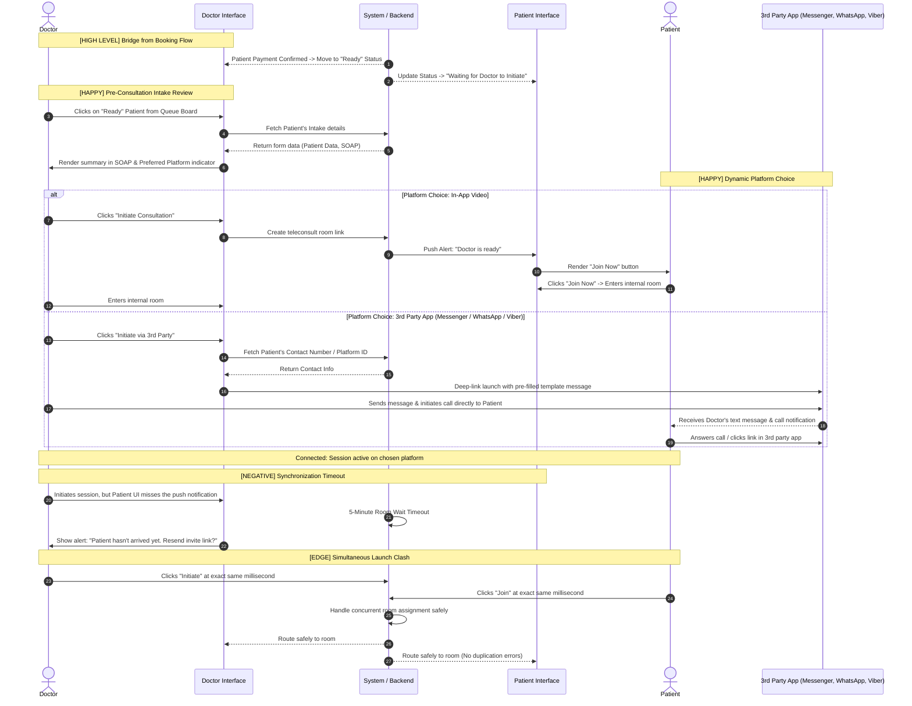

# Title / Flow : Pre-Consultation

## Narrative

AS a ROLE
I WANT to ACTION a consultation
SO THAT I can communicate with OTHER_ROLE

Example:

| ROLE | ACTION | OTHER_ROLE |
| --- | --- | --- |
| Doctor | Initiate | Patient |
| Patient | Join | Doctor |

## Background:

GIVEN the system is online
And Patient and Doctor are within the scheduled session

## Scenarios

### Scenario [HAPPY] : Doctor reads Patient’s intake

GIVEN Doctor have teleconsult session with Patient
WHEN Doctor look at the Patient’s intake
**THEN** It should help Doctor understand what the Patient’s purpose

### Scenario [HAPPY] : Patient waits for Doctor to initiate consultation session

GIVEN Patient have teleconsult session with Doctor
WHEN Doctor initiates the session
**THEN** then it should be my preferred communication platforms

### Scenario [NEGATIVE] : ?

GIVEN ?
WHEN?
THEN ?
AND ?

### Scenario [EDGE] : ?

GIVEN ?
WHEN ?
THEN ?

