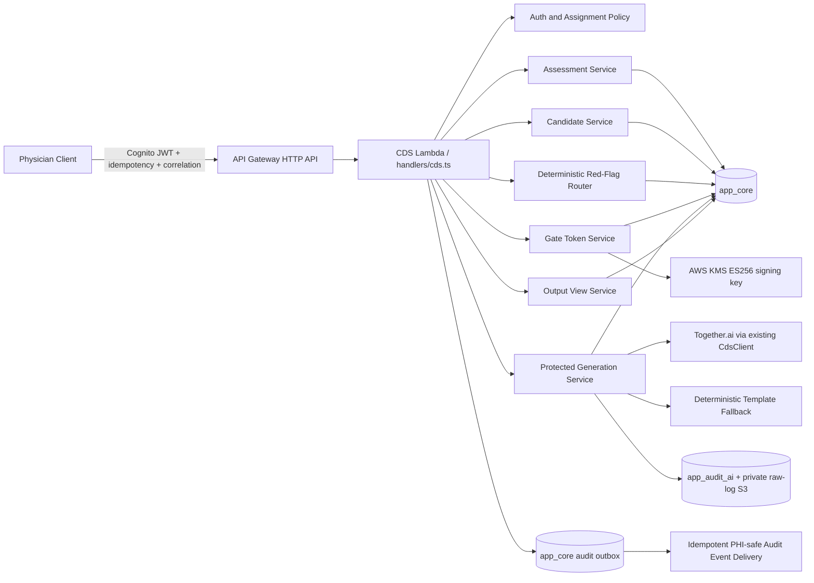

# Design Document: Assessment-First CDS Gating

## Overview

This design introduces the server-enforced assessment-first Clinical Decision Support (CDS) boundary required by ADR-20260703-01. It separates editable and physician-confirmed Assessment state from pre-assessment support and post-assessment protected generation. Plan, prescription, final ICD, medical certificate, lab request, imaging request, and patient education remain unavailable until the authenticated assigned physician confirms a non-empty Assessment after the live consultation, receives a signed version-bound gate token, and passes a fresh deterministic red-flag evaluation.

The design is an evolution of the current CDS implementation, not a parallel pipeline. The existing `backend/src/handlers/cds.ts` creates SOAP drafts containing Subjective, Objective, Assessment, and Plan in one operation; `backend/src/lib/cds/drafts.ts` models only `soap | patient-card`; and async continuation updates those drafts without revalidating current gate state. The target design preserves Together.ai, deterministic template fallback, de-identification, output validation, audit storage, and the existing Lambda deployment model while replacing the unsafe one-shot boundary.

### Goals

- Make the complete, validated OpenAPI 3.1 contract and documented/locked defaults the prerequisite and source of truth for downstream implementation.
- Keep Assessment blank until physician selection or manual entry and require explicit confirmation.
- Provide deterministic diagnosis-name-only candidates without ranking, confidence, code, solver, or AI attribution leakage.
- Provide a separate bounded CPG Preview with structured support facts, confirmation questions, and approved source metadata while excluding treatment and hidden-reasoning content.
- Bind each confirmed Assessment to immutable server-owned generation eligibility so reference-only and unmapped manual diagnoses cannot silently invoke disease-specific protected generation.
- Evaluate deterministic red flags before candidates and before every protected generation attempt.
- Enforce signed, expiring, revocable, consultation-, physician-, and Assessment-version-bound gate tokens entirely on the server.
- Make Assessment version changes race-safe, fail closed, and immediately authoritative for current views, token validity, and stale artifacts.
- Revalidate synchronous completions and asynchronous starts, resumes, and completions before an output can become current.
- Preserve TypeScript strict mode, Node.js 24, `app_core` single-table conventions, `app_audit_ai` inference metadata, and Together.ai fallback behavior.
- Use coherent transactional or revision-fenced authorization snapshots, KMS-backed asymmetric signing, durable audit intent, and least-privilege infrastructure.
- Make legacy cutover, async recovery, observability, fail-closed rollback, and incident operation explicit and testable.
- Keep shared gate behavior maintainable through typed interfaces, dependency injection, deterministic tests, and one source of truth for contracts and state vocabulary.

### Non-Goals

- No production code, infrastructure, contract, or architecture-document changes are made in this design phase.
- No model fine-tuning, model distillation, provider migration, or client-side-only gate is introduced.
- No runtime implementation-work state machine is defined; persisted safety state and idempotency phases described below are domain safeguards.
- No raw Gate_Token, signing secret, Assessment text, patient identifier, or generated clinical content is added to operational logs.
- No Clinical Knowledge Operations source-registry lifecycle, acquisition/parsing/chunking/review/publication UI, vector retrieval, or bulk diagnosis-card onboarding is implemented here; a later spec owns those capabilities. This design consumes only immutable, already-approved preview/source and grounding metadata from the active policy bundle.
- No `reference_only` diagnosis is promoted by this feature; promotion requires separately reviewed content/evidence and activation of a new immutable catalog version.

### Research Findings Informing the Design

1. [ADR-20260703-01](../../../architecture/DECISIONS.md) makes Assessment confirmation a distinct physician action and rejects frontend-only enforcement.
2. [AI_INFERENCE.md](../../../architecture/AI_INFERENCE.md) retains Together.ai and deterministic template fallback, while requiring protected endpoint revalidation.
3. [API_DESIGN_STANDARDS.md](../../../architecture/API_DESIGN_STANDARDS.md) requires OpenAPI-first sequencing, Cognito role/assignment documentation, idempotency, standard envelopes, and correlation identifiers.
4. [dynamo.ts](../../../backend/src/lib/dynamo.ts) is the required source of truth for key prefixes, entity types, schema versions, TTLs, and key builders; authoritative gate reads must remain on the base table so strong consistency is available.
5. The current [CDS handler](../../../backend/src/handlers/cds.ts), [draft store](../../../backend/src/lib/cds/drafts.ts), and [async jobs](../../../backend/src/lib/cds/async-jobs.ts) need restructuring because they persist protected content before Assessment confirmation and do not revalidate asynchronous continuation.
6. The 40-case synthetic fixture in `architecture/bayanhealth_prd_v3_synthetic_intake_test_cases.csv` is the deterministic safety regression corpus, supplemented—not replaced—by generated property tests.
7. [QA feedback v1.pdf](../../../architecture/QA%20feedback%20v1.pdf), the v3.2 post-consult harness baseline, requires a separate compact CPG Preview and distinguishes reviewed full solvers from reference-only knowledge cards; the gate must model that distinction without exposing it as candidate ranking.
8. [ADR-20260624-01](../../../architecture/DECISIONS.md) and [AI_INFERENCE.md](../../../architecture/AI_INFERENCE.md) already define Phase 1 solver-content grounding. This feature consumes that approved boundary but defers the broader source-registry and vector-RAG lifecycle to a later spec.


## Architecture

### System Context and Trust Boundaries



The client can request actions but cannot assert that generation is unlocked. Every protected generation route reconstructs an authoritative `GateSnapshot` from strongly consistent server reads. A cryptographically valid token is necessary but never sufficient: current Consultation state, assignment, Assessment, version, token-family revocation, generation lock, red-flag state, and acknowledgment state override token claims.

### OpenAPI-First Delivery Boundary

The first implementation task is a contract-only change to `contracts/openapi.yaml`. The contract must completely define the following inventory and pass repository contract validation before downstream implementation begins:

| Capability | Proposed resource-oriented operation |
|---|---|
| Read Assessment state | `GET /v1/cds/consultations/{consultationId}/assessment` |
| Manually edit Editable_Assessment | `PUT /v1/cds/consultations/{consultationId}/assessment/editable` |
| Select a committed diagnosis candidate | `POST /v1/cds/consultations/{consultationId}/diagnosis-candidate-evaluations/{evaluationId}/selections` |
| Confirm an unconfirmed Assessment | `POST /v1/cds/consultations/{consultationId}/assessment/confirmations` |
| Update or re-attest Confirmed_Assessment | `PUT /v1/cds/consultations/{consultationId}/assessment/confirmation` |
| Clear Confirmed_Assessment | `DELETE /v1/cds/consultations/{consultationId}/assessment/confirmation` |
| Evaluate candidate-stage safety and create a snapshot | `POST /v1/cds/consultations/{consultationId}/diagnosis-candidate-evaluations` |
| Read/search an immutable candidate snapshot | `GET /v1/cds/consultations/{consultationId}/diagnosis-candidate-evaluations/{evaluationId}` |
| Read one bounded candidate CPG Preview | `GET /v1/cds/consultations/{consultationId}/diagnosis-candidate-evaluations/{evaluationId}/preview?diagnosisName=...` |
| Issue a gate token | `POST /v1/cds/consultations/{consultationId}/gate-tokens` |
| Acknowledge a clinical-safety episode | `POST /v1/cds/consultations/{consultationId}/red-flag-acknowledgments` |
| Retrieve current outputs | `GET /v1/cds/consultations/{consultationId}/outputs/current` |
| Retrieve output history | `GET /v1/cds/consultations/{consultationId}/outputs/history` |
| Generate each protected type | Seven explicit `POST .../{type}-generations` operations |
| Read async job status | `GET /v1/cds/consultations/{consultationId}/jobs/{jobId}` |
| Cancel async job | `POST /v1/cds/consultations/{consultationId}/jobs/{jobId}/cancellations` |
| Finalize a current artifact | `POST /v1/cds/consultations/{consultationId}/outputs/{artifactId}/finalizations` |
| Release a finalized artifact | `POST /v1/cds/consultations/{consultationId}/outputs/{artifactId}/releases` |

Candidate evaluation is a write because it persists an evaluation snapshot and may set a durable safety lock. Subsequent GET requests are side-effect free and paginate or search only within that immutable committed snapshot. The separate CPG Preview GET identifies one exact diagnosis name within the committed snapshot and returns only bounded support facts, confirmation questions, and approved source metadata; it is assignment-authorized, freshness-checked, `no-store`, and never changes candidate or Assessment state. Candidate selection is a separate idempotent write carrying `evaluationId`, exact diagnosis name, expected Editable_Assessment_Revision, and snapshot revisions; the manual editable write cannot claim candidate attribution. Candidate selection also captures immutable internal catalog-entry and Generation_Eligibility provenance without adding tier, solver, or eligibility fields to the diagnosis-name-only candidate item. Async continuation is worker-owned: the legacy client `.../continue` route is rejected after cutover, while clients may only read status or request cancellation. Finalization and release are distinct writes. Each write requires `Idempotency-Key`, accepts `X-Correlation-ID`, documents the `doctor` role and assigned-physician scope, and uses the platform success/error envelopes. Every protected generation schema requires the exact contract fields `consultationId`, `assessmentVersion`, `physicianActorId`, and `gateToken`; the path identifier must equal `consultationId`, and `physicianActorId` must equal the authenticated Cognito `sub`. Camel case is used consistently with the repository's existing JSON conventions; ADR field names map directly to these contract properties. The contract adds `CPG_PREVIEW_UNAVAILABLE`, `ASSESSMENT_GENERATION_NOT_ELIGIBLE`, and `OUTPUT_TYPE_NOT_ELIGIBLE`; all three are fail-closed and expose no protected content or internal capability metadata.

The legacy `/v1/cds/soap` contract must not remain an alternate route to Assessment or Plan generation. It is replaced by a non-protected pre-assessment S/O support operation and protected post-assessment output operations, or deprecated and rejected whenever protected fields are supplied. The existing patient-card route becomes the protected patient-education operation. Handler, frontend, tests, Terraform route work, and legacy-route removal may begin once the operation/schema/error inventory is complete, the applicable defaults/data model are documented, and the repository OpenAPI contract check passes. Missing approval links or named reviewers are not execution gates.

### Assessment and Gate State Flow

```mermaid
stateDiagram-v2
    [*] --> Unconfirmed: canonical session ends; initialize once
    Unconfirmed --> Editable: candidate selection / manual edit; editable revision++
    Editable --> TokenRequired: confirm exact editable revision; assessment version++; epoch 1
    TokenRequired --> IssuanceEvaluation: request gate token
    IssuanceEvaluation --> EvaluationFailedLocked: failure; revoke current epoch
    EvaluationFailedLocked --> IssuanceEvaluation: retry after recovery
    IssuanceEvaluation --> ClinicalRedFlagLocked: non-routine; revoke current epoch
    ClinicalRedFlagLocked --> AcknowledgmentRequired: fresh ROUTINE for current head
    AcknowledgmentRequired --> TokenRequired: acknowledge episode; create next epoch
    IssuanceEvaluation --> TokenIssued: ROUTINE + clear recoverable locks + current unrevoked epoch
    TokenIssued --> InputChangedLocked: source change; source fence++; revoke epoch
    InputChangedLocked --> IssuanceEvaluation: normalize current head and retry
    TokenIssued --> GenerationReevaluation: request protected output
    GenerationReevaluation --> ClinicalRedFlagLocked: non-routine; revoke epoch
    GenerationReevaluation --> EvaluationFailedLocked: failed; revoke epoch
    GenerationReevaluation --> Generating: equivalent ROUTINE; token remains current
    Generating --> CurrentOutput: fenced postflight publication passes
    Generating --> HistoricalStale: any authoritative fence changed
    TokenIssued --> ReattestationRequired: assignment changes; revoke epoch
    ReattestationRequired --> ChangeBarrier: new physician updates/re-attests or clears
    TokenIssued --> ChangeBarrier: update or clear begins
    ChangeBarrier --> TokenRequired: update/re-attestation commits; new version epoch 1
    ChangeBarrier --> Unconfirmed: clear commits; new version epoch 1
    ChangeBarrier --> RecoveryRequired: transition fails after barrier
    RecoveryRequired --> ChangeBarrier: authorized idempotent recovery
```



Assessment_Version and Editable_Assessment_Revision are independent monotonic fences. Candidate selection/manual edit increments only the editable revision; confirmation binds the exact editable revision and digest and increments Assessment_Version exactly once. Confirmation, update, re-attestation, and clear create Token_Family_Epoch 1 for the new Assessment version but no token. Clear → edit → reconfirm remains reachable. Editing while confirmed is rejected.

A Token_Family_Epoch is permanently revocable. Red-flag, evaluation-failure, clinical-input, assignment, and Assessment transitions revoke only the current epoch; no record is unrevoked. Recovery from operational/input locks creates the next epoch during eligible token issuance, while clinical recovery creates it during exact episode acknowledgment. This removes the previous liveness deadlock where clearing a lock left the sole Assessment-version family revoked.

Token issuance creates the first `protected_generation` evaluation. It requires a normalized current Clinical_Input_Head and active policy bundle. A routine evaluation can clear owned operational/input locks and make the next epoch token eligible; a clinical non-routine outcome requires a later routine result plus acknowledgment; an operational evaluation failure requires dependency recovery but no physician acknowledgment.

`Post_Consult_State` derives only from a strongly consistent canonical `CONSULT#.../SESSION#CURRENT` projection with closed status `active | ended`. The session-ending transaction initializes Assessment/gate/head records exactly once; a conditional lazy initializer exists only for migrated records. Every mutable gate aggregate carries `gateRevision`; the Clinical_Input_Head carries source and normalized revisions; and each active immutable policy bundle carries `policyActivationRevision`. Commands include applicable expected revisions and fail on mismatch.

### Fail-Closed Assessment Change Protocol

Update and clear use two durable steps:

1. **Fail-closed barrier:** conditionally increment `gateRevision`, set `assessment_change`, record operation identity/timestamp, and permanently revoke the current `{assessmentVersion, tokenFamilyEpoch}`. Failure rejects before Assessment mutation.
2. **Safety transition:** one `TransactWriteItems` conditions on Assessment/editable/assignment/gate revisions and operation identity; writes Assessment/current history; advances `staleThroughVersion`; creates Token_Family_Epoch 1 for the new Assessment version; marks the operation committed; removes only matching `assessment_change` and applicable `reassignment`; increments `gateRevision`; and commits deterministic idempotency and audit-outbox records. Failure leaves prior Assessment/artifact dependencies unchanged while the barrier and prior-epoch revocation remain.

A barrier operation is `started`, `committed`, or `recovery_required`. Same-scope retries may complete it. Reconciliation may mark an abandoned operation `recovery_required` but cannot clear lock or revocation. Operator recovery is conditional, attributable, least privilege, and cannot restore an old token family. Generation after a successful transition is blocked by absence of a new token, not by an orphaned change lock.

### Logical Staleness and Atomic Invalidation

Updating every historical artifact item in one DynamoDB transaction is unsafe because transaction size is bounded while history is not. “Marked stale” therefore means effectively stale under the authoritative predicate:

```text
artifact is effectively stale iff
  artifact.stale == true OR
  artifact.assessmentVersion != currentAssessmentVersion OR
  artifact.assessmentVersion <= staleThroughVersion OR
  artifact.clinicalInputSourceFence != currentClinicalInputSourceFence OR
  artifact.assignmentRevision != currentAssignmentRevision OR
  artifact.physicianActorId != currentConfirmedAssessmentPhysician OR
  artifact.tokenFamilyEpoch is revoked
```

Assessment transitions advance the version watermark atomically. Clinical-input and assignment writers independently advance their authoritative fences and revoke the current epoch in the same source transaction, so current views become stale immediately—even before normalization or rerouting. Artifact items retain all linked revisions; reads materialize `effectiveStale=true` whenever the predicate applies. Optional item-level denormalization may set `stale=true`, but correctness never depends on eventual work. Current_Output_View strongly reads the Assessment, Clinical_Input_Head, assignment, and epoch records before applying the predicate; History_View returns current and stale records with bounded reasons.

### Clinical Input Snapshot and Deterministic Routing

`ClinicalInputHeadService` owns one strongly consistent consultation record containing `sourceMembershipVersion`, ordered source vector, `clinicalInputSourceFence`, `clinicalInputRevision`, canonicalization version, normalized digest, `normalizedAtSourceFence`, and `dirty | ready`. Every authoritative source writer uses a bounded transaction that updates the source revision, increments source fence and Gate_Revision, marks the head dirty, sets `clinical_input_changed`, revokes the current Token_Family_Epoch, and writes idempotency/audit intent. This makes prior tokens/jobs/artifacts invalid immediately.

Normalization reads the head and all versioned `app_core` source projections in `TransactGetItems`, canonicalizes once, and conditionally changes `dirty → ready` only if the source fence and vector remain unchanged. It increments Clinical_Input_Revision exactly when source membership/vector, canonicalization version, or digest changes; concurrent equivalent normalizers converge through compare-and-swap. An external mutable source is never authorized directly: trusted ingestion first creates an immutable versioned `app_core` projection and advances the head transactionally. Publication condition-checks the head record, closing the former race between final reread and transaction commit.

`ClinicalInputSnapshotService` returns the bounded immutable view of that ready head and source vector. Candidate evaluation, token issuance, generation input, Continuation_Grant, and postflight bind both Clinical_Input_Revision and Clinical_Input_Source_Fence.

The router is a pure TypeScript engine over the closed snapshot schema and immutable policy bundle. It performs no model, fallback, or network calls. Evaluations persist `{ evaluationId, clinicalSafetyEpisodeId?, clinicalInputRevision, clinicalInputSourceFence, normalizedInputDigest, policyActivationRevision, rulesetVersion, stage }`. Equivalent non-routine results for the same fence/policy/outcome/rules map to one episode; materially different or more severe results supersede it according to fixed precedence:

```text
EMERGENCY > REFER_F2F > WARNING > ROUTINE
```

Candidate and issuance/generation stages are independent. Token issuance performs the first fresh `protected_generation` evaluation. Generation reevaluates immediately before inference. Equivalent routine reevaluation may update history/current evaluation metadata without changing Gate_Revision; a new evaluation identifier alone cannot invalidate a token. A non-routine or failed generation reevaluation atomically increments Gate_Revision, sets the applicable lock, revokes the current family, and denies generation.

| Outcome | Candidate response | Token/generation behavior |
|---|---|---|
| `ROUTINE` | Ordered diagnosis-name-only candidates | May continue after lock transition and remaining checks |
| `WARNING` | Diagnosis-name-only candidates plus warning metadata | Clinical lock + acknowledgment required after later routine |
| `REFER_F2F` | Suppress candidates; routing metadata only | Clinical lock + acknowledgment required after later routine |
| `EMERGENCY` | Suppress candidates; routing metadata only | Clinical lock + acknowledgment required after later routine |
| `EVALUATION_FAILED` | `503`; no current, cached, or prior candidate payload | Operational lock; successful reevaluation may clear without acknowledgment |

Every candidate GET, CPG Preview GET, or selection strongly checks the snapshot's input revision/digest, policy activation, ruleset, and catalog against current state before returning any candidate, preview, or routing payload. Mismatch returns `STALE_CANDIDATE_EVALUATION`. Opaque cursors are integrity protected and bind Consultation, evaluation, revisions, normalized filter, and page size.

### CPG Preview and Generation Eligibility

The CPG Preview is a distinct authorized projection, never an extension of `CdsDiagnosisCandidate`. A request identifies one exact diagnosis name within a committed Candidate_Evaluation. `CandidateService` verifies assignment, candidate membership, current snapshot fences, and a candidate-permitting routing outcome before deriving the preview deterministically from the immutable evaluation snapshot and active catalog metadata. Responses use `Cache-Control: no-store` and contain:

- zero to three structured patient facts already present in the normalized snapshot;
- zero to three missing or discriminating questions;
- one preview-eligible source reference with title, publisher, year/effective date, and review status; and
- an explicit reminder that the Physician must independently select or enter and confirm the Assessment.

Preview schemas reject score, confidence, rank, verdict, hidden-chain reasoning, solver/model identity, ICD, treatment, medication, dosage, and protected-output fields. Preview construction performs no inference, fallback, broad retrieval, or mutable external-source read. Missing, unpublished, deprecated, unreviewed, incompatible, or unverifiable metadata returns `CPG_PREVIEW_UNAVAILABLE` without partial or prior data. The broader source-registration, acquisition, parsing, review/publication, and vector-retrieval lifecycle is intentionally delegated to a future Clinical Knowledge Operations/RAG spec.

Each immutable internal catalog entry carries:

```typescript
type CatalogCapability = 'full_solver' | 'reference_only';

interface GenerationEligibility {
  capability: CatalogCapability | 'unmapped_manual';
  eligibleOutputTypes: ProtectedOutputType[];
  digest: string;
}
```

`reference_only` entries have an empty output set. Candidate selection captures the exact catalog entry, Catalog_Version, and eligibility digest from the committed evaluation. Manual entry remains first-class: deterministic exact approved alias matching may bind it to an active entry; otherwise confirmation records `unmapped_manual` with an empty output set. Eligibility never controls whether the Physician may record or confirm a clinical Assessment—it controls only CDS generation.

Token issuance rejects an empty current output set with `ASSESSMENT_GENERATION_NOT_ELIGIBLE` before signing. An eligible token binds the eligibility digest, while the server-owned Assessment/catalog records remain authoritative. Every synchronous and asynchronous preflight, resume, completion, and publication validates that the requested output type is allowed and that the digest remains current. `OUTPUT_TYPE_NOT_ELIGIBLE` is returned before inference or fallback. Promotion creates a new immutable catalog and Policy_Activation_Revision; it never mutates a reference-only entry, retroactively validates a token, or resumes an old job.

### Lock Ownership and Liveness

| Lock reason | Set by | Clear owner and exact precondition | Gate revision | Automatic timeout |
|---|---|---|---|---|
| `assessment_change` | Update/clear/re-attestation barrier | Matching successful version transition; otherwise authorized recovery keeps the gate closed | Increment on set/clear | None; reconciliation may mark `recovery_required` |
| `reassignment` | Canonical assignment writer | New assigned Physician's successful update, re-attestation, or clear for the expected assignment revision | Increment on set/clear | None |
| `clinical_input_changed` | Authoritative source writer | Token-issuance `ROUTINE` evaluation for a ready head at the exact current source fence | Increment on set/clear | None |
| `red_flag` | Clinical non-routine evaluation | Assigned Physician acknowledgment of the current bounded episode after a fresh generation-stage `ROUTINE` result for the same head/policy | Increment on set/clear | None |
| `acknowledgment_pending` | Clinical non-routine evaluation | Same conditional acknowledgment transaction as `red_flag` | Increment on set/clear | None |
| `evaluation_failed` | Failed deterministic evaluation | Fresh successful evaluation for the exact current head/policy; no Physician acknowledgment | Increment on set/clear | None; dependency alarm/runbook |
| `operator_hold` | Authorized safety operator | Separately authorized conditional operator action with attributable reason | Increment on set/clear | None |
| `recovery_required` | Outcome-uncertain or interrupted safety operation | Operation-specific dual-reviewed recovery; never a generic unlock | Increment on set/clear | None |

Every lock mutation identifies its owner, expected Gate_Revision, source operation, and bounded reason. Clinical episode identity is deterministic over Consultation, source fence, policy activation, outcome, and sorted rule identifiers. Equivalent non-routine evaluations retain one acknowledgment target and do not churn Gate_Revision; a materially different or more severe result supersedes the episode under the fixed severity order. No command clears an unrelated reason, and no revoked epoch is ever reopened. Epoch creation is owned only by: confirmation/version transition (epoch 1), exact clinical-episode acknowledgment (next epoch), or eligible token issuance after clearing only matching operational/input locks (next epoch). Missing dependencies remain fail closed rather than timing out open.

### Signed Gate Token Model

Gate tokens are compact `ES256` credentials signed by a per-environment Terraform-managed AWS KMS `ECC_NIST_P256` key. Private key material never leaves KMS. The role receives only `kms:Sign` and `kms:GetPublicKey`; verification keys come from an allow-listed manifest `{ kid, SPKI fingerprint, status, verifyUntil }` cached only through `verifyUntil`. The opaque `kid` maps server-side to KMS; ARNs/account details are not exposed.

The signer constructs `BASE64URL(protectedHeader) + "." + BASE64URL(payload)` without padding, UTF-8 encodes that ASCII input exactly once, and calls KMS `Sign` with `SigningAlgorithm=ECDSA_SHA_256` and `MessageType=RAW`; KMS performs the sole SHA-256 operation. The implementation never pre-hashes in `RAW` mode and never switches to `DIGEST`. A reviewed adapter strictly parses minimal DER integers, rejects negative/oversized/truncated/trailing encodings, and emits exactly 64-byte JOSE `R || S`. Independent JWS interoperability vectors cover signing and verification; no curve or signature primitive is implemented locally.

```typescript
interface PolicyComponentVersions {
  promptTemplateVersion: string;
  deterministicTemplateVersion: string;
  outputSchemaVersion: string;
  groundingBundleVersion: string;
  modelProfileVersion: string;
}

interface GateTokenClaims {
  iss: 'bayanhealth-cds';
  aud: 'bayanhealth-protected-generation';
  sub: string;
  consultationId: string;
  assessmentVersion: number;
  tokenFamilyEpoch: number;
  assignmentRevision: number;
  clinicalInputRevision: number;
  clinicalInputSourceFence: number;
  gateRevision: number;
  clinicalSafetyEpisodeId?: string;
  rulesetVersion: string;
  policyActivationRevision: number;
  generationEligibilityDigest: string;
  componentVersions: PolicyComponentVersions;
  jti: string;
  iat: number;
  exp: number;
}
```

Tokens live at most five minutes with at most 30 seconds skew. Domain records store only digest/identifier and revocation metadata. To satisfy exact idempotent issuance replay, only the scoped idempotency record may store the compact token as envelope-encrypted ciphertext under a dedicated environment key, expiring no later than `exp + skew`; decrypt permission is limited to authorized replay. Replay after expiry returns `EXPIRED_IDEMPOTENT_RESPONSE` and never mints under the old operation. Responses use `Cache-Control: no-store`; tokens never enter URLs, cookies, logs, metrics, errors, prompts, or provider metadata.

Verification allow-lists ES256 and validates the key manifest, signature, issuer/audience, time, jti, exact `{assessmentVersion, tokenFamilyEpoch}` record, Consultation, actor, confirmation ownership, assignment revision, Clinical_Input_Revision, Clinical_Input_Source_Fence, Gate_Revision, ruleset, policy activation, current Generation_Eligibility digest, every claimed generation-component version, canonical `ended` Session state, and lock state. Revoked epochs are immutable and cannot be repaired in place. Cached known-key verification continues only through manifest `verifyUntil`; unknown, compromised, retired, or expired-cache keys fail closed. Signing/key-load failure blocks issuance; cold-cache unknown-key failure blocks verification. Rotation overlaps active and previous keys for token TTL plus skew.

Issuance first captures a ready current Clinical_Input_Head/snapshot, active policy, and current server-owned Generation_Eligibility. An empty allowed output set returns `ASSESSMENT_GENERATION_NOT_ELIGIBLE` before KMS signing, inference, or fallback. Otherwise issuance persists a fresh protected-generation evaluation and applies reason-owned lock transitions. A matching `ROUTINE` may clear only `evaluation_failed` and `clinical_input_changed`; if all blockers are gone and the current epoch is revoked, the same transaction conditionally creates the next unrevoked epoch. Clinical locks require exact episode acknowledgment; `assessment_change`, `reassignment`, operator, and recovery locks are never issuance-cleared. The signer then binds the final epoch, assignment revision, source fence, Gate_Revision, and eligibility digest and conditionally persists jti plus encrypted idempotent replay against that unchanged state before returning. A state change after signing yields no response token. Bounded rate limits and distinct PHI-safe reason codes cover ineligible Assessment, sign, key-load, cache, adapter, unknown-key, and issuance failures.

### Protected Generation Sequence

```mermaid
sequenceDiagram
    participant P as Physician Client
    participant H as CDS Handler
    participant G as Gate Evaluator
    participant R as Red-Flag Router
    participant I as Together.ai / Template
    participant D as app_core

    P->>H: protected generation + required gate fields
    H->>G: atomic/revision-fenced preflight snapshot
    G->>R: fresh deterministic generation-stage evaluation
    alt any check fails
      G-->>H: authoritative machine-readable denial
      H-->>P: error; zero inference and fallback calls
    else all checks pass
      H->>I: generate with current confirmed Assessment + revisions
      I-->>H: candidate output
      H->>G: atomic/revision-fenced completion snapshot
      alt snapshot changed
        H->>D: persist only as stale/history when required
        H-->>P: authoritative gate failure; no current output
      else snapshot unchanged
        H->>D: conditional publication + audit intent
        H-->>P: current protected output
      end
    end
```

All seven output types use the same coordinator; adapters cannot bypass it. Preflight verifies the token, current policy/snapshot, and server-derived Generation_Eligibility, requires the requested output type in the current allowed set, then performs the fresh generation reevaluation. Ineligible output or digest mismatch denies before any provider or fallback call. Equivalent routine reevaluation leaves Gate_Revision unchanged; non-routine/failure atomically changes gate state, revokes the family, and denies before any provider or fallback call.

Co-located canonical Session/assignment projection, Assessment, Clinical_Input_Head, gate, exact epoch, jti, policy activation, and current red-flag records use `TransactGetItems` where transaction limits permit. Authorization never reads a directly external mutable clinical source. Such data first enters through trusted ingestion as an immutable versioned `app_core` projection whose source mutation atomically advances Clinical_Input_Source_Fence. Preflight stores the exact head, epoch, assignment, confirmation-owner, and policy dimensions in GateSnapshot.

Synchronous publication is one conditional transaction requiring the canonical Session projection still be `ended` and unchanged, the assigned Physician still own the confirmation, and Assessment_Version, Clinical_Input_Head including Source_Fence/normalized revision/digest, Gate_Revision, assignment revision, exact Token_Family_Epoch, Policy_Activation_Revision, current Generation_Eligibility digest and requested-output membership, locks, acknowledgment, and routing state all match preflight. The Clinical_Input_Head and immutable eligibility conditions close mutation-after-snapshot and policy-promotion races at commit time. The transaction creates the deterministic current artifact with the eligibility digest, completes idempotency, and writes deterministic audit intent. The prompt receives only the current Assessment and approved minimized snapshot/grounding. Inference metadata remains in `app_audit_ai`; authoritative dependencies remain in `app_core`.

### Asynchronous Continuation Revalidation

A valid client Gate_Token authorizes admission only. Admission atomically creates the job, scoped Idempotency_Reservation state, and a non-exportable server-side `ContinuationGrant` bound to `{ consultationId, physicianActorId, assessmentVersion, tokenFamilyEpoch, assignmentRevision, clinicalInputRevision, clinicalInputSourceFence, gateRevision, gateTokenId, policyActivationRevision, generationEligibilityDigest, componentVersions, outputType }`. Its deadline is no later than the configured maximum job age. Admission requires `outputType` in the current server-derived eligibility set. The compact client token is never stored with the job and cannot be used to continue work through an API.

- **Queue/admission:** Complete preflight and finite per-actor/Consultation quotas pass; no current output is created. Original token expiry after this commit alone does not invalidate the admitted grant.
- **Claim:** A worker conditionally acquires a bounded lease with job version, lease epoch, owner, and expiry; duplicate workers cannot both invoke or publish.
- **Start/resume:** Validate grant deadline, jti and exact epoch revocation, canonical `ended` Session, assignment/confirmation ownership, Assessment, Clinical_Input_Head/source fence, gate, policy, locks, acknowledgment, and fresh routing before provider/fallback work. Any changed dimension rejects the job even if the original token would otherwise have been valid.
- **Heartbeat/recovery:** Renew conditionally. Expired leases may be reclaimed only within attempt/deadline limits and only when the idempotency state proves provider invocation did not begin. Outcome-unknown provider work enters `recovery_required` and is never automatically reinvoked.
- **Completion/publication:** Derive `publicationId = hash(jobId, outputType)`. One `TransactWriteItems` condition-checks Continuation_Grant deadline/snapshot including `generationEligibilityDigest`, current requested-output membership, lease owner/epoch, job version, full current gate dependencies, and absent deterministic artifact key; puts the artifact with the same eligibility digest; marks the job completed with that key; completes idempotency; and writes one deterministic audit intent. No earlier transition marks the job completed.
- **Retry:** Observing the same completed publication returns its stored reference without generation. A competing or different publication is rejected.
- **Cancellation:** The idempotent cancellation route conditionally moves only a cancellable job to `cancelled`; it cannot race a committed publication into deletion or expose payload.
- **Changed state:** Mark `rejected_stale` when permitted, withhold current output, and expose only a bounded reason code.

The OpenAPI exposes exact `{consultationId, jobId}` status and cancellation point reads. It exposes no client-driven inference continuation, and status responses for queued, running, cancelled, failed, recovery-required, or rejected-stale work contain no generated payload.

## Components and Interfaces

### Handler Boundary

`backend/src/handlers/cds.ts` remains the domain Lambda entry point and route dispatcher. Handlers perform authentication first, validate OpenAPI-shaped inputs, enforce assignment-as-not-found semantics, invoke shared services, and return only `successResponse()`/`errorResponse()` envelopes. Clinical decisions and DynamoDB key strings do not live in handlers.

### Assessment and Canonical Session Services

```typescript
type AssessmentSource = 'candidate_selection' | 'manual_entry';

interface CanonicalSessionProjection {
  consultationId: string;
  sessionId: string;
  bookingId: string;
  patientId: string;
  assignedPhysicianActorId: string;
  status: 'active' | 'ended';
  sessionRevision: number;
  assignmentRevision: number;
  updatedAt: string;
}

interface AssessmentState {
  consultationId: string;
  editableDiagnosis: string;
  editableAssessmentRevision: number;
  editableAssessmentDigest: string;
  editableSource?: AssessmentSource;
  editableSourceEvaluationId?: string;
  editableCatalogEntryId?: string;
  editableCatalogVersion?: string;
  editableGenerationEligibility?: GenerationEligibility;
  confirmed?: {
    diagnosis: string;
    physicianActorId: string;
    confirmedAt: string;
    source: AssessmentSource;
    sourceEvaluationId?: string;
    catalogEntryId?: string;
    catalogVersion: string;
    generationEligibility: GenerationEligibility;
    confirmedEditableAssessmentRevision: number;
    confirmedEditableAssessmentDigest: string;
    assessmentVersion: number;
  };
  assessmentVersion: number;
  assignmentRevision: number;
  clinicalInputRevision: number;
  clinicalInputSourceFence: number;
  gateRevision: number;
  tokenFamilyEpoch: number;
  clinicalSafetyEpisodeId?: string;
  policyActivationRevision: number;
  componentVersions: PolicyComponentVersions;
  lockReasons: GateLockReason[];
  staleThroughVersion: number;
  activeChangeOperation?: {
    operationId: string;
    status: 'started' | 'committed' | 'recovery_required';
    startedAt: string;
  };
}

interface AssessmentService {
  initializePostConsult(consultationId: string): Promise<AssessmentState>;
  edit(input: EditAssessmentInput): Promise<AssessmentState>;
  selectCandidate(input: SelectCandidateInput): Promise<AssessmentState>;
  confirm(input: ConfirmAssessmentInput): Promise<AssessmentState>;
  update(input: UpdateAssessmentInput): Promise<AssessmentState>;
  clear(input: ClearAssessmentInput): Promise<AssessmentState>;
  getCurrent(consultationId: string): Promise<AssessmentState>;
}
```

The canonical Session writer transaction updates the primary Session item and `SESSION#CURRENT` projection together, monotonically advances session/assignment revisions, and owns first-time post-consult initialization. Assessment authorization uses a strongly consistent point read or `TransactGetItems` of this exact projection; a GSI, Query, booking status, duplicate legacy Session, `completed`, or other permissive string cannot establish Post_Consult_State.

Every editable replacement requires expected Assessment_Version, Editable_Assessment_Revision, assignment revision, and canonical payload hash, then increments only Editable_Assessment_Revision. Confirmation condition-checks the exact reviewed editable revision and digest. `edit` and `selectCandidate` are rejected while confirmed; `confirm` accepts any unconfirmed current Assessment_Version, enabling clear → edit → reconfirm. Update/re-attestation/clear use the fail-closed barrier, require canonical status `ended`, and bind the current assigned Physician. Whitespace-only diagnosis text is invalid.

### Clinical Input Head and Snapshot Services

```typescript
interface ClinicalInputHead {
  consultationId: string;
  assessmentVersion: number;
  tokenFamilyEpoch: number;
  assignmentRevision: number;
  sourceMembershipVersion: number;
  sources: Array<{ entityKey: string; revision: number }>;
  sourceVectorDigest: string;
  clinicalInputSourceFence: number;
  clinicalInputRevision: number;
  canonicalizationVersion: string;
  normalizedInputDigest?: string;
  normalizedAtSourceFence?: number;
  status: 'dirty' | 'ready';
  clinicalSafetyEpisodeId?: string;
  policyActivationRevision: number;
  componentVersions: PolicyComponentVersions;
}

interface ClinicalInputSnapshot {
  consultationId: string;
  assessmentVersion: number;
  tokenFamilyEpoch: number;
  assignmentRevision: number;
  sourceMembershipVersion: number;
  clinicalInputSourceFence: number;
  clinicalInputRevision: number;
  canonicalizationVersion: string;
  normalizedInputDigest: string;
  sources: Array<{ entityKey: string; revision: number }>;
  clinicalSafetyEpisodeId?: string;
  policyActivationRevision: number;
  componentVersions: PolicyComponentVersions;
  capturedAt: string;
}

interface ClinicalInputHeadService {
  recordSourceMutation(input: SourceMutationInput): Promise<ClinicalInputHead>;
  normalize(consultationId: string): Promise<ClinicalInputHead>;
  captureReady(consultationId: string): Promise<ClinicalInputSnapshot>;
}
```

Source membership is explicit and versioned. Each authoritative writer transaction increments its source revision, source fence, and Gate_Revision; marks the head dirty; sets `clinical_input_changed`; revokes the current epoch; and commits idempotency/audit intent. Normalization reads only trusted versioned `app_core` projections and conditionally commits against the unchanged source vector/fence. The head is the sole Clinical_Input_Revision allocator: equivalent concurrent normalization converges, while changed membership/vector, canonicalization, or digest increments once. Capture rejects dirty heads and any `normalizedAtSourceFence` mismatch. Publication condition-checks the head directly; no read-before/read-after external-source scheme is authorization proof.

### Candidate Service

```typescript
interface DiagnosisCandidate { diagnosisName: string }

type CandidateBuildStatus = 'building' | 'committed' | 'abandoned';

interface CandidateEvaluationMetadata {
  evaluationId: string;
  buildId: string;
  status: CandidateBuildStatus;
  consultationId: string;
  assessmentVersion: number;
  tokenFamilyEpoch: number;
  assignmentRevision: number;
  sourceMembershipVersion: number;
  clinicalInputRevision: number;
  clinicalInputSourceFence: number;
  normalizedInputDigest: string;
  clinicalSafetyEpisodeId?: string;
  rulesetVersion: string;
  catalogVersion: string;
  policyActivationRevision: number;
  componentVersions: PolicyComponentVersions;
  chunkCount: number;
  candidateCount: number;
  aggregateDigest: string;
  prefixDirectoryVersion: string;
}

interface CandidateSuccessResponse {
  status: 'evaluated';
  evaluationId: string;
  candidates: DiagnosisCandidate[];
  routing: {
    outcome: 'ROUTINE' | 'WARNING' | 'REFER_F2F' | 'EMERGENCY';
    clinicalSafetyEpisodeId?: string;
    rulesetVersion: string;
    catalogVersion: string;
    policyActivationRevision: number;
    clinicalInputRevision: number;
    clinicalInputSourceFence: number;
    matchedRuleIds: string[];
    warning?: { code: string; message: string };
  };
}

type CandidateEvaluationResult =
  | CandidateSuccessResponse
  | { status: 'failed'; errorCode: 'RED_FLAG_EVALUATION_FAILED' };

interface CandidateService {
  evaluate(input: CandidateEvaluationInput): Promise<CandidateEvaluationResult>;
  search(input: CandidateSearchInput): Promise<CandidatePage>;
  select(input: SelectCandidateInput): Promise<AssessmentState>;
}
```

Candidate creation is an idempotent write with a closed visibility transition. It first creates metadata in `building`, conditionally writes immutable zero-padded chunks and a bounded normalized-prefix directory under `buildId`, and verifies expected chunk count, candidate count, and aggregate digest. One bounded transaction then condition-checks those verified values and changes metadata to `committed` while persisting routing/lock effects, the terminal idempotency response, and audit intent. A failed or abandoned build never becomes searchable or selectable and expires under bounded cleanup policy. `committed` metadata is immutable.

Side-effect-free GET search/scroll reads only a committed snapshot through its bounded prefix directory and configured read-count/byte ceilings; it never scans or filters an unbounded chunk set. Before every page/display/selection, the service strongly compares input revision/digest, source fence, assignment revision, policy activation, ruleset, and catalog with current state. Mismatch returns `STALE_CANDIDATE_EVALUATION` without candidates or prior routing metadata. Opaque integrity-protected cursors bind Consultation, evaluation, revisions, normalized filter, and page size.

Candidate selection is a dedicated actor-scoped idempotent command, not an editable-assessment alias. It verifies committed metadata, exact membership of the diagnosis name in immutable chunks, current assignment, Clinical_Input_Source_Fence and policy provenance, and expected Editable_Assessment_Revision before atomically recording `candidate_selection`. Manual entry is a separate command and cannot claim candidate provenance. Candidate generation uses deterministic catalog tie-breakers only; projection validation allows only `diagnosisName` and rejects ranking, confidence, ICD, solver, AI-attribution, and protected-content fields. `EVALUATION_FAILED` has no candidate payload and cannot use cached or prior data.

### Red-Flag Router

```typescript
type RedFlagOutcome =
  | 'ROUTINE'
  | 'WARNING'
  | 'REFER_F2F'
  | 'EMERGENCY'
  | 'EVALUATION_FAILED';

interface RedFlagEvaluation {
  evaluationId: string;
  clinicalSafetyEpisodeId?: string;
  consultationId: string;
  stage: 'candidate' | 'protected_generation';
  outcome: RedFlagOutcome;
  matchedRuleIds: string[];
  assessmentVersion: number;
  tokenFamilyEpoch: number;
  assignmentRevision: number;
  sourceMembershipVersion: number;
  clinicalInputRevision: number;
  clinicalInputSourceFence: number;
  normalizedInputDigest: string;
  rulesetVersion: string;
  policyActivationRevision: number;
  componentVersions: PolicyComponentVersions;
  evaluatedAt: string;
}

interface RedFlagRouter {
  evaluate(input: NormalizedClinicalInput, stage: RedFlagEvaluation['stage']): RedFlagEvaluation;
}
```

Normalization uses a closed schema, explicit Unicode normalization, canonical serialization, size limits, and a versioned digest. Rule iteration order cannot affect severity; matched identifiers are deduplicated and sorted. The router has no network or inference dependency. Persistence of a current non-routine result, bounded clinical-safety episode, lock update, Gate_Revision increment, and current-epoch revocation is one transaction. Equivalent non-routine outcomes retain the same episode; a materially different or more severe result supersedes it under the documented rules.

### Gate Token Service and Gate Evaluator

```typescript
interface GateTokenService {
  issue(input: IssueGateTokenInput): Promise<{ token: string; expiresAt: string; tokenId: string }>;
  verify(token: string, expected: GateExpectation): Promise<VerifiedGateToken>;
  revokeEpoch(input: RevokeTokenEpochInput): Promise<void>;
}

interface GateSnapshot {
  consultationId: string;
  physicianActorId: string;
  assessmentVersion: number;
  tokenFamilyEpoch: number;
  assignmentRevision: number;
  sourceMembershipVersion: number;
  clinicalInputRevision: number;
  clinicalInputSourceFence: number;
  canonicalizationVersion: string;
  normalizedInputDigest: string;
  sourceRevisions: Array<{ entityKey: string; revision: number }>;
  gateRevision: number;
  gateTokenId: string;
  consultationState: 'ended';
  assignmentCurrent: true;
  hasConfirmedAssessment: true;
  tokenFamilyRevoked: false;
  lockReasons: [];
  acknowledgmentPending: false;
  redFlagEvaluationId: string;
  clinicalSafetyEpisodeId?: string;
  redFlagOutcome: 'ROUTINE';
  rulesetVersion: string;
  policyActivationRevision: number;
  componentVersions: PolicyComponentVersions;
}

interface GateEvaluator {
  authorize(input: ProtectedGenerationRequest): Promise<GateSnapshot>;
  revalidate(snapshot: GateSnapshot): Promise<GateSnapshot>;
}
```

The evaluator returns a snapshot only when every field above matches authoritative state. It derives identity from Cognito and the canonical `SESSION#CURRENT` projection, checks authorization before idempotency replay, and uses co-located `TransactGetItems` plus transaction conditions on publication. Only canonical `ended` establishes Post_Consult_State; `completed`, booking state, GSIs, Queries, and duplicate legacy Session items are never authorization evidence. No directly external mutable source is read before/after as proof: trusted ingestion must first materialize immutable versioned `app_core` projections and atomically advance `CLINICAL_INPUT_HEAD`. Publication condition-checks that head, closing source mutation races. Deterministic rejection precedence is authentication → assignment/not-found → canonical lifecycle → confirmation ownership → Assessment/input/source-fence/gate/policy revisions → token cryptography → expiry/revocation/mismatch → locks/acknowledgment → fresh routing.

### Protected Generation and Output Views

```typescript
type ProtectedOutputType =
  | 'plan'
  | 'prescription'
  | 'final_icd'
  | 'medical_certificate'
  | 'lab_request'
  | 'imaging_request'
  | 'patient_education';

interface ProtectedGenerationService {
  generate(input: ProtectedGenerationRequest): Promise<CurrentArtifact | AsyncJobReference>;
}

interface InternalContinuationWorker {
  claim(jobId: string, workerId: string): Promise<ClaimedAsyncJob>;
  startOrResume(job: ClaimedAsyncJob): Promise<void>;
  publish(job: ClaimedAsyncJob, result: ValidatedProtectedOutput): Promise<CurrentArtifact>;
}

interface OutputViewService {
  current(consultationId: string): Promise<DependentArtifact[]>;
  history(consultationId: string, cursor?: string): Promise<DependentArtifactPage>;
  assertFinalizable(artifactId: string): Promise<void>;
}
```

Output adapters reuse existing Together.ai and deterministic template functions only after authorization; Amazon Bedrock is not introduced. Existing timeout, circuit-breaker, injection, de-identification, grounding, schema, and content validators remain mandatory and fail closed. Finalization/release code calls `assertFinalizable`; effectively stale artifacts return `STALE_ARTIFACT` and cannot become finalized or patient-visible. Legacy SOAP, patient-card, draft approval, post-consult automation, regeneration, and retry routes either call the same coordinator or are historical-only and reject protected behavior. Continuation is internal worker behavior only: there is no client continuation method or route.

### Reassignment and Re-attestation

The canonical assignment writer owns reassignment. In one bounded transaction it changes the assigned Physician, increments `assignmentRevision` and `gateRevision`, sets `reassignment`, permanently revokes the current `{assessmentVersion, tokenFamilyEpoch}`, updates both the primary Session and `SESSION#CURRENT`, and writes reservation/audit effects. Prior-assignment tokens, candidates, jobs, Continuation_Grants, drafts, and artifacts immediately fail current-ownership checks or become effectively stale.

If the Confirmed_Assessment author differs from the current assigned Physician, token issuance, generation, finalization, and release remain denied with `ASSESSMENT_REATTESTATION_REQUIRED`. The new Physician must explicitly update, re-attest, or clear through the fail-closed Assessment-change protocol. Success increments Assessment_Version, attributes the new state to the current Physician, creates immutable epoch 1 for the new version, advances invalidation state, and clears only the matching `reassignment` and `assessment_change` reasons. Assignment change itself never rewrites clinical judgment, acknowledges a red flag, unrevokes an epoch, or authorizes output.

### Idempotency Reservation and Audit

Authentication and assignment precede reservation lookup. `Idempotency_Reservation` is keyed and scoped by `{operation, consultationId, actorId, key}`; its canonical hash includes method/path, normalized payload, actor, and Consultation. Before any mutation, job creation, provider call, or deterministic fallback, the coordinator conditionally creates or claims the reservation. A live lease held by another execution returns `IDEMPOTENCY_IN_PROGRESS` with bounded retry guidance and performs no side effect.

```typescript
type IdempotencyReservationStatus =
  | 'reserved'
  | 'running'
  | 'provider_invocation_started'
  | 'completed'
  | 'failed_terminal'
  | 'recovery_required';

interface IdempotencyReservationItem {
  operation: string;
  consultationId: string;
  actorId: string;
  idempotencyKey: string;
  canonicalPayloadHash: string;
  status: IdempotencyReservationStatus;
  ownerId?: string;
  leaseEpoch: number;
  leaseExpiresAt?: string;
  attempts: number;
  maxAttempts: number;
  providerInvocationStartedAt?: string;
  deterministicPublicationId?: string;
  terminalStatusCode?: number;
  terminalResponseCiphertext?: string;
  ciphertextExpiresAt?: string;
  boundedFailureReason?: string;
  policyActivationRevision: number;
  createdAt: string;
  updatedAt: string;
  ttl?: number;
  legalHold: boolean;
}
```

The closed transition graph is `reserved → running → provider_invocation_started → completed | failed_terminal | recovery_required`, with `reserved | running → failed_terminal` for failures proven to precede provider dispatch. Every transition is conditional on status and current owner/lease epoch. Immediately before provider dispatch, the coordinator durably marks `provider_invocation_started`. If ownership is lost before a durable outcome is known, reconciliation enters `recovery_required`; it never automatically repeats the outcome-unknown invocation. Reclaim is allowed only when the durable marker proves no provider invocation began, the lease expired, and attempt/deadline budgets remain. Terminal states and responses are immutable.

Same scope/key/hash at `completed` returns the original response; a scope/hash mismatch returns `IDEMPOTENCY_CONFLICT` without clinical data. `failed_terminal` replays its terminal response. `recovery_required` returns `IDEMPOTENCY_RECOVERY_REQUIRED` until a new Physician-authorized operation or governed recovery resolves uncertainty. The final domain transition, deterministic artifact/job reference, completed response, and deterministic PHI-safe audit intent commit atomically. A failure before that transaction leaves no completed response or current publication; best-effort domain/audit fallback is prohibited.

Gate-token issuance is the only response that may retain recoverable secret material. Only its scoped reservation may store compact-token ciphertext under the dedicated replay key with scope-bound encryption context and authoritative `ciphertextExpiresAt <= exp + skew`. The application clock denies decryption at or after that instant even if DynamoDB has not physically removed the item. Authorized replay before expiry returns the exact token without signing again; afterward it returns `EXPIRED_IDEMPOTENT_RESPONSE`.

Safety-relevant transactions write a minimal PHI-safe audit-outbox item in `app_core`. A DynamoDB stream consumer delivers idempotently to the approved destination with bounded retry/backoff and encrypted dead-letter handling. Delivery failure does not roll back valid clinical state, but intent remains durable and backlog age/count are alarmed. Raw tokens, Assessment text, patient identifiers, normalized input, prompts, generated content, and unbounded exceptions are excluded from operational telemetry.

## Data Models

### Single-Table Key Design

All constants and builders are future additions to `backend/src/lib/dynamo.ts`, the implementation source of truth, and are prohibited until the CDS access-pattern and transaction-manifest update to `architecture/DATA_MODEL.md` is approved. Each record has `entityType`, `schemaVersion`, retention class, `legalHold`, and optional `ttl`; `ttl` is absent under legal hold. Base-table records are authoritative and no GSI authorizes a gate decision.

| Entity | Primary key | Sort key | Main access pattern |
|---|---|---|---|
| Canonical Session projection | `CONSULT#<consultationId>` | `SESSION#CURRENT` | Strong point read / transactional condition; status only `active | ended` |
| Clinical Input Head | `CONSULT#<consultationId>` | `CLINICAL_INPUT_HEAD` | Strong point read / source-fence condition |
| Immutable clinical source projection | `CONSULT#<consultationId>` | `CLINICAL_SOURCE#<type>#<sourceId>#V#<revision>` | Bounded snapshot transaction |
| Assessment aggregate | `CONSULT#<consultationId>` | `CDS#ASSESSMENT` | Transactional/strong point read |
| Assessment history | `CONSULT#<consultationId>` | `CDS#ASSESSMENT_VERSION#<zero-padded-version>` | Paginated history Query |
| Gate aggregate/lock | `CONSULT#<consultationId>` | `CDS#GATE` | Revision fence and conditional writes |
| Token family epoch | `CONSULT#<consultationId>` | `CDS#TOKEN_FAMILY#V#<zero-padded-version>#E#<zero-padded-epoch>` | Exact strong point read; immutable after revocation |
| Gate token identifier | `GATE_TOKEN#<jti>` | `GATE_TOKEN#<jti>` | Strong point read by jti |
| Current red-flag result | `CONSULT#<consultationId>` | `CDS#RED_FLAG_CURRENT#<stage>` | Transactional/strong point read |
| Red-flag history | `CONSULT#<consultationId>` | `CDS#RED_FLAG#<stage>#<timestamp>#<evaluationId>` | Paginated history Query |
| Candidate build metadata | `CONSULT#<consultationId>` | `CDS#CANDIDATE_BUILD#<buildId>` | Building/verification cleanup state |
| Candidate committed metadata | `CONSULT#<consultationId>` | `CDS#CANDIDATES#<evaluationId>#META` | Immutable committed point read |
| Candidate immutable chunk | `CONSULT#<consultationId>` | `CDS#CANDIDATE_BUILD#<buildId>#CHUNK#<zero-padded-number>` | Digest-verified bounded reads |
| Candidate prefix directory | `CONSULT#<consultationId>` | `CDS#CANDIDATE_BUILD#<buildId>#PREFIX#<normalized-prefix>` | Bounded no-scan search |
| Policy activation | `CDS#POLICY#<environment>` | `ACTIVE` | Strong point read/conditional activation |
| Immutable policy component | `CDS#POLICY_COMPONENT#<type>` | `<contentDigest>` | Content-addressed point read |
| Dependent artifact | `CONSULT#<consultationId>` | `CDS#ARTIFACT#<version>#<type>#<publicationId>` | Bounded Query / deterministic conditional put |
| CDS draft | `CONSULT#<consultationId>` | `CDS_DRAFT#<draftId>` | Revised bounded schema Query |
| Continuation Grant | `CONSULT#<consultationId>` | `CDS#CONTINUATION_GRANT#<jobId>` | Internal exact point read/condition; never exported |
| Async job | `CONSULT#<consultationId>` | `CDS_JOB#<jobId>` | Exact `{consultationId, jobId}` read/conditional lease |
| Scoped Idempotency Reservation | `IDEM#<operation>#<actorId>#<consultationId>` | `KEY#<uuid>` | Scoped conditional point read/write |
| Audit outbox | `AUDIT_OUTBOX#<shard>` | `<createdAt>#<eventId>` | Hash-sharded stream/reconciliation |

No authoritative GSI is required. Operational indexes use bounded non-PHI dimensions only. Co-located state uses `TransactGetItems`; sources that cannot join the safety transaction first become immutable versioned `app_core` projections and advance `CLINICAL_INPUT_HEAD` atomically. Candidate chunks, directory entries, and pages obey approved byte/count ceilings. Audit shard count, backlog ceiling, reshard procedure, and retirement checkpoints remain prerequisite configuration/operations artifacts rather than values invented by this design.

### Assessment Aggregate

```typescript
interface AssessmentItem {
  pk: string;
  sk: 'CDS#ASSESSMENT';
  entityType: 'cds_assessment';
  schemaVersion: number;
  consultationId: string;
  editableDiagnosis: string;
  editableAssessmentRevision: number;
  editableAssessmentDigest: string;
  editableSource?: 'candidate_selection' | 'manual_entry';
  editableSourceEvaluationId?: string;
  confirmedDiagnosis?: string;
  confirmationState: 'unconfirmed' | 'confirmed';
  assessmentSource?: 'candidate_selection' | 'manual_entry';
  sourceEvaluationId?: string;
  physicianActorId?: string;
  confirmedAt?: string;
  assessmentVersion: number;
  tokenFamilyEpoch: number;
  assignmentRevision: number;
  sourceMembershipVersion: number;
  clinicalInputRevision: number;
  clinicalInputSourceFence: number;
  gateRevision: number;
  clinicalSafetyEpisodeId?: string;
  policyActivationRevision: number;
  componentVersions: PolicyComponentVersions;
  updatedAt: string;
  retentionClass: string;
  ttl?: number;
  legalHold: boolean;
}
```

Version history stores immutable snapshots and action (`confirmed | updated | reattested | cleared`) with the same assignment, epoch, source-fence, episode when applicable, and policy provenance. Confirmation may occur from any unconfirmed current version and binds the exact editable revision/digest. Assessment text is clinical data and never appears in operational logs, metrics, traces, token claims, or generic errors.

### Gate Aggregate and Token Records

```typescript
type GateLockReason =
  | 'assessment_change'
  | 'reassignment'
  | 'clinical_input_changed'
  | 'red_flag'
  | 'acknowledgment_pending'
  | 'evaluation_failed'
  | 'operator_hold'
  | 'recovery_required';

interface GateStateItem {
  entityType: 'cds_gate_state';
  consultationId: string;
  assessmentVersion: number;
  currentTokenFamilyEpoch: number;
  assignmentRevision: number;
  clinicalInputRevision: number;
  clinicalInputSourceFence: number;
  gateRevision: number;
  clinicalSafetyEpisodeId?: string;
  rulesetVersion: string;
  policyActivationRevision: number;
  componentVersions: PolicyComponentVersions;
  lockReasons: GateLockReason[];
  acknowledgmentPending: boolean;
  staleThroughVersion: number;
  activeChangeOperation?: {
    operationId: string;
    status: 'started' | 'committed' | 'recovery_required';
    startedAt: string;
    actorId: string;
  };
  updatedAt: string;
  retentionClass: string;
  ttl?: number;
  legalHold: boolean;
}

interface TokenFamilyEpochItem {
  entityType: 'cds_token_family_epoch';
  consultationId: string;
  assessmentVersion: number;
  tokenFamilyEpoch: number;
  assignmentRevision: number;
  clinicalInputRevision: number;
  clinicalInputSourceFence: number;
  gateRevision: number;
  clinicalSafetyEpisodeId?: string;
  policyActivationRevision: number;
  componentVersions: PolicyComponentVersions;
  status: 'unrevoked' | 'revoked';
  createdAt: string;
  revokedAt?: string;
  revocationReason?: string;
  retentionClass: string;
  ttl?: number;
  legalHold: boolean;
}

interface GateTokenItem {
  entityType: 'cds_gate_token';
  tokenId: string;
  tokenDigest: string;
  keyId: string;
  consultationId: string;
  physicianActorId: string;
  assessmentVersion: number;
  tokenFamilyEpoch: number;
  assignmentRevision: number;
  sourceMembershipVersion: number;
  clinicalInputRevision: number;
  clinicalInputSourceFence: number;
  gateRevision: number;
  clinicalSafetyEpisodeId?: string;
  rulesetVersion: string;
  policyActivationRevision: number;
  generationEligibilityDigest: string;
  componentVersions: PolicyComponentVersions;
  issuedAt: string;
  expiresAt: string;
  revokedAt?: string;
  revocationReason?: string;
  retentionClass: string;
  ttl?: number;
  legalHold: boolean;
}
```

The exact `{assessmentVersion, tokenFamilyEpoch}` record is authoritative for O(1) revocation. A revoked epoch is immutable and never transitions back to unrevoked. Recovery conditionally creates the next epoch and preserves all prior records. Individual token records establish jti existence and optional direct revocation; both jti and epoch must remain valid. Domain records are digest-only; `keyId` identifies an approved public verification key and is not secret material.

### Red-Flag and Candidate Records

Red-flag records use the `RedFlagEvaluation` shape above: evaluation and clinical-safety episode IDs, stage/outcome, Assessment_Version, Token_Family_Epoch, assignment revision, source membership, Clinical_Input_Revision, Clinical_Input_Source_Fence, normalized digest, Ruleset_Version, Policy_Activation_Revision, component versions, sorted rule IDs, and timestamp—never raw input. Candidate build/committed metadata carries the same applicable epoch, assignment, source-fence, episode, and policy provenance plus Catalog_Version, build status, verified aggregate digest, bounded counts/bytes, prefix-directory version, and immutable internal catalog-entry references. Preview metadata is separate from physician-visible candidate chunks and stores only bounded normalized fact selectors, confirmation-question identifiers/text, and an approved source reference; no treatment content or free-form reasoning is persisted. Each internal catalog entry carries capability, eligible output types, and a canonical eligibility digest, while `CdsDiagnosisCandidate` remains diagnosis-name-only. Immutable chunk, preview, and directory items are reachable only through committed metadata. Candidate cursors contain no raw names or PHI and are authenticated before use.

### Immutable Policy Bundle

Rulesets, diagnosis catalogs, prompts, deterministic templates, output schemas, grounding bundles, and model profiles are immutable content-addressed components. Diagnosis catalogs include internal preview/source references, deterministic approved manual aliases, and Generation_Eligibility for each entry. `reference_only` entries have an empty allowed output set; an entry becomes or expands `full_solver` eligibility only in a new reviewed catalog version with compatibility and synthetic evidence. One strongly read environment activation item selects a compatibility-validated bundle and monotonically increments Policy_Activation_Revision. Rollback activates a prior bundle as a new revision; no activated content is mutated.

Activation conditionally verifies expected current revision, component existence/digests, compatibility matrix, synthetic evidence reference, recorded change provenance, and generation mode. The same transaction updates activation and writes deterministic audit/idempotency records. Candidate reads and token verification reject stale activation. Preflight and postflight require the same active generation bundle; an in-flight activation change makes output historical/stale. Partial activation fails closed.

### Draft and Artifact Separation

```typescript
interface DraftPolicyProvenance extends PolicyComponentVersions {
  policyActivationRevision: number;
}

type RevisedCdsDraftItem = DraftPolicyProvenance & (
  | {
      phase: 'pre_assessment_support';
      contentKind: 'subjective_objective';
      assignmentRevision: number;
      clinicalInputRevision: number;
      clinicalInputSourceFence: number;
      rulesetVersion: string;
      stale: boolean;
    }
  | {
      phase: 'post_assessment_protected';
      contentKind: ProtectedOutputType;
      assessmentVersion: number;
      tokenFamilyEpoch: number;
      assignmentRevision: number;
      clinicalInputRevision: number;
      clinicalInputSourceFence: number;
      gateRevision: number;
      gateTokenId: string;
      clinicalSafetyEpisodeId?: string;
      rulesetVersion: string;
      catalogEntryId: string;
      catalogVersion: string;
      generationEligibilityDigest: string;
      stale: boolean;
    }
);

interface DependentArtifactItem {
  entityType: 'cds_dependent_artifact';
  artifactId: string;
  publicationId: string;
  consultationId: string;
  outputType: ProtectedOutputType;
  assessmentVersion: number;
  tokenFamilyEpoch: number;
  assignmentRevision: number;
  clinicalInputRevision: number;
  clinicalInputSourceFence: number;
  gateRevision: number;
  physicianActorId: string;
  gateTokenId: string;
  redFlagEvaluationId: string;
  clinicalSafetyEpisodeId?: string;
  rulesetVersion: string;
  policyActivationRevision: number;
  catalogEntryId: string;
  catalogVersion: string;
  generationEligibilityDigest: string;
  promptTemplateVersion: string;
  deterministicTemplateVersion: string;
  outputSchemaVersion: string;
  groundingBundleVersion: string;
  modelProfileVersion: string;
  generatedAt: string;
  stale: boolean;
  staleReason?:
    | 'assessment_changed'
    | 'assessment_cleared'
    | 'assignment_changed'
    | 'clinical_input_changed'
    | 'gate_revoked'
    | 'policy_changed'
    | 'generation_eligibility_changed'
    | 'postflight_failed';
  source: 'llm' | 'template';
  payloadReference: string;
  retentionClass: string;
  ttl?: number;
  legalHold: boolean;
}
```

A pre-assessment draft contains only S/O support and no protected Assessment/Plan content. A protected draft contains exactly one protected kind and the complete Assessment version, epoch, assignment, source fence, gate, episode, token, and policy provenance. Mixed or mislabeled writes are rejected. Legacy SOAP and patient-card content is historical-only through a read adapter and never current proof. Large payloads use approved encrypted private references with ownership validation.

### Async Job, Continuation Grant, and Audit-Outbox Revision

```typescript
interface ContinuationGrantItem {
  entityType: 'cds_continuation_grant';
  consultationId: string;
  jobId: string;
  physicianActorId: string;
  outputType: ProtectedOutputType;
  assessmentVersion: number;
  tokenFamilyEpoch: number;
  assignmentRevision: number;
  clinicalInputRevision: number;
  clinicalInputSourceFence: number;
  gateRevision: number;
  gateTokenId: string;
  rulesetVersion: string;
  policyActivationRevision: number;
  generationEligibilityDigest: string;
  componentVersions: PolicyComponentVersions;
  redFlagEvaluationId: string;
  clinicalSafetyEpisodeId?: string;
  deadlineAt: string;
  createdAt: string;
  retentionClass: string;
  ttl?: number;
  legalHold: boolean;
}

interface CdsAsyncJobItem {
  entityType: 'cds_async_job';
  consultationId: string;
  jobId: string;
  outputType: ProtectedOutputType;
  status:
    | 'queued'
    | 'running'
    | 'completed'
    | 'cancelled'
    | 'rejected_stale'
    | 'failed_terminal'
    | 'recovery_required';
  continuationGrantKey: string;
  assessmentVersion: number;
  tokenFamilyEpoch: number;
  assignmentRevision: number;
  clinicalInputRevision: number;
  clinicalInputSourceFence: number;
  gateRevision: number;
  clinicalSafetyEpisodeId?: string;
  policyActivationRevision: number;
  generationEligibilityDigest: string;
  componentVersions: PolicyComponentVersions;
  jobVersion: number;
  leaseOwner?: string;
  leaseEpoch: number;
  leaseExpiresAt?: string;
  attempts: number;
  providerInvocationStarted: boolean;
  queuedAt: string;
  deadlineAt: string;
  publicationId: string;
  artifactKey?: string;
  boundedReason?: string;
  retentionClass: string;
  ttl?: number;
  legalHold: boolean;
}
```

The Continuation_Grant is non-exportable and created atomically at admission from a valid token. Original client-token expiry after admission alone is allowed, but grant deadline, jti/epoch revocation, Assessment, assignment, source fence, gate, lock, episode, policy, Generation_Eligibility digest, or requested-output membership changes reject start/resume/completion. There is no client continuation route. Claims and heartbeats condition on job version and lease epoch. Before provider dispatch, the shared reservation and job durably record `provider_invocation_started`; outcome uncertainty becomes `recovery_required` without automatic reinvocation.

Only the publication transaction changes a job to `completed`. It condition-checks grant deadline/snapshot including `generationEligibilityDigest`, current requested-output membership, current lease owner/epoch, job version, canonical `ended` Session, all gate dependencies, and absent deterministic artifact key; then writes the eligibility-bound artifact, completed job/reference, terminal reservation response, and deterministic audit intent atomically. A completed replay returns the reference without regeneration. Cancellation is an idempotent conditional terminal transition and cannot erase a committed publication.

Outbox items use deterministic event IDs, bounded event/reason, applicable Assessment/epoch/assignment/source-fence/episode/policy provenance, approved pseudonymous references, correlation/operation IDs, delivery status, and retention metadata. Sharding, backlog thresholds, and online resharding require approved operations artifacts; this design does not invent their numeric values.

### Retention, Encryption, and Recovery

Feature-specific retention classes, legal-hold ownership, backup/restore, deletion, token-replay ciphertext expiry, Continuation_Grant/job deadlines, and audit retention must be documented before the affected implementation is considered complete. Records use optional `ttl`; activating legal hold conditionally removes it, and releasing a hold conditionally restores only the documented retention expiry. DynamoDB TTL is eventual cleanup, never an authorization or cryptographic control. Application-layer `ciphertextExpiresAt` and the injected clock are authoritative: ciphertext is undecryptable at expiry, and delayed physical deletion cannot restore access. If a value is absent, implementation selects the smallest safe bounded value consistent with the contract and records it in the same change rather than waiting for named approval.

Terraform implementation may enable the documented encryption, PITR/backup, and least-privilege KMS/IAM baseline. Environment validation remains separate evidence for the environment being changed.

### Consistency and Transaction Boundaries

- Gate decisions use base-table `TransactGetItems` for canonical `SESSION#CURRENT`, Assessment, `CLINICAL_INPUT_HEAD`, gate, exact epoch/jti, current red flag, and policy state. Direct read-before/read-after of an external mutable source is never authorization proof.
- Every external clinical source is first trusted-ingested into an immutable versioned `app_core` projection; the same bounded mutation transaction advances Clinical_Input_Source_Fence, Gate_Revision, lock state, and epoch revocation.
- Candidate/history Queries are bounded and never authorize generation; candidate display and selection perform current point-read checks. Building chunks/directories are unreachable until digest-verified committed metadata exists.
- Confirmation, assignment change/re-attestation, clinical-source mutation/head normalization, change barrier/commit, evaluation/lock transition, acknowledgment/epoch creation, token issuance, async admission/claim/cancel/publication, synchronous publication, finalization, release, and policy activation each require an approved transaction manifest.
- Every non-repeatable write first creates/claims its scoped Idempotency_Reservation. Terminal domain state, current reference, terminal reservation response, and audit intent commit atomically.
- Equivalent routine evaluation history does not change Gate_Revision. Revoked epochs are immutable; recovery creates a next epoch.
- Conditional cancellation maps to a deterministic current-state error and never falls through to generation, finalization, or release.

Before any data-access implementation task, `architecture/DATA_MODEL.md` must inventory the complete transaction manifests for: session-end initialization; manual edit; candidate build, digest verification, commit, and selection; confirmation; assignment change and re-attestation; clinical-source mutation and head normalization; Assessment barrier and commit; evaluation/lock transition; acknowledgment and epoch rearm; idempotency reservation, lease, provider marker, terminalization, and recovery; token issuance; async admission, claim, heartbeat, cancel, and publication; synchronous publication; finalization; release; and policy activation. Each manifest must list keys, actions, conditions, action/byte budget, worst-case item bytes, deterministic identifiers, cancellation/error mapping, lease ownership, replay behavior, and recovery owner. These inventories are prerequisite documents; this design does not assume they fit or supply unapproved numeric budgets. Any command that cannot fit an approved bounded transaction must be redesigned; non-atomic fallback is forbidden.

### Capacity, Admission Control, and Backpressure

Concrete finite defaults and maxima for candidate count/page/chunk/directory bytes, history page size, request/payload bytes, transaction actions/bytes, token issue rate, active jobs per actor and Consultation, lease/heartbeat/attempt/queue age, Continuation_Grant deadline, Lambda concurrency, provider tokens/cost, outbox shards/backlog, and request rates must be documented before the affected path is implementation-complete. The OpenAPI/configuration and operations artifacts define them in the same workstream. No production path may use an unbounded default; if a required value is missing, choose and record the smallest safe bounded value rather than pausing for named approval.

Admission is checked before expensive work. Bound exhaustion returns the approved documented `429` or `503`, creates no duplicate reservation/job/provider work, and exposes no partial clinical output. KMS, DynamoDB, Together.ai, and queue throttling use bounded jittered retry only where the current reservation proves replay safety and the request/grant budget remains valid. Generation mode is a strongly consistent server-owned `disabled | canary | enabled` value that defaults to `disabled` on missing/read failure; canary membership is bounded and server controlled.

## Security, Privacy, and Clinical-Safety Controls

A threat model and data-flow review cover client tampering, cross-actor replay, token theft/reuse, algorithm confusion, key compromise, stale-state races, duplicate workers, legacy bypasses, prompt injection, output leakage, audit failure, and malicious or unavailable dependencies. The security boundary assumes the client, queued payloads, model output, external provider output, legacy records, and cached data are untrusted.

- Cognito establishes identity; current session assignment establishes authorization. Client patient/physician identifiers never become authority.
- KMS signing keys are environment isolated and Terraform managed. Lambda receives least-privilege signing/public-key permissions, never private key export.
- Gate tokens are short-lived, no-store, log-redacted, version/revision scoped, revocable, and insufficient without current server state.
- Clinical payloads remain encrypted in approved stores and are minimized before inference. Gate and routing records avoid raw clinical text.
- Output schemas, grounding/citation validation, injection defenses, content-kind isolation, and physician finalization remain mandatory after authorization.
- History and break-glass access are independently authorized and audited. No gate token grants broad chart or history access.
- Rate limits, WAF, bounded payloads, timeouts, retries, circuit breakers, and safe dependency errors protect availability without weakening fail-closed behavior.
- Security and clinical-safety review are release gates. Findings that can expose protected content, bypass a gate, misattribute physician action, or lose authoritative safety state block enablement.

## Observability and Operability

Metrics use bounded dimensions only. Required signals cover gate decisions, candidate/red-flag outcomes, stale candidate suppression, source-fence mismatch, lock age, token/KMS/key-cache outcomes, policy activation, postflight stale, async admission/lease/retry/queue age, duplicate publication suppression, current publication, DynamoDB throttling/transaction conflict by bounded operation, outbox per-shard age/backlog/dead-letter, migration quarantine, and provider/fallback latency/cost. Identifiers are prohibited as metric dimensions.

The coordinator stores a request-local terminal `ALLOW | DENY` decision. Provider and fallback adapters require `ALLOW`; an invocation after `DENY` rejects locally before network/template work and increments `denied_path_invocation_attempt_total{source,outputType}` synchronously. Any nonzero value alarms as a safety incident—correlation after the fact is not the control. Other alarms cover sustained evaluation failure, stale snapshots, old locks/recovery operations, key-cache expiry, policy activation failure, outbox shard backlog, stale/duplicate publication attempts, async admission/retry exhaustion, migration unknowns, and abnormal bounded denial/latency rates.

Before production, dashboards, SLOs, thresholds, on-call ownership, escalation, and runbooks are reviewed. Runbooks cover fail-closed mode, KMS rotation/retirement, audit backlog, ruleset rollback, stuck barriers, legacy-job rejection, async lease recovery, and suspected protected-content exposure.

## Migration, Deployment, and Rollback

An ADR addendum approves KMS signing, encrypted token replay, audit outbox/sharding, immutable policy activation, retention, and cutover. Protected generation defaults disabled.

1. Provision Terraform-managed KMS/IAM, policy/config records, streams/dead-letter, alarms, dashboards, and kill switch.
2. Deploy backward-readable code with issuance/generation disabled; disable creation by all legacy protected writers before capturing the migration high-water mark.
3. Deterministically classify every legacy record/job/hook as `historical_read_only`, `convertible_pre_assessment`, `reject_pending_protected`, or `quarantine_unknown`. Legacy content is never current gate proof.
4. Checkpoint by deterministic key; drain/reject jobs at or below the high-water mark; reconcile `source = classified + quarantined`, require pending protected jobs = 0, and block on unknown/checksum mismatch.
5. Deploy approved contract/backend/frontend and run a documented dual-read period with legacy protected writes still disabled.
6. Run contract, security, migration, synthetic, concurrency, capacity, operational, and rollback checks in dev/staging.
7. Treat clinical review, privacy/legal review, canary observation, and production enablement as separately scheduled operational evidence. Any actual high-impact environment mutation requires one explicit operator authorization at execution time; missing named-person approval artifacts do not block repository implementation. Remove legacy readers only after environment reconciliation and dual-read exit criteria pass.

Rollback disables issuance/generation while preserving authorized Assessment/history, audit, and evidence. It may revert readers but never legacy protected writers, one-shot SOAP Assessment/Plan, patient education, or approval automation. Emergency fail-closed mode blocks new generation without deleting history.

Migration scripts are idempotent, resumable, dry-run capable, bounded, conditionally written, and PHI-safe. Reports contain per-class counts/checksums, checkpoint, quarantine, and reconciliation equality. Recovery of a stuck barrier is attributable and condition checked; it cannot automatically clear safety state or restore revoked authorization.

## Maintainability and Developer Experience

Shared gate evaluation, transition commands, stale predicate, token policy, idempotency scope, audit projection, error mapping, and metrics vocabulary live in typed modules rather than output handlers. Output adapters receive an already-authorized immutable snapshot and cannot access lower-level publication primitives directly. Clocks, identifiers, KMS, persistence, inference, rulesets, and telemetry are injected behind narrow interfaces for deterministic tests.

OpenAPI schemas, domain types, DynamoDB keys, error codes, state transitions, and metric names each have one documented source of truth. New dependencies are pinned, security reviewed, and justified; no dependency is added for logic that can remain small and deterministic. CI favors targeted unit/property tests, isolated DynamoDB integration, mocked paid inference, contract checks, and infrastructure policy checks so routine development remains fast while release gates remain comprehensive.

## Continuous Delivery and Operational Evidence Boundary

QA feedback v1 / PRD v3.2 defines the product's human gate as physician confirmation of the Assessment and physician approval of clinical outputs. It does not define Dev A or CEO approval as a software implementation state transition.

Repository work follows an evidence-driven flow:

| Work class | Completion rule |
|---|---|
| Contract, code, tests, Terraform definitions, documentation | Complete when the bounded artifact exists and its deterministic checks pass |
| In-scope security or safety defect | Fix or leave the affected bounded task open with a reproducible failure |
| Unrelated repository finding | Record in a separate remediation backlog; do not expand this feature task |
| Dev-safe, non-destructive inspection | Proceed and record evidence without named approval |
| High-impact environment mutation | Request one explicit point-of-action authorization under normal operational controls |
| Pentest, migration execution, staging campaign, clinical review, canary, production | Track as deferred operational evidence outside implementation task completion |

A missing PR link, named approver, clinical-review record, pentest, target environment, observation window, or production record cannot block task creation, repository implementation, local validation, documentation, or feature completion. Technical failures remain authoritative: contract drift, test failures, gate bypasses, protected-content leakage, stale-state publication, and feature-scoped least-privilege violations must be resolved for the artifact that depends on them.

Clinical review remains valuable for diagnosis cards, rules, patient-visible content, and production use. It runs in parallel and produces role-based findings; it is not a recurring permission checkpoint. Canary and production decisions are operational actions made from measurable evidence and explicit operator authorization, not named-person approval artifacts.

Task status has one interpretation: checked means the bounded deliverable is evidenced; unchecked means a reproducible in-scope technical obligation remains. External work is listed in the operational follow-up register and never represented as an unfinished coding task.

## Correctness Properties

*A property is a characteristic or behavior that should hold true across all valid executions of a system-essentially, a formal statement about what the system should do. Properties serve as the bridge between human-readable specifications and machine-verifiable correctness guarantees.*

### Correctness Property Consolidation

The prework identified many clauses that express the same invariant through different endpoints or test-suite wording. The properties below consolidate those redundancies: all seven output-specific gate clauses share one output-type property; candidate shape and leakage clauses share one projection property; update/clear invalidation clauses share one transition property; sync/async completion clauses share one temporal revalidation property; and Current_Output_View/History_View clauses share one artifact-classification model. Contract, documentation, external DynamoDB wiring, and fixed fixture checks remain smoke, contract, or integration tests rather than being mislabeled as properties.

### Property 1: Assessment transitions are monotonic, recoverable, and physician-authored

For any valid command sequence, editable-only commands do not change Assessment_Version or create a confirmation; every confirmation, update, or clear increments exactly once; editing while confirmed is rejected; and clear → edit → reconfirm succeeds from the nonzero unconfirmed version while preserving immutable history and physician attribution. A successful confirmation atomically creates the new unrevoked token family without leaving an `assessment_change` lock.

**Validates: Requirements 2.1, 2.3, 2.5, 2.7, 2.8, 2.13, 2.15, 2.16**

### Property 2: Invalid actors, lifecycle states, identities, and revisions cannot mutate state

For any actor, authoritative assignment/session, client identity assertion, and expected revision set, an unauthorized actor receives PHI-safe not-found, an ineligible lifecycle or stale revision receives the deterministic conflict, and no client-supplied patient, physician, red-flag, or unlock value controls authorization or persistence.

**Validates: Requirements 2.2, 2.10, 2.11, 2.12, 6.2, 6.3, 6.4, 6.5, 6.6, 10.1, 10.2, 10.3**

### Property 3: Idempotency is actor-, operation-, and Consultation-scoped

For any authorized write, repeating the same scoped key and canonical payload returns the original response with no repeated state, inference, fallback, token, notification, publication, or audit-intent side effects. Changing scope or payload rejects without returning cached clinical data.

**Validates: Requirements 2.13, 2.14, 5.16, 10.4, 10.5, 10.6**

### Property 4: Fail-closed Assessment changes preserve barriers and recover safely

For any update or clear attempt, the service establishes the lock and token-family revocation before state change. Success advances state and watermark exactly once; failure preserves prior Assessment/artifact dependencies and the completed barrier. Retry/recovery cannot silently unlock or duplicate the transition.

**Validates: Requirements 2.15, 5.13, 5.14, 5.15, 7.1, 7.2, 7.10, 7.12, 7.13, 7.14**

### Property 5: Candidate snapshots are deterministic, non-leading, and freshness-bound

For any fixed normalized input, Clinical_Input_Revision, Ruleset_Version, Catalog_Version, and Policy_Activation_Revision, repeated evaluation returns the same ordered diagnosis names. Public candidates contain only `diagnosisName`; forbidden ranking, attribution, ICD, protected content, and extra fields reject the entire payload. `EVALUATION_FAILED` returns no current, cached, or prior candidates. Any input, digest, ruleset, catalog, or activation mismatch before page, display, or selection returns `STALE_CANDIDATE_EVALUATION`; a cursor cannot cross its signed evaluation, filter, revision, or page-size scope.

**Validates: Requirements 3.1, 3.5, 3.7, 3.8, 3.10, 3.12, 3.13, 4.1, 4.6, 4.7, 8.6, 8.17, 11.2, 11.14, 11.15, 11.16, 11.17**

### Property 6: Red-flag routing and lock transitions are deterministic and reason-scoped

For any normalized input and immutable policy bundle, routing returns sorted rule IDs and fixed severity precedence. Clinical non-routine outcomes atomically set clinical and acknowledgment locks and revoke the family; only acknowledgment of the exact prior clinical evaluation at the expected Gate_Revision after a fresh current `ROUTINE` result clears those reasons. Operational `EVALUATION_FAILED` atomically sets its own lock and revokes the family, but a fresh successful evaluation for the same current snapshot and activation clears only that operational lock without acknowledgment. Equivalent routine reevaluation with unchanged lock state does not advance Gate_Revision, and no transition clears an unrelated reason.

**Validates: Requirements 4.1, 4.2, 4.3, 4.4, 4.5, 4.6, 4.7, 4.8, 4.9, 4.10, 4.11, 4.12, 4.13, 4.14, 4.15, 4.16, 4.17, 4.18, 4.19, 4.20, 4.21, 4.22**

### Property 7: Token issuance, replay, and verification are equivalent to current gate eligibility

For any token-issuance request, a token is returned only after issuance-stage routing and conditional persistence prove unchanged eligible state. The token binds Assessment, source snapshot, epoch, assignment, gate, ruleset, policy activation, and generation-component versions. Exact authorized replay decrypts the original scoped ciphertext before expiry and never signs again; expired replay cannot mint a replacement. Allow-listed ES256 verification, issuer/audience, time, jti, family, actor, all revisions, activation, and component versions must match. KMS signs the exactly once-constructed input under the documented hashing mode, strict DER-to-JOSE conversion yields exactly 64 bytes, and malformed signatures, cache expiry, key retirement, mutation, expiry, or revocation reject before generation.

**Validates: Requirements 5.1, 5.2, 5.3, 5.4, 5.5, 5.6, 5.7, 5.8, 5.9, 5.10, 5.11, 5.12, 5.13, 5.14, 5.15, 5.16, 5.17, 5.18, 5.19, 5.20, 5.21, 8.4, 8.18, 8.21, 11.16, 11.17**

### Property 8: Every protected and legacy path shares one server-side gate

For any protected output type or legacy entry point, generation begins only after the shared authoritative evaluator succeeds. Any denial produces zero Together.ai and zero generation-fallback calls; no legacy approval, automation, retry, continuation, finalization, or release can bypass the gate.

**Validates: Requirements 6.1, 6.2, 6.3, 6.4, 6.5, 6.6, 6.14, 6.15, 6.16, 6.17, 11.3**

### Property 9: Authoritative snapshots fence every independently mutable source

For any interleaving of Assessment, clinical-input source, assignment, session, gate, token, policy, red-flag, and job changes, authorization either observes one coherent transaction snapshot or detects a source-specific revision or condition change and rejects. Gate_Revision never substitutes for an independently mutated source revision, and independent strong reads alone are never accepted as atomic proof.

**Validates: Requirements 4.4, 4.5, 6.2, 6.4, 6.8, 6.9, 6.10, 6.11, 6.12, 6.13, 6.14, 9.2, 9.3, 9.4, 9.5, 9.6, 9.7, 9.8, 9.9**

### Property 10: Successful outputs bind only to current authoritative inputs and policy

For any current artifact, the record contains the exact Assessment, epoch, assignment, canonical input/source revisions and digest, gate revision, physician, token, episode, ruleset, Policy_Activation_Revision, applicable component versions, output type, source, and timestamp from the authorized snapshot. Prompts use only the current server-derived Assessment and approved minimized grounding.

**Validates: Requirements 6.7, 6.13, 6.14, 8.7, 8.21, 11.5, 11.10, 11.16, 11.17**

### Property 11: Temporal revalidation prevents late output publication

For any synchronous generation or asynchronous start, resume, or completion, changing any authoritative dimension before publication prevents a current result. Any persisted result is historical/effectively stale and generated content is absent from error and job responses.

**Validates: Requirements 6.8, 6.9, 6.10, 6.11, 6.12, 6.13, 6.14, 9.8, 9.9, 11.9, 11.17**

### Property 12: Artifact views equal the effective-stale predicate

For any authorized output view, Current_Output_View contains exactly current-version artifacts that are non-stale under item, version, watermark, source-fence, assignment, and token-family rules. History preserves all authorized artifacts with effective status, and no stale artifact can be finalized or released.

**Validates: Requirements 7.2, 7.3, 7.4, 7.5, 7.6, 7.7, 7.8, 7.9, 7.10, 7.11, 8.7**

### Property 13: Draft phase classification is exclusive

For any draft, S/O-only support is accepted only in pre-assessment phase with its applicable immutable policy provenance. Exactly one protected kind with all current Assessment, snapshot, gate, token, Policy_Activation_Revision, and component-version dependencies is accepted only in protected phase. Mixed, empty, mislabeled, or dependency-stale records are rejected or historical-only and never current.

**Validates: Requirements 8.11, 8.12, 8.13, 8.14, 8.21, 11.16**

### Property 14: Optimistic concurrency admits at most one winning transition

For any competing writes carrying the same expected Assessment, input, gate, operation, job, or lease version, at most one state-changing write succeeds; losers cannot issue a token, clear unrelated locks, publish, finalize, or overwrite the winner.

**Validates: Requirements 9.3, 9.4, 9.5, 9.6, 9.7, 9.8, 9.9, 9.12, 9.13, 9.14**

### Property 15: Async publication is one deterministic atomic transition

For any workers, crashes, lease expiries, and retries, at most one valid lease epoch can publish the deterministic `publicationId`. The single publication transaction condition-checks current lease/job/gate state, creates the absent artifact, marks the job completed with that reference, completes idempotency, and records one audit intent. Crashes before it publish nothing; retries after it return the stored reference without regeneration; stale completion becomes `rejected_stale` without payload exposure.

**Validates: Requirements 6.9, 6.10, 6.14, 8.19, 9.8, 9.12, 9.13, 9.14**

### Property 16: Audit intent is durable and operational output is safe

For any safety-relevant committed transition, the transaction atomically records one idempotent audit intent. Delivery failure preserves domain state and intent for retry/dead-letter handling. Audit, logs, traces, metrics, errors, and temporary data exclude prohibited token, key, identity, clinical, prompt, output, and exception sentinel values.

**Validates: Requirements 9.14, 10.7, 10.8, 10.9, 10.10, 10.11, 10.12, 10.13**

### Property 17: AI and fallback output remain untrusted drafts

For any provider or fallback output, schema, content-kind, grounding, citation, injection, and safety validation must pass before persistence as current. Invalid or unsupported content cannot become current or patient-visible, and no token or internal gate material is sent to inference.

**Validates: Requirements 11.4, 11.5, 11.6, 11.7, 11.8, 11.9, 11.10, 11.11, 11.12, 11.13**

### Property 18: Generation mode and rollback fail closed

For any missing, unreadable, disabled, canary, enabled, or rollback mode, only server-authorized eligible requests can reach generation. Missing or unreadable state is `disabled`, client assertions cannot enable work, and rollback cannot restore any legacy ungated path.

**Validates: Requirements 13.6, 13.8, 13.9, 13.20**

### Property 19: Telemetry is bounded, PHI-safe, and attributable

For any request and failure path, metric dimensions remain in the approved bounded vocabulary, correlation identifiers remain only in protected logs and traces, and prohibited clinical or token values never become telemetry dimensions or payloads.

**Validates: Requirements 10.11, 10.12, 10.13, 13.1, 13.2, 13.5**

### Property 20: Every reachable nonterminal safety state has a governed progress transition

For any reachable Assessment, lock, acknowledgment, barrier, reservation, lease, and generation-mode state that is not terminal, the state model identifies at least one bounded dependency retry, Physician action, idempotent command retry, lease reclaim or exhaustion, or authorized operator transition. No transition requires a token or output that can only be produced after leaving that state, and no timeout fails open.

**Validates: Requirements 4.16, 4.17, 4.18, 4.19, 4.20, 4.21, 4.22, 7.13, 7.14, 13.9, 13.15**

### Property 21: Policy activation is immutable, atomic, and revision-invalidating

For any activated policy component and activation or rollback command, components remain content addressed and immutable, and the command conditionally selects one compatibility-validated complete bundle as a new monotonic revision with audit and idempotency evidence. Missing or partial components fail closed, and candidate display, token verification, or in-flight publication under an older activation cannot become current.

**Validates: Requirements 8.20, 8.21, 9.12, 9.13, 9.14, 11.14, 11.15, 11.16, 11.17, 11.18**

### Property 22: Capacity bounds apply backpressure before expensive work

For any configured count, byte, concurrency, queue-age, attempt, cost, and request bound, exhaustion produces the documented `429` or `503` before duplicate jobs, provider work, or partial output can be created. Retries remain bounded, idempotent, and within the originating request or job budget.

**Validates: Requirements 8.16, 8.17, 13.16, 13.17, 13.20**

### Property 23: A terminal denial is locally non-bypassable

For any request whose coordinator records `DENY`, every provider and deterministic-fallback adapter rejects invocation before network or template work and synchronously emits exactly the bounded denied-path safety signal. No later code path can change that request-local decision to `ALLOW`.

**Validates: Requirements 6.5, 11.3, 13.18**

### Property 24: Epoch recovery never reopens revoked authorization

For any sequence of failure, clinical acknowledgment, source normalization, or eligible token-issuance recovery, every revoked Token_Family_Epoch remains immutable and rejected, while restored eligibility conditionally creates exactly the next epoch without losing prior history or clearing unrelated locks.

**Validates: Requirements 4.19, 4.20, 4.27, 5.11, 12.41**

### Property 25: Editable revision fencing confirms only the reviewed diagnosis

For any interleaving of manual edits, candidate selections, clears, and confirmation attempts, confirmation succeeds only when both the expected Editable_Assessment_Revision and canonical editable digest identify the current value; every intervening replacement makes the stale confirmation fail without changing Assessment_Version.

**Validates: Requirements 2.3, 2.5, 2.12, 3.4, 3.16, 12.42**

### Property 26: Reassignment invalidates prior ownership until explicit re-attestation

For any authoritative assignment change, prior-assignment tokens, epochs, jobs, candidates, and artifacts cannot authorize current use; protected actions remain denied until the new assigned Physician updates, re-attests, or clears through the versioned protocol, and that transition attributes the new version to the new Physician without clearing unrelated locks.

**Validates: Requirements 2.17, 2.18, 2.19, 2.20, 6.2, 7.3, 12.43**

### Property 27: Source-fence mutation is atomic and immediately stale

For any authoritative clinical-source mutation and any interleaving with snapshot capture or publication, the source update, source revision, Clinical_Input_Source_Fence, Gate_Revision, dirty head, lock, and epoch revocation commit together or not at all; every earlier-fence token, candidate, job, grant, or artifact is rejected or effectively stale immediately, and the publication head condition prevents a stale current artifact.

**Validates: Requirements 4.23, 4.24, 4.25, 6.13, 7.3, 9.4, 9.5, 12.44, 12.45**

### Property 28: Candidate visibility requires digest-verified commit

For any candidate build, chunk-write ordering, crash, partial write, or retry, search and selection can observe candidates only after one atomic transition commits metadata whose chunk count and aggregate digest match immutable chunks and bounded prefix-directory entries; abandoned or building data remains unreachable.

**Validates: Requirements 3.14, 3.15, 3.16, 3.17, 8.17, 12.46**

### Property 29: Idempotency reservation serializes side effects and isolates uncertainty

For any concurrent executions sharing an actor/operation/Consultation-scoped key, at most one current lease owner can mutate state or dispatch provider work; completed terminal response is immutable and replayable, a different scope/hash conflicts, and loss after `provider_invocation_started` produces `recovery_required` without automatic reinvocation.

**Validates: Requirements 10.16, 10.17, 10.18, 10.19, 10.20, 10.21, 12.47**

### Property 30: Continuation Grant permits only bounded admitted continuation

For any admitted async job, expiry of the original client Gate_Token alone does not invalidate its non-exportable Continuation_Grant, but deadline expiry or any jti, epoch, Assessment, assignment, source-fence, gate, lock, episode, or policy change rejects start, resume, and completion; no client continuation request can invoke work.

**Validates: Requirements 6.18, 6.19, 6.20, 8.19, 12.48**

### Property 31: Legal hold and ciphertext expiry are independent of physical TTL timing

For any retained entity, activating legal hold removes TTL, approved hold release restores only the governed expiry, and application ciphertext becomes undecryptable at its authoritative expiry regardless of delayed DynamoDB deletion; delayed cleanup never makes expired authorization or clinical output current.

**Validates: Requirements 8.8, 8.18, 8.27, 12.29, 12.49**

### Property 32: Canonical Session projection is the only lifecycle authority

For any primary Session/projection update or conflicting legacy/GSI/booking view, authorization accepts Post_Consult_State only from a strongly consistent `SESSION#CURRENT` point read whose status is exactly `ended` and whose session/assignment revisions match the transactionally updated primary Session; `completed` and all permissive alternatives deny.

**Validates: Requirements 2.2, 2.20, 8.23, 12.50**

## Error Handling

Errors use `{ error: { code, message, requestId, retryable } }` and never include Assessment text, patient identifiers, token material, KMS identifiers, normalized input, prompts, generated content, stack traces, or internal dependency details. Cognito authentication failures remain `401`; authenticated role failures remain `403`; assignment mismatches return `404 RESOURCE_NOT_FOUND`. Gate tokens are domain authorization proofs rather than Cognito credentials, so invalid gate state uses `409`.

| Error code | HTTP | Retryable | Trigger |
|---|---:|---:|---|
| `INVALID_JSON` | 400 | false | Malformed JSON or unsupported content type |
| `INVALID_PAYLOAD` | 422 | false | Semantically invalid schema, phase, diagnosis, or projection |
| `MISSING_CONFIRMED_ASSESSMENT` | 409 | false | Protected action without current confirmation |
| `STALE_ASSESSMENT_VERSION` | 409 | false | Expected Assessment version differs from current |
| `STALE_EDITABLE_ASSESSMENT` | 409 | false | Expected Editable_Assessment_Revision or editable digest differs from current reviewed value |
| `ASSESSMENT_REATTESTATION_REQUIRED` | 409 | false | Current assigned Physician does not own the Confirmed_Assessment after reassignment |
| `STALE_CLINICAL_INPUT_REVISION` | 409 | false | Expected clinical-input revision or normalized digest differs from current |
| `CLINICAL_INPUT_NOT_READY` | 409 | true | Clinical_Input_Head is dirty or normalization-complete fence does not equal current source fence |
| `STALE_GATE_REVISION` | 409 | false | Expected gate revision differs from current |
| `STALE_POLICY_ACTIVATION` | 409 | false | Candidate, token, job, or publication uses a non-current activation revision |
| `STALE_CANDIDATE_EVALUATION` | 409 | false | Candidate snapshot input, source fence, assignment, ruleset, catalog, activation, or cursor scope is no longer current |
| `CANDIDATE_BUILD_INCOMPLETE` | 409 | true | Candidate metadata is building/abandoned or chunks/prefix directory are not committed |
| `CANDIDATE_COMMIT_CONFLICT` | 409 | false | Verified chunk count/digest or expected build state failed the atomic commit condition |
| `CANDIDATE_SELECTION_CONFLICT` | 409 | false | Selection is absent from committed chunks or editable/snapshot fences changed |
| `INVALID_GATE_TOKEN` | 409 | false | Malformed token, unknown/retired `kid`, disallowed algorithm, or invalid signature/issuer/audience/jti |
| `EXPIRED_GATE_TOKEN` | 409 | false | Token expiration plus allowed skew has elapsed |
| `REVOKED_GATE_TOKEN` | 409 | false | jti or exact `{assessmentVersion, tokenFamilyEpoch}` is revoked |
| `GATE_TOKEN_MISMATCH` | 409 | false | Consultation, actor, Assessment/input/gate revision, policy activation, or component-version mismatch |
| `RED_FLAG_BLOCKED` | 409 | false | Current non-routine outcome |
| `RED_FLAG_ACKNOWLEDGMENT_REQUIRED` | 409 | false | Fresh routine exists but exact prior evaluation is unacknowledged |
| `RED_FLAG_EVALUATION_FAILED` | 503 | true | Deterministic evaluation cannot complete; lock remains set |
| `GENERATION_LOCKED` | 409 | false | Assessment transition, recovery, or durable safety lock is active |
| `STALE_ARTIFACT` | 409 | false | Effective-stale artifact requested for current use/finalization/release |
| `IDEMPOTENCY_CONFLICT` | 409 | false | Key scope or canonical payload differs |
| `IDEMPOTENCY_IN_PROGRESS` | 409 | true | A non-expired scoped reservation is owned by another execution |
| `IDEMPOTENCY_RECOVERY_REQUIRED` | 409 | false | Provider outcome or safety transition is uncertain and automatic replay is prohibited |
| `CONTINUATION_GRANT_EXPIRED` | 409 | false | Internal grant deadline elapsed; client token or continuation cannot extend it |
| `EXPIRED_IDEMPOTENT_RESPONSE` | 409 | false | Exact token replay ciphertext is past application expiry; caller must begin a new operation with a new key |
| `STATE_CONFLICT` | 409 | false | Invalid lifecycle/transition or conditional/revision-fence loss |
| `RATE_LIMIT_EXCEEDED` | 429 | true | Actor-, Consultation-, or operation-rate limit exceeded |
| `CAPACITY_EXCEEDED` | 503 | true | Concurrency, active-job, queue-age, cost, or bounded backlog admission is unavailable |
| `RESOURCE_NOT_FOUND` | 404 | false | Missing or unauthorized Consultation/artifact/job |
| `KMS_SIGNING_UNAVAILABLE` | 503 | true | KMS signing or signing-key permission is unavailable; no token issued |
| `KEY_MANIFEST_UNAVAILABLE` | 503 | true | Verification manifest/cache is missing, expired, unreadable, or cannot safely identify a key |
| `POLICY_UNAVAILABLE` | 503 | true | Active policy bundle is missing, partial, incompatible, or unreadable |
| `CLINICAL_SNAPSHOT_UNAVAILABLE` | 503 | true | Authoritative source snapshot cannot be captured or revision fenced |
| `DEPENDENCY_UNAVAILABLE` | 503 | true | Another required store, queue, or approved generation dependency is unavailable without a safe path |
| `INTERNAL_ERROR` | 500 | true | Safe unexpected failure without internal details |

Error precedence is deterministic. Authentication and assignment precede idempotency replay and Consultation-specific details. Preflight errors occur before inference or fallback. Postflight returns the current authoritative reason and avoids persistence or persists only non-current history. An injected clock, KMS signer/verifier, identifier source, and dependency fakes make expiration and failure tests deterministic.

## Testing Strategy

### Test Layers

1. **OpenAPI contract tests:** Parse `contracts/openapi.yaml`; validate every operation, camel-case gate fields, exact statuses/errors, roles/scopes, cache control, idempotency/correlation, revisions, envelopes, async responses, pagination, finalization/release, and legacy-route rejection. A complete inventory and passing validation are objective prerequisites for the affected boundary behavior, not named-person approval gates or substitutes for implementation tests.
2. **Pure unit tests:** Cover canonical normalization and source-revision digests, candidate projection/chunking/cursor integrity, routing precedence, reason-owned lock transitions, draft classification, stale predicate, rejection precedence, immutable policy-bundle compatibility, request-local `ALLOW | DENY`, claim mapping, prompt binding, schema/grounding validators, and edge cases such as Unicode, whitespace diagnosis, nonzero reconfirmation, exact expiry, malformed tokens, and evaluation failure.
3. **Property/model tests:** Use pinned `fast-check` with Vitest and at least `numRuns: 100` per runtime property. Stateful models cover editable revision races, Assessment and reassignment/re-attestation transitions, every GateLockReason, immutable epoch recovery, source-fence publication interleavings, candidate build/commit visibility, scoped reservation leases/provider markers/recovery, Continuation_Grant validity, legal-hold/expiry semantics, competing writes, immutable policy activation, async publication, capacity admission, and generation mode using synthetic data only.
4. **DynamoDB integration tests:** In an isolated environment, verify canonical `SESSION#CURRENT`, `CLINICAL_INPUT_HEAD`, trusted source projections, exact version+epoch keys, candidate build/chunk/prefix keys, Continuation_Grant/job keys, scoped reservation keys, `TransactGetItems`, source-fence conditions, no Scan, conditional races, every approved transaction manifest/cancellation mapping, barrier/reassignment recovery, watermark views, atomic terminal domain/reservation/audit writes, bounded items/transactions, optional TTL removal/restoration under hold, and delayed TTL behavior.
5. **KMS and token integration tests:** Use an isolated non-production KMS key or faithful adapter to verify the exact UTF-8 JWS signing input, documented KMS `MessageType` and single-hash behavior, strict DER parsing and 64-byte JOSE conversion, independent interoperability vectors, protected-header `kid`, public-key manifest/cache, rotation overlap, retirement, least-privilege denial, malformed signatures, exact expiry/skew, authoritative application ciphertext expiry despite delayed TTL, encrypted exact-response replay, and signing/key-load/cache dependency failures. Pure tests use injected signers and clocks.
6. **Handler/orchestration tests:** Mock Together.ai/provider and fallback and assert authentication/assignment before reservation replay, server-derived identity, canonical `ended` only, token-issuance evaluation/epoch recovery/acknowledgment ordering, generation reevaluation, deterministic errors, candidate commit/selection suppression, zero-call denials, reservation ownership and `provider_invocation_started`, synchronous adapter-level denial guard, conditional publication against Clinical_Input_Head, output validation, and every legacy entry point.
7. **Async fault-injection tests:** Exercise admission-only client tokens, token expiry after admission, grant deadline/fence invalidation, duplicate workers, reservation/lease reclaim, heartbeat, cancellation, retry exhaustion, and crashes immediately before and after every durable step. Verify no client continuation path, one deterministic publication, completed-job reference, terminal reservation response, audit intent, stale-result withholding, no completed state before publication, and `recovery_required` without reinvocation after outcome uncertainty.
8. **Synthetic clinical regression:** Run all 40 fixtures at candidate and generation stages against the exact activated bundle; assert deterministic outcomes/rule IDs, severity precedence, warning behavior, referral/emergency suppression, evaluation-failure suppression, and zero pre-Assessment leakage.
9. **AI integration safety tests:** Mock Together.ai for routine CI and use a separately approved, budget-capped staging suite for representative live calls. Verify minimized prompts, no token/internal state transmission, Policy_Activation_Revision and component-version attribution, injection handling, citations/grounding, output-kind isolation, fallback policy, validation failure, latency, and cost signals. No property test makes paid calls.
10. **Security/privacy tests:** Fuzz token, cursor, DER, and payload parsers; cross-use Consultation/version/revision/actor/policy; tamper client identity/state; test exact replay ciphertext access controls and redaction; inject sentinel PHI/secrets into every failure path; verify log/metric/trace/audit redaction and bounded dimensions; test rate/admission limits; and prove history/break-glass boundaries.
11. **Migration/infrastructure/load/operational tests:** Dry-run, resume, and checksum deterministic legacy classification through the high-water mark; verify quarantine and source-to-class reconciliation equality; test generation mode default-disabled/canary controls, immutable policy activation and rollback-as-new-revision, representative candidate/job/outbox load and backpressure, Terraform routes/KMS/IAM/streams/alarms/kill switch, emergency fail-closed, runbooks, and the invariant that rollback never restores ungated generation.
12. **Documentation/conformance checks:** Validate OpenAPI, ADR addendum, AI inference binding, data model, consultation workflow, threat model, retention approval, IAM matrix, runbooks, metric catalog, migration plan, and session handoff against ADR-20260703-01.

Test doubles must fail explicitly rather than silently defaulting to success. Failure injection covers every transaction boundary, dependency call, audit-delivery phase, and publication barrier. Tests assert response, domain/gate/reservation/audit state, provider/fallback call counts, telemetry, and recovery outcome.

The added senior-review regression criteria are explicitly covered as follows: Requirement 12.41 by P24 and token/lock state models; Requirement 12.42 by P25 and editable-selection/confirmation races; Requirement 12.43 by P26 and reassignment tests across issuance, generation, finalization, and release; Requirements 12.44 and 12.45 by P27 and source mutation/publication/current-view interleavings; Requirement 12.46 by P28 and candidate build crash tests; Requirement 12.47 by P29 and reservation ownership/outcome-unknown tests; Requirement 12.48 by P30 and async grant/token-expiry tests; Requirement 12.49 by P31 and legal-hold/application-expiry integration tests; and Requirement 12.50 by P32 and canonical Session projection tests.

### Property Test Annotation

Every property test includes a comment in this exact form and uses a single `fc.assert` for the corresponding design property:

```typescript
// Feature: assessment-first-cds-gating, Property 6: Red-flag routing and lock transitions are deterministic
fc.assert(fc.property(arbitraryNormalizedInput, input => {
  // Assertion against the deterministic reference model.
}), { numRuns: 100 });
```

Property generators must shrink to safe counterexamples and exclude real PHI. Cryptographic signing, DynamoDB, and inference are wrapped behind injected interfaces so properties exercise BayanHealth logic in memory; focused integration tests then verify those adapters with a small number of examples.

### Coverage Matrix

| Concern | Primary evidence |
|---|---|
| Contract-first sequencing and fixed errors | T1 complete OpenAPI inventory + passing contract validation |
| Assessment monotonicity, editable races, epoch recovery, and liveness | P1, P4, P20, P24, P25 + T2, T3, T4, T6 |
| Candidate bias, building-to-commit integrity, bounded prefix search, selection, cursor integrity, and stale suppression | P5, P25, P28 + T2, T4, T6, T8 |
| Reassignment and explicit new-Physician re-attestation | P2, P26 + T2, T3, T4, T6 |
| Red-flag lock ownership and acknowledgment ordering | P6, P20, P24 + T2, T3, T4, T6, T8 |
| Trusted source projection, atomic source-fence mutation, and immediate staleness | P9, P10, P11, P27 + T3, T4, T6, T7 |
| Canonical Session point-read lifecycle authority | P2, P32 + T4, T6 |
| Token/KMS interoperability and encrypted replay | P7 + T5, T10 |
| Immutable policy activation and in-flight invalidation | P5, P7, P10, P21 + T2–T6, T8–T11 |
| Seven outputs and legacy bypasses | P8, P23 + generated output-type tests and explicit legacy-route matrix in T1/T6 |
| Effective staleness, views, finalization, and release | P4, P12–P14 + T2, T4, T6 |
| Deterministic atomic async publication and bounded Continuation_Grant | P9, P11, P14, P15, P30 + T4, T7 crash/token-expiry fault injection |
| Durable scoped reservation, lease ownership, provider uncertainty, and terminal atomicity | P3, P14, P15, P16, P29 + T3, T4, T6, T7 |
| Legal hold, optional TTL, and authoritative ciphertext expiry | P31 + T4, T5, T10, T11 |
| AI/fallback safety and local denial guard | P8, P17, P23 + T6, T9, T10 |
| Identity, authorization, and idempotency | P2–P3 + T3, T4, T6, T10 |
| Transaction-budget conformance | P4, P6–P7, P14–P16, P21 + manifest checks in T4 |
| Capacity, admission, and backpressure | P22 + representative load and throttle tests in T4, T7, T10, T11 |
| Audit, outbox sharding, and telemetry safety | P16, P19, P23 + T4, T6, T10, T11 |
| Migration, rollback, infrastructure, and runbooks | T11 rehearsal and Terraform policy evidence; not a pure runtime property |
| Documentation and governance | T12 ADR, threat model, retention, IAM, traceability, runbook, and handoff checks; not a pure runtime property |

### Acceptance-Criterion Traceability and Evidence

`P#` denotes a runtime correctness property above; `T1` through `T12` denote numbered test layers. Every acceptance criterion is written explicitly below because Kiro diagnostics and implementation evidence require individually addressable IDs. The future traceability artifact stores one row per criterion with `{ requirementId, designAnchor, evidenceType, evidenceId, positiveCase, denialOrFaultCase, status, evidenceLink }`; this table is the reviewed baseline and does not claim missing approval or execution evidence exists.

| Acceptance criteria | Design anchor | Evidence type / ID | Positive case | Denial or fault case |
|---|---|---|---|---|
| 1.1, 1.2, 1.3, 1.4, 1.5, 1.6, 1.7 | OpenAPI-First Delivery Boundary; Error Handling; Prerequisite Gates | Contract/governance: T1, T12 | Approved schemas/routes enforce sequencing | Legacy/incomplete/unapproved contract blocks implementation |
| 2.1, 2.2, 2.3, 2.4, 2.5, 2.6, 2.7, 2.8, 2.9, 2.10, 2.11, 2.12, 2.13, 2.14, 2.15, 2.16, 2.17, 2.18, 2.19, 2.20 | Assessment Flow; Canonical Session; Reassignment; Fail-Closed Change | Runtime: P1, P2, P3, P4, P24, P25, P26, P32; T2, T3, T4, T6 | Edit/confirm/update/clear/reassign/re-attest commit once | Wrong actor/lifecycle/revision/owner or partial failure remains fail closed |
| 3.1, 3.2, 3.3, 3.4, 3.5, 3.6, 3.7, 3.8, 3.9, 3.10, 3.11, 3.12, 3.13, 3.14, 3.15, 3.16, 3.17 | Candidate Service; Clinical Input Snapshot | Runtime: P5, P9, P25, P28; T2, T4, T6, T8 | Digest-verified committed name-only snapshot supports bounded search/selection | Building/failed/stale snapshot, invalid cursor, or selection race returns no candidates |
| 4.1, 4.2, 4.3, 4.4, 4.5, 4.6, 4.7, 4.8, 4.9, 4.10, 4.11, 4.12, 4.13, 4.14, 4.15, 4.16, 4.17, 4.18, 4.19, 4.20, 4.21, 4.22, 4.23, 4.24, 4.25, 4.26, 4.27 | Clinical Input Head; Routing; Lock Ownership; Epoch Recovery | Runtime: P6, P20, P24, P27; T2, T3, T4, T6, T8 | Deterministic routing and reason-owned recovery progress | Failure/source mutation/non-routine outcome revokes immutable epoch and fails closed |
| 5.1, 5.2, 5.3, 5.4, 5.5, 5.6, 5.7, 5.8, 5.9, 5.10, 5.11, 5.12, 5.13, 5.14, 5.15, 5.16, 5.17, 5.18, 5.19, 5.20, 5.21 | Signed Gate Token Model; Epoch Records | Runtime/security: P7, P24; T5, T6, T10 | Current eligible epoch issues/verifies/replays exactly | Tamper, expiry, stale fence, immutable revocation, or KMS/key/cache/DER fault denies |
| 6.1, 6.2, 6.3, 6.4, 6.5, 6.6, 6.7, 6.8, 6.9, 6.10, 6.11, 6.12, 6.13, 6.14, 6.15, 6.16, 6.17, 6.18, 6.19, 6.20, 6.21 | Protected Generation; Continuation Grant; Output Views | Runtime: P8, P9, P10, P11, P15, P17, P23, P26, P27, P30; T4, T6, T7, T9 | Authorized sync/async output and finalization/release publish atomically | Any fence/grant/lease/adapter denial yields no current output or client continuation |
| 7.1, 7.2, 7.3, 7.4, 7.5, 7.6, 7.7, 7.8, 7.9, 7.10, 7.11, 7.12, 7.13, 7.14 | Fail-Closed Change; Effective Staleness; Reassignment | Runtime: P4, P12, P20, P26, P27; T2, T3, T4, T6 | Change advances watermark and preserves history | Barrier/source/assignment fault remains locked, stale, and recoverable |
| 8.1, 8.2, 8.3, 8.4, 8.5, 8.6, 8.7, 8.8, 8.9, 8.10, 8.11, 8.12, 8.13, 8.14, 8.15, 8.16, 8.17, 8.18, 8.19, 8.20, 8.21, 8.22, 8.23, 8.24, 8.25, 8.26, 8.27 | Data Models; Draft/Artifact; Candidate Build; Reservation; Grant; Retention | Runtime/integration: P10, P12, P13, P15, P16, P21, P22, P24, P28, P29, P30, P31, P32; T4, T5, T7 | Bounded versioned records preserve complete provenance | Mixed/stale/building/expired/held/partial records cannot become authorization evidence |
| 9.1, 9.2, 9.3, 9.4, 9.5, 9.6, 9.7, 9.8, 9.9, 9.10, 9.11, 9.12, 9.13, 9.14 | Key Design; Consistency; Transaction Manifests | Integration: P9, P14, P15, P16, P21, P27, P28, P29; T4 | Approved no-scan point reads and manifests commit atomically | External read-before/read-after, stale fence, cancellation, or budget overflow blocks operation |
| 10.1, 10.2, 10.3, 10.4, 10.5, 10.6, 10.7, 10.8, 10.9, 10.10, 10.11, 10.12, 10.13, 10.14, 10.15, 10.16, 10.17, 10.18, 10.19, 10.20, 10.21 | Idempotency Reservation; Audit; Security; Errors | Runtime/security: P2, P3, P16, P19, P29; T4, T6, T10 | Authorized owner executes once and terminal response/audit is atomic | Cross-scope, live owner, provider uncertainty, leakage, or audit fault remains safe |
| 11.1, 11.2, 11.3, 11.4, 11.5, 11.6, 11.7, 11.8, 11.9, 11.10, 11.11, 11.12, 11.13, 11.14, 11.15, 11.16, 11.17, 11.18 | Policy Bundle; Protected Generation; Together.ai Safety | Runtime/AI: P5, P7, P8, P10, P17, P21, P23; T2, T6, T8, T9, T10 | Activated bundle produces validated attributable draft via Together.ai/fallback | Gate, bundle, provider, grounding, schema, or injection fault denies; no Bedrock path |
| 12.1, 12.2, 12.3, 12.4, 12.5, 12.6, 12.7, 12.8, 12.9, 12.10, 12.11, 12.12, 12.13, 12.14, 12.15, 12.16, 12.17, 12.18, 12.19, 12.20, 12.21, 12.22, 12.23, 12.24, 12.25, 12.26, 12.27, 12.28, 12.29, 12.30, 12.31, 12.32, 12.33, 12.34, 12.35, 12.36, 12.37, 12.38, 12.39, 12.40, 12.41, 12.42, 12.43, 12.44, 12.45, 12.46, 12.47, 12.48, 12.49, 12.50 | Testing Strategy; Coverage Matrix | Verification: P1, P2, P3, P4, P5, P6, P7, P8, P9, P10, P11, P12, P13, P14, P15, P16, P17, P18, P19, P20, P21, P22, P23, P24, P25, P26, P27, P28, P29, P30, P31, P32; T1, T2, T3, T4, T5, T6, T7, T8, T9, T10, T11 | Required fixtures, models, integration, load, race, hold, grant, and fault tests pass | Any missing assertion, leakage, stale publication, reinvocation, or unsafe call fails suite |
| 13.1, 13.2, 13.3, 13.5, 13.6, 13.8, 13.9, 13.11, 13.12, 13.15, 13.16, 13.17, 13.18, 13.19, 13.20 | Operability; Capacity; Maintainability | Runtime/operational: P18, P19, P20, P22, P23; T2, T3, T4, T6, T7, T10, T11 | Bounded observable fail-closed operation | Missing mode/config, exhausted bound, old lock, or denial bypass alarms/denies |
| 13.4, 13.7, 13.10, 13.13, 13.14 | Migration; Deployment; Developer Experience | Operational/governance: T11, T12 | Reviewed rollout, CI, evidence, and runbooks permit canary | Missing approval/evidence/reconciliation blocks enablement |
| 14.1, 14.2, 14.3, 14.4, 14.5, 14.6, 14.7, 14.8, 14.9, 14.10, 14.11, 14.12, 14.13, 14.14, 14.15, 14.16, 14.17 | Documentation; Prerequisite Gates; Traceability | Documentation/governance: T12 | Contract, ADR, data model, inventories, limits, runbooks, and evidence agree | Any missing/stale/unapproved prerequisite blocks implementation or completion |
| 15.1, 15.2, 15.3, 15.4, 15.5, 15.6, 15.7, 15.8 | Prerequisite Gates / Task-Creation Boundary | Governance: T12 | Every prerequisite has named owner, status, approval, and evidence link | While unresolved, only prerequisite/governance discovery tasks are permissible; coding tasks and complete `tasks.md` are prohibited |

The suite can pass only after mandatory prerequisites are approved and linked; all required checks pass; all 40 fixtures pass at both stages; every applicable runtime property completes at least 100 runs; Requirements 12.41 through 12.50 evidence is present; pre-Assessment leakage is zero; denied-path provider/fallback calls and adapter attempts are zero; legacy bypass tests are green; transaction manifests conform; reservation/grant/publication crash tests pass; migration reconciliation and quarantine criteria are clean; capacity/backpressure and policy activation exercises pass; audit intent is durable; every criterion row has linked evidence; and rollback/fail-closed exercises preserve the gate invariant. Until then, the design remains implementation-blocked under the Task-Creation Boundary.