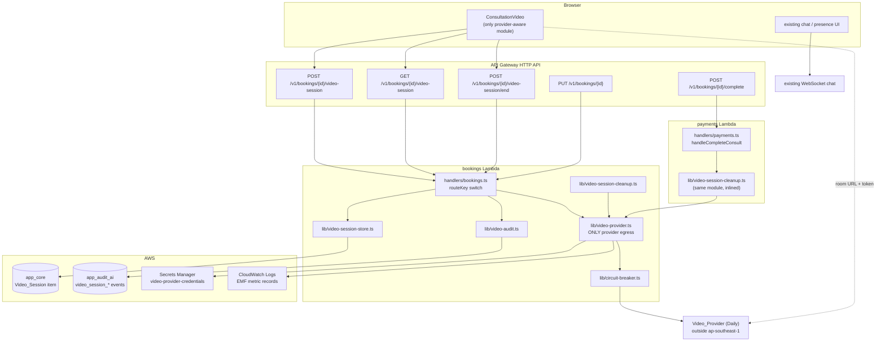
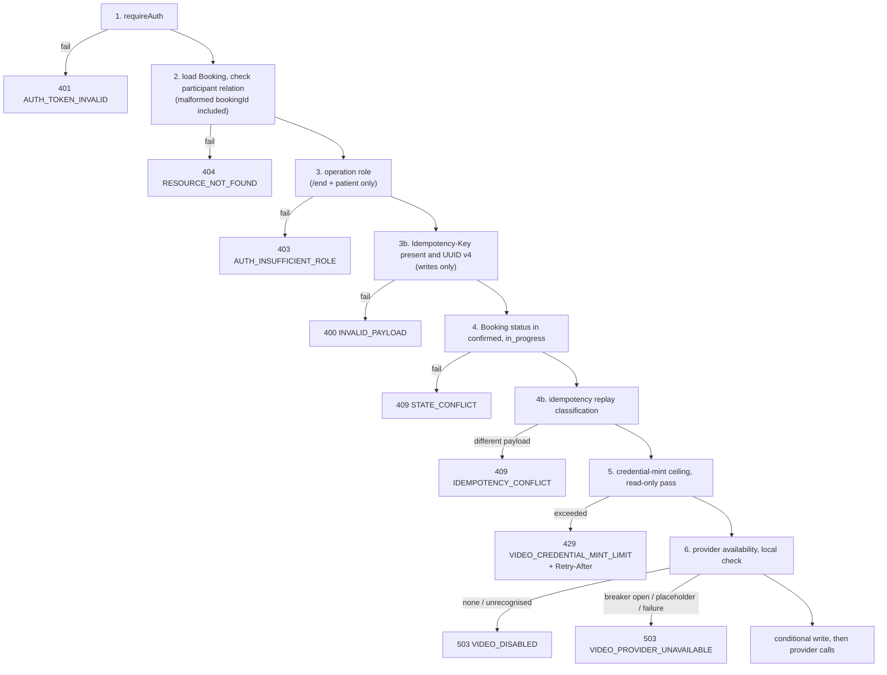

# Design Document

## Overview

This design implements phase one of the consultation media layer: live video for a
consultation, behind a provider-adapter seam, with the Media_Artifact, Consent_Record, and
Transcript_Artifact shapes defined but never written.

The design is deliberately conservative about *where* code lands. Every new capability
attaches to a module that already exists and already carries the convention it needs: the
three `video-session` routes join the `bookings` handler's existing `event.routeKey` switch
next to `POST /v1/bookings/{bookingId}/start`, keys go through `lib/dynamo.ts`, envelopes
through `lib/response.ts`, writes through `lib/idempotency.ts`, and provider calls through
the breaker in `lib/circuit-breaker.ts`. Three shared-library files take small additive
changes, each called out with the requirement that forces it.

### Research findings that shape the design

**Provider REST surface (Daily).** Room creation, credential minting, and room termination
are three REST calls with no SDK: `POST /v1/rooms`, `POST /v1/meeting-tokens`, and
`DELETE /v1/rooms/{name}`, authenticated with a bearer API key. Room names are
**caller-chosen**, and room properties include `exp`, `start_video_off`, and
`start_audio_off`, which enforce the muted-on-join default of Requirement 20 criterion 2
a room property rather than frontend code. Caller-chosen names are load-bearing for this
design: they let the service derive the room identifier locally and therefore win the
DynamoDB conditional expression *before* touching the provider, as Requirement 3 criterion 6
demands. Sources: [the /rooms family of endpoints](https://your-team.daily.co/blog/video-call-api-tutorial-the-rooms-family-of-endpoints/),
[room access control](https://your-team.daily.co/blog/intro-to-room-access-control/),
[configuring a room with audio and video off](https://your-team.daily.co/blog/create-remote-video-call-presentations-with-our-api/).
Content was rephrased for compliance with licensing restrictions.

**The repository already has one shared Lambda execution role.**
`infra/modules/http_api/main.tf` gives every handler except `admin` the same
`aws_iam_role.lambda_exec`. This changes the meaning of Requirement 18 criterion 8 and
Requirement 24 criterion 14 — see [Finding F3](#f3-single-execution-role-is-already-shared-across-every-non-admin-handler).

**Nothing in the backend calls `PutMetricData`.** The PayRex namespace grant and the alarms
exist in Terraform, but `@aws-sdk/client-cloudwatch` is not a backend dependency and no
source file emits a metric datum through the SDK. The existing metric mechanism on this
platform is a structured JSON log line (`lib/cds/metrics.ts`). Requirement 24 criterion 10
forbids adding a dependency, so video metrics are emitted as CloudWatch **Embedded Metric
Format** log records — see [D7](#d7-metrics-via-embedded-metric-format-not-putmetricdata).

**`POST /v1/bookings/{bookingId}/complete` is served by the `payments` handler**, not
`bookings`. See [Finding F1](#f1-consultation-completion-is-served-by-the-payments-handler).

**A reschedule operation does exist.** `PUT /v1/bookings/{bookingId}` in `bookings.ts`
accepts a `scheduledAt` change gated by `PATIENT_RESCHEDULABLE_STATUSES`, alongside the
`status: 'cancelled'` branch. Requirement 5 criterion 10 is therefore **applicable**, not
`not applicable`, and Requirement 5 criterion 15 is discharged by this finding.

**The idempotency store already redacts a field named `token`.**
`sanitizeForIdempotencyStorage` in `lib/idempotency.ts` replaces `data.token` with
`[REDACTED]` before persisting. Naming the Join_Credential field `token` in the response
body satisfies Requirement 21 criterion 8 with no change to that helper — see
[D6](#d6-the-join-credential-response-field-is-named-token).

### What this design builds

| Area | Deliverable |
|---|---|
| Adapter | `lib/video-provider.ts` — `createRoom`, `mintJoinCredential`, `endRoom` implemented; `startRecording`/`stopRecording` declared and inert |
| Persistence | `lib/video-session-store.ts` — Video_Session item, at-most-one conditional write, re-open, mint accounting |
| Lifecycle | `lib/video-session-cleanup.ts` — best-effort end on complete, cancel, reschedule |
| Audit | `lib/video-audit.ts` — the six `video_session_*` events |
| Routes | three cases added to the `bookings` handler switch, plus the contract operations |
| Definition-only | `lib/media-artifact.ts`, `lib/consent-record.ts`, `lib/transcript.ts` |
| Socket | `lib/transcript-cds-socket.ts` — the Requirement 17 falsifiable test target |
| Frontend | `<ConsultationVideo />`, one seam component, four `videoJoinUrl` surfaces migrated |
| Removal | `lib/video-session.ts`, its test, `videoJoinUrl`, `DEMO_VIDEO_JOIN_URL`, `demo_video_join_url` |
| Terraform | credentials secret, three route registrations, env vars, metric namespace grant, alarms and dashboard (fast-follow) |

### What this design does not build

Recording, ASR, transcription, the scribe surface, a transcript de-identifier, corpus
curation or export, any queue, state machine, or scheduled job, the media object bucket and
its KMS key (Requirement 25 criterion 10), and any write of a Media_Artifact,
Consent_Record, or Transcript_Artifact in any environment.

---

## Architecture

### Component view



### Evaluation order

Requirement 6 criterion 5 fixes a total order and forbids any other criterion from claiming
a status code independently of it. Every `video-session` request walks exactly this ladder
and responds from the first stage that fails.



Two stages sit inside the ladder that Requirement 6 criterion 5 does not enumerate, and
both are placed deliberately.

**Stage 3b, the `Idempotency-Key` check, sits after the participant relation and the
operation role.** Requirement 21 criterion 7 requires `400 INVALID_PAYLOAD` for a missing or
malformed key. Existing handlers such as `media.ts` perform that check immediately after
authentication. Doing that here would break Requirement 6 criterion 4: a non-participant
probing without the header would receive `400` where a participant receives `404`, which is
a distinguishable response and therefore an enumeration oracle. Concealment wins, and the
`400` is reachable only by an actual participant.

**Stage 4b, the idempotency replay classification, sits after eligibility.** A replay must
not be a cheaper path to a `409 STATE_CONFLICT` decision than a first request, and a stored
response must not be returned for a booking that has since left the eligibility window.

### Room creation ordering

Requirement 3 criterion 6 requires the conditional write to be won *before* the provider is
asked for a room, so that a losing caller creates nothing. That is only possible if the room
identifier is known before the provider call. The provider allows caller-chosen room names,
so the identifier is derived locally.

```
providerRoomId = "bh-" + environment + "-" + sha256(bookingId + "#" + roomEpoch).hex[0..24]
```

The derivation is pure, deterministic, opaque, and distinct across distinct booking
identifiers, which is what Requirement 3 criterion 9 and Requirement 8 criterion 10 need.
Hashing keeps the booking identifier out of the provider's administration console and out of
the participant-facing URL. Knowing the name grants nothing, because rooms are created
private and entry requires a minted, participant-scoped credential.

`roomEpoch` is an integer on the Video_Session item, starting at 1 and incremented on every
re-open. It exists for a security reason, not a bookkeeping one: without it, a re-opened room
would carry the same name as the ended one, and a credential minted before the end — still
inside its 30-minute lifetime — would let its holder walk back into a room the doctor
deliberately closed. With the epoch, the superseded name no longer exists at the provider and
the old credential is dead.

```mermaid
sequenceDiagram
    participant P as Patient
    participant D as Doctor
    participant H as bookings handler
    participant T as app_core
    participant V as Video_Provider

    Note over P,D: both arrive; whoever is first opens the room
    P->>H: POST video-session (Idempotency-Key)
    D->>H: POST video-session (Idempotency-Key)
    H->>T: Put Video_Session, attribute_not_exists(pk) AND attribute_not_exists(sk)<br/>mintAccounting = { patient: {start, 1} }
    T-->>H: patient wins
    T-->>H: doctor: ConditionalCheckFailed
    H->>V: createRoom(derived name)   %% winner only
    V-->>H: room created
    H->>T: set roomCreatedAt
    H->>V: mintJoinCredential(patient)
    H->>T: doctor re-reads winner, conditional mint increment
    H->>V: mintJoinCredential(doctor)
    H-->>P: 201 { roomUrl, token, expiresAt }
    H-->>D: 200 { roomUrl, token, expiresAt }
```

### Degradation

Provider unavailability is a `503` on the media path and nothing else. `POST
/v1/bookings/{bookingId}/start` completes, the WebSocket chat, presence, and typing
subsystem is untouched, and the component renders a chat-only state. No code in this design
reads, writes, or configures anything in the chat subsystem.

The `VIDEO_DISABLED` and `VIDEO_PROVIDER_UNAVAILABLE` branches are reached only at stage 6,
so an unauthenticated or non-participant caller never learns whether video is configured.

---

## Components and Interfaces

### C1. Video_Provider_Adapter — `backend/src/lib/video-provider.ts`

The only backend module that issues a network request to a Video_Provider (R1.4). It
replaces `lib/video-session.ts`, which is deleted in the same change set (R10.1).

```ts
export type VideoProviderName = 'none' | 'daily';

/** Complete outbound provider interface. A later recording phase adds no new seam. (R1.1) */
export interface VideoProviderAdapter {
  createRoom(input: CreateRoomInput): Promise<ProviderOutcome<CreateRoomResult>>;
  mintJoinCredential(input: MintCredentialInput): Promise<ProviderOutcome<MintCredentialResult>>;
  endRoom(input: EndRoomInput): Promise<ProviderOutcome<EndRoomResult>>;
  /**
   * Not implemented under this specification (R1.3, R22.3).
   * Capability contract for the recording phase (R1.10, R1.11):
   *  - the provider MUST capture per-participant UNMIXED audio tracks, one track per
   *    participant, so a later diarisation step is correct by construction;
   *  - audio is the ONLY recordable track kind. No video track is ever captured.
   * Reachable only through evaluateRecordingPrecondition (R13.8).
   */
  startRecording(input: never): Promise<ProviderOutcome<never>>;
  stopRecording(input: never): Promise<ProviderOutcome<never>>;
}

export type ProviderOutcome<T> =
  | { ok: true; value: T }
  | { ok: false; unavailable: true; category: UnavailableCategory }
  | { ok: false; unavailable: false; code: 'RECORDING_NOT_IMPLEMENTED' };

export type UnavailableCategory =
  | 'provider_disabled'        // VIDEO_PROVIDER = none, or unrecognised value  -> VIDEO_DISABLED
  | 'credential_placeholder'   // Secrets_Loader placeholder detection (R18.4)
  | 'credential_rejected'      // provider 401/403 (R18.6)
  | 'breaker_open'             // Circuit_Breaker fast-fail (R1.9)
  | 'timeout'
  | 'transport'                // non-2xx, malformed body, network error
  ;
```

Named constants, declared once here and never as a literal at a call site:

| Constant | Value | Requirement |
|---|---|---|
| `VIDEO_JOIN_CREDENTIAL_TTL_SECONDS` | `30 * 60` | R8.6 |
| `VIDEO_CLEANUP_TIMEOUT_MS` | `2000` | R5.14 |
| `VIDEO_PROVIDER_REQUEST_TIMEOUT_MS` | `3000` | request-path bound |
| `VIDEO_ROOM_EXPIRY_SECONDS` | `12 * 60 * 60` | additive backstop, see below |

`VIDEO_ROOM_EXPIRY_SECONDS` is set as the provider room's own `exp`. It is additive to the
requirements and exists because Requirement 5 criterion 11 makes provider termination
best-effort: if every cleanup path fails, the room still disappears at the vendor within
twelve hours instead of living for the lifetime of the account, which is what Requirement 5
criterion 12 asks for.

**Provider selection (R1.5–R1.7).** `VIDEO_PROVIDER` is read per invocation. `daily` selects
the Daily implementation; `none` selects an implementation that reports
`{ unavailable: true, category: 'provider_disabled' }` for every operation with no network
request. Any other value behaves as `none` and emits one PHI-free structured configuration
warning per Lambda container, guarded by a module-level `warnedOnce` flag.

**Daily implementation.** `fetch` only, no SDK, no new dependency (R23.4).

| Operation | Call | Notes |
|---|---|---|
| `createRoom` | `POST https://api.daily.co/v1/rooms` | body `{ name, privacy: 'private', properties: { exp, start_video_off: true, start_audio_off: true, enable_prejoin_ui: false, enable_chat: false, enable_screenshare: false, enable_knocking: false, enable_people_ui: false, enable_pip_ui: false } }` — muted on join with participant-controlled camera and microphone (R1.12, R20.2). The `enable_*` properties were added while `<ConsultationVideo />` still used Daily's Prebuilt iframe, each disabling a Daily-owned UI surface (its prejoin lobby, its chat panel, etc.) that either fought this component's own UI or would have silently violated Requirement 2 criterion 6. Now that the component runs Call Object mode and renders no Daily-owned UI at all, these properties are **inert** — Call Object never reads them — but are left set rather than removed, so a future swap back to Prebuilt (or to a different provider entirely) does not have to rediscover the same decisions. A duplicate-name rejection is mapped to `ok: true`, making creation idempotent on the derived name. |
| `mintJoinCredential` | `POST https://api.daily.co/v1/meeting-tokens` | body `{ properties: { room_name, user_id: participantLabel, user_name: roleLabel, is_owner: isDoctor, exp } }`. `roleLabel` is the literal `Patient` or `Doctor`; no person name, email, or phone reaches the provider. |
| `endRoom` | `DELETE https://api.daily.co/v1/rooms/{name}` | `404` mapped to `ok: true` — already gone is the desired state. |

`participantLabel` is derived as `sha256(bookingId + ':' + actorSub).hex[0..32]`. It is an
opaque label, distinct per participant within a Video_Session, stable for the lifetime of the
booking, carries no Cognito subject or person identifier, and is resolvable to an actor only
by joining Booking state. That is precisely the Media_Artifact track-identity contract of
Requirement 12 criterion 4, so the label the recording phase will need already exists and is
already what the provider sees.

**Credentials (R18.3–R18.6).** Read through `lib/secrets.ts` with its in-process cache and
`PLACEHOLDER_SET_VIA_CLI` detection, added as `ensureVideoProviderCredentialsLoaded()`
following `ensurePayRexCredentialsLoaded` exactly. A placeholder, or a provider `401`/`403`,
yields `unavailable` rather than an error surface. Credential values never appear in a log
statement, an error message, or an HTTP response.

**Startup validation (R19.9).** `validateVideoProviderConfiguration()` mirrors
`validatePayRexConfiguration`: one PHI-free structured record per Lambda container naming the
environment, the selected provider, and whether the credential is populated or a placeholder.
No credential value is disclosed.

### C2. Circuit breaker reuse — `backend/src/lib/circuit-breaker.ts`

Requirement 1 criteria 8 and 9 require every provider call to be routed through the existing
breaker, and require an open breaker to fast-fail to `unavailable` **without** a network
request while the breaker retains its own state transitions.

The existing `CircuitBreaker` is hard-typed to `PaymentGatewayAdapter` and, when open,
delegates to a fallback adapter. Both properties are usable as-is with one type-level change
and one wiring choice:

1. `class CircuitBreaker<TAdapter = PaymentGatewayAdapter>` with
   `execute<T>(operation: (adapter: TAdapter) => Promise<T>, name: string)`. The default type
   parameter preserves every existing PayRex call site and inference, and no runtime
   behaviour changes.
2. The video breaker is constructed with the Daily adapter as primary and the `none` adapter
   as fallback. When the breaker is open, `execute` selects the fallback, which returns
   `{ unavailable: true }` with no network request — exactly Requirement 1 criterion 9's
   "report the media path as unavailable from the Circuit_Breaker's fast-fail outcome" — while
   the breaker keeps counting and keeps its `CLOSED → OPEN → HALF_OPEN` transitions.

The fallback's `category` is rewritten to `breaker_open` by the wrapper so the `503` code and
the metric dimension distinguish an open breaker from a configured-off provider.

`getStatus()` carries PayRex-specific description strings; the video path uses `getMetrics()`
only, so no change is made there.

### C3. Video_Session store — `backend/src/lib/video-session-store.ts`

Owns every read and write of the Video_Session item. All keys come from `lib/dynamo.ts`
builders; no `BOOKING#` literal appears here (R11.1).

```ts
export interface VideoSessionItem { /* see Data Models */ }

export async function readVideoSession(bookingId: string): Promise<VideoSessionItem | null>;

/** R3.2, R3.5, R3.6, R11.10, R11.11 */
export async function createVideoSessionClaimingMint(args: {
  bookingId: string; actorId: string; actorRole: 'patient' | 'doctor';
  provider: VideoProviderName; now: Date;
}): Promise<{ won: true; item: VideoSessionItem } | { won: false }>;

/** R3.3, R3.7, R9.6, R11.11 */
export async function recordMintOnExistingSession(args: {
  bookingId: string; actorId: string; observed: VideoSessionItem; now: Date;
}): Promise<
  | { ok: true; item: VideoSessionItem }
  | { ok: false; reason: 'ceiling_exceeded'; retryAfterSeconds: number }
  | { ok: false; reason: 'contended' }
>;

/** R3.13, R3.14, R3.15 — mutates the existing item, never creates a second */
export async function reopenVideoSessionClaimingMint(args: {
  bookingId: string; actorId: string; actorRole: 'patient' | 'doctor';
  observed: VideoSessionItem; now: Date;
}): Promise<{ won: true; item: VideoSessionItem; supersededRoomId: string } | { won: false }>;

/** R5.2, R5.7 */
export async function markVideoSessionEnded(args: {
  bookingId: string; now: Date;
}): Promise<{ transitioned: boolean; item: VideoSessionItem | null }>;

export async function markRoomCreated(bookingId: string, roomEpoch: number): Promise<void>;

/** R9.6 read-only pass at stage 5 of the evaluation order */
export function evaluateMintCeiling(
  item: VideoSessionItem | null, actorId: string, now: Date
): { allowed: true } | { allowed: false; retryAfterSeconds: number };
```

**Mint accounting (R11.10, R11.11).** A map on the item keyed by actor identifier, each entry
holding `{ windowStartedAt: string; count: number }`, bounded to two entries because a
Booking has exactly one Owning_Patient and one Assigned_Doctor. It is not a separate item: a
per-Booking-per-actor counter with the Video_Session's own lifetime has no access pattern of
its own.

The ceiling is enforced **inside** the same conditional write that records the mint, so
concurrent requests cannot bypass it. DynamoDB cannot express the reset-or-increment choice
in one update expression, so the store reads the observed entry and issues the matching
branch under a condition pinned to the exact observed values:

- *window expired* — condition `attribute_not_exists(mintAccounting.#a) OR
  mintAccounting.#a.windowStartedAt = :observedStart`; sets the entry to
  `{ windowStartedAt: now, count: 1 }`.
- *within window* — condition `mintAccounting.#a.windowStartedAt = :observedStart AND
  mintAccounting.#a.#c = :observedCount AND mintAccounting.#a.#c < :ceiling`; sets
  `count = observedCount + 1`.

A `ConditionalCheckFailedException` means a concurrent mint moved the counter. The store
re-reads and retries, bounded to three attempts. Exhausting the retries returns
`reason: 'contended'`, which the handler surfaces as `429 VIDEO_CREDENTIAL_MINT_LIMIT` with
`Retry-After: 1`. With at most two actors on a booking, three consecutive losses means
sustained self-contention from one client, and asking that client to wait a second is the
correct answer. The invariant that matters — a successful mint always writes against the
exact counter value it observed — holds on every path, so the ceiling can never be exceeded.

The window is a fixed hour that restarts when the previous one lapses, not a continuously
sliding one. `Retry-After` is `ceil((windowStartedAt + 3_600_000 - now) / 1000)`, which is
always a whole number of seconds no greater than the window length, as Requirement 9
criterion 11 requires.

**Ordering note.** The mint slot is consumed by the conditional write, which precedes the
provider call. A provider failure therefore consumes a slot without disclosing a credential.
The alternative — a compensating decrement — is a second write that can itself fail and would
turn a bounded over-count into an unbounded under-count. At a ceiling of 20 per actor per
hour the waste is not worth a second failure mode.

### C4. Lifecycle cleanup — `backend/src/lib/video-session-cleanup.ts`

```ts
/** R5.8–R5.14. Never throws. Never blocks the caller. */
export async function endVideoSessionForLifecycle(args: {
  bookingId: string;
  trigger: 'consult_completed' | 'booking_cancelled' | 'booking_rescheduled';
  actorId: string;
  requestId: string;
}): Promise<void>;
```

One shared library module, inlined by esbuild into both bundles, called as a **local
synchronous function call** from the handler serving each lifecycle operation. No
cross-handler invocation, no queue, no state machine, no scheduled job (R5.13, R22.4).

| Trigger | Route | Handler |
|---|---|---|
| `consult_completed` | `POST /v1/bookings/{bookingId}/complete` | `handlers/payments.ts` → `handleCompleteConsult` |
| `booking_cancelled` | `PUT /v1/bookings/{bookingId}` with `status: 'cancelled'` | `handlers/bookings.ts` → `handleUpdateBooking` |
| `booking_rescheduled` | `PUT /v1/bookings/{bookingId}` with `scheduledAt` | `handlers/bookings.ts` → `handleUpdateBooking` |

Behaviour: read the Video_Session; if absent or already ended, return. Otherwise call
`endRoom` bounded by `VIDEO_CLEANUP_TIMEOUT_MS`, record the lifecycle state as ended
regardless of the provider outcome, and emit `video_session_ended` carrying the provider
termination outcome so a leaked vendor room is observable rather than silent (R5.11). Every
failure is caught and logged; the function resolves rather than rejects, so it cannot extend
the latency budget or the failure surface of the clinical operation (R5.14). It is invoked
**after** the lifecycle write has committed, so a cleanup fault cannot roll back a
completion, a cancellation, or a reschedule.

The reschedule case ends the room so the rescheduled Booking provisions a fresh one on its
next `POST`, rather than reusing the superseded appointment's room (R5.10).

### C5. Audit writer — `backend/src/lib/video-audit.ts`

`app_audit_ai`, item shape and TTL identical to `recordAdminAudit`, partitioned under
`VIDEO#EVENTS` with `sk = EVENT#<timestamp>#<eventId>`. `recordAdminAudit` is not reused
because its item is keyed to `ADMIN#EVENTS` and requires an `adminUserId`; a patient or
doctor acting on their own consultation is not an admin action.

| Event | Fields | Requirement |
|---|---|---|
| `video_session_created` | bookingId, actorId, actorRole, provider, timestamp | R9.1 |
| `video_session_credential_disclosed` | bookingId, actorId, actorRole, timestamp | R9.2 |
| `video_session_ended` | bookingId, actorId, providerTerminationOutcome, timestamp | R9.3 |
| `video_session_denied` | errorCode, actorId, actorRole, bookingId, timestamp | R9.4, R9.6 |
| `video_session_provider_unavailable` | bookingId, provider, failureCategory, timestamp | R9.7 |
| `video_session_reopened` | bookingId, actorId, actorRole, supersededProviderRoomId, timestamp | R9.10, R3.16 |

No event carries a Join_Credential, a provider secret, a patient name, or clinical content
(R9.8). A `401`, or a `404` under the concealment rule, writes **no** audit row and emits one
CloudWatch metric datum naming the responded code instead, because a denial reachable without
a participant relation is reachable at probing volume (R9.5).

**Durability posture.** The disclosure-path events — `video_session_created`,
`video_session_credential_disclosed`, `video_session_reopened` — are written **fail-closed**:
awaited, unswallowed, and ordered before the credential leaves the handler. If the audit write
fails the response is `500` and no credential is disclosed, which matches the fail-closed
break-glass audit posture this platform already runs. The lifecycle-cleanup events are
best-effort, because Requirement 5 criterion 11 forbids the cleanup path from failing a
clinical operation. `video_session_denied` is best-effort for the same reason a denial should
not become a `500`.

No `video_session_*` event is evidence that a consultation was clinically completed; clinical
completion is established only by `POST /v1/bookings/{bookingId}/complete` (R5.5, R9.9).

### C6. Route dispatch — `backend/src/handlers/bookings.ts`

Three cases added to the existing switch (R21.10). No new Lambda handler, so
`scripts/package-lambdas.mjs` and the Terraform handler inventory are unchanged (R23.6).

```ts
case 'POST /v1/bookings/{bookingId}/video-session':      return handleCreateVideoSession(event);
case 'GET  /v1/bookings/{bookingId}/video-session':      return handleGetVideoSession(event);
case 'POST /v1/bookings/{bookingId}/video-session/end':  return handleEndVideoSession(event);
```

A shared private helper resolves stages 1 through 3 of the evaluation order once, so the
Booking read and the participant-relation check are not duplicated:

```ts
type Relation = { auth: AuthContext; booking: BookingItem; role: 'patient' | 'doctor' };
async function resolveVideoSessionRelation(
  event: APIGatewayProxyEventV2, operation: 'create' | 'read' | 'end'
): Promise<{ ok: true; relation: Relation } | { ok: false; response: APIGatewayProxyResultV2 }>;
```

Requester identity comes from the verified token claims through `requireAuth`, never from a
body or query parameter (R6.8). Ownership and assignment are evaluated from the Booking item
in `app_core`; provider state is never consulted for authorization (R6.7).

**`handleCreateVideoSession`** — the only operation that mints or discloses a credential
(R3.12), and the only one that creates a provider room (R3.10):

1. stages 1–4b of the ladder
2. `readVideoSession` → `evaluateMintCeiling` (stage 5) → local availability probe (stage 6)
3. dispatch on the observed state:
   - **absent** → `createVideoSessionClaimingMint`. Winner: `createRoom`, `markRoomCreated`,
     `video_session_created`, mint, `201`. Loser (`won: false`) → re-read and fall into the
     *active* branch, creating no provider room (R3.7).
   - **active** → `recordMintOnExistingSession`, then `mintJoinCredential`, `200` (R3.3).
     If `roomCreatedAt` is absent, `createRoom` is called first as a repair; the derived name
     makes that idempotent, so it produces no second room. See
     [D3](#d3-roomcreatedat-closes-the-crash-window-between-the-write-and-the-provider-call).
   - **ended** → `reopenVideoSessionClaimingMint` under a `lifecycleState = ended` condition,
     which increments `roomEpoch`, overwrites `providerRoomId`, clears `endedAt`, and
     transitions back to active on the **same item** (R3.13–R3.15). Winner then calls
     `createRoom` for the new name and writes `video_session_reopened`, not
     `video_session_created` (R3.16). A losing concurrent re-open falls into the *active*
     branch, so two concurrent re-opens cannot produce two rooms (R3.14).
4. `video_session_credential_disclosed`, fail-closed, then respond and store the idempotency
   record.

**`handleGetVideoSession`** — safe and side-effect free (R4.4). It requests no room, mints no
credential, and writes no item, including no idempotency record. Absent Video_Session →
`404 RESOURCE_NOT_FOUND` (R4.3). Present → `200 { provider, lifecycleState, createdAt,
endedAt? }`, with no credential (R4.2) and, deliberately, no room URL: Requirement 4
criterion 2 enumerates existence, lifecycle state, and provider name, and the component
obtains the URL from the `POST` response it must make anyway. The eligibility check applies
here as on every other operation and is not relaxed for reads (R7.3, R23.9).

**`handleEndVideoSession`** — Assigned_Doctor only; the Owning_Patient receives
`403 AUTH_INSUFFICIENT_ROLE` at stage 3 (R6.6). Requires `Idempotency-Key` (R5.6). Already
ended → `200` with no provider request (R5.7). Absent Video_Session →
`404 RESOURCE_NOT_FOUND`, filling a gap the requirements do not state and choosing the code
that the read path already uses for the same condition. Provider failure → still record
ended, still `200` (R5.3). Booking status is left unchanged (R5.4). No credential appears in
the response (R8.1).

### C7. Metrics — Embedded Metric Format

One EMF log record per provider operation, carrying the outcome and the observed latency
(R24.1), under namespace `BayanHealth/Video/{environment}` (R24.2):

```json
{ "_aws": { "Timestamp": 1755000000000,
            "CloudWatchMetrics": [{ "Namespace": "BayanHealth/Video/dev",
              "Dimensions": [["operation","outcome"]],
              "Metrics": [{ "Name": "provider.call.count", "Unit": "Count" },
                          { "Name": "provider.call.latency", "Unit": "Milliseconds" }] }] },
  "operation": "mintJoinCredential", "outcome": "success",
  "provider.call.count": 1, "provider.call.latency": 142 }
```

Dimensions are drawn from closed enums only: `operation` ∈ {`createRoom`,
`mintJoinCredential`, `endRoom`}, `outcome` ∈ {`success`, `unavailable`, `error`}, plus
`category` for an unavailable outcome. No booking identifier, actor identifier, credential
value, provider secret, or PHI appears in any metric name or dimension (R24.3). A second
record covers breaker state (`circuit_breaker.state.open`) for the Requirement 24 criterion 5
alarm, and a third covers concealment-path denials for Requirement 9 criterion 5.

### C8. Definition-only modules

These modules define shape and validate construction. None of them imports `docClient` or any
`@aws-sdk/lib-dynamodb` command, which is how the zero-write property of Requirement 12
criterion 10 and Requirement 13 criterion 10 is made mechanically checkable.

**`lib/media-artifact.ts`**

```ts
export type MediaArtifactKind = 'audio' | 'transcript';   // exactly two; no video kind (R12.5)

export function buildMediaArtifact(
  input: MediaArtifactInput,
  deps: { resolveConsent: ConsentResolver; resolveSourceAudio: AudioArtifactResolver }
): { ok: true; item: MediaArtifactItem } | { ok: false; error: MediaArtifactRejection };
```

Rejections return which bound was violated and persist nothing (R12.3): kind outside the
two-value set; audio duration outside 1–14400 whole seconds; track identity outside 1–64
characters or containing a Cognito subject, name, email, or phone shape; more than 8 track
identities in one Video_Session; storage pointer over 256 characters or containing a bucket
name or object key path; notice version outside 1–64 characters; consent scope set outside
1–8 entries or drawn from outside the closed scope set; unresolvable consent reference;
consultation-bound grant supplied without its consultation identifier; transcript kind
without a resolvable source audio reference; Training_Eligible_Retention_Class requested
against a grant lacking the training-corpus scope (R16.5).

The resolvers are injected, so every rejection path is unit-testable against zero persisted
items.

**`lib/consent-record.ts`**

```ts
export type ConsentScope = 'recording' | 'transcription' | 'training_corpus';  // closed, three (R13.5)
export type ConsentBinding = { consultationId: string } | { standing: true };

export function buildConsentRecord(input: ConsentRecordInput):
  { ok: true; item: ConsentRecordItem } | { ok: false; error: ConsentRejection };

/** granted -> revoked is the only permitted transition (R13.4) */
export function revokeConsentScopes(item: ConsentRecordItem, scopes: ConsentScope[]): ConsentRecordItem;

/** R13.6, R13.7 — fail-closed, no partial or single-party permit */
export async function evaluateRecordingPrecondition(args: {
  consultationId: string; patientId: string; doctorId: string;
  currentNoticeVersion: string;                    // argument, never hardcoded (R13.13)
  resolveGrants: (actorId: string) => Promise<ConsentRecordItem[]>;
  now: Date; timeoutMs?: number;                   // default 2000
}): Promise<{ outcome: 'permitted' } | { outcome: 'denied'; reason: RecordingDenialReason }>;
```

`evaluateRecordingPrecondition` returns `permitted` only when **both** the Owning_Patient and
the Assigned_Doctor hold a Consent_Record whose revocation state is `granted`, whose scopes
include `recording`, whose binding holds the addressed consultation identifier, and whose
notice version equals the supplied current version. A `standing` binding never satisfies the
recording scope for either participant, so per-communication authorization under RA 4200 is
never inferred from a registration-time grant (R13.6). Unresolvable, failed, or slower than
2000 ms all return `denied` with no partial permit, and the denial leaves the Video_Session
and the Chat_Channel untouched (R13.7).

Because the notice version is an argument rather than a constant, publishing a superseding
notice makes every prior grant fail the precondition without touching a stored item and
without erasing the superseded identifier that existing artifacts carry as provenance
(R13.13).

**`lib/transcript.ts`**

```ts
export type TranscriptProducer = 'none' | 'human' | 'asr';

/** R15.6 — code-level guard on the factory, not an HTTP response */
export function createTranscriptProducer():
  | { ok: false; code: 'TRANSCRIPT_PRODUCER_NOT_IMPLEMENTED' }
  | { ok: false; code: 'TRANSCRIPT_PRODUCER_DISABLED' };
```

`none` implements no producer, exposes no route, and creates no artifact (R15.5). `human` or
`asr` returns `TRANSCRIPT_PRODUCER_NOT_IMPLEMENTED` without constructing a producer and emits
one PHI-free configuration warning per container (R15.6). Terraform sets `none` in every
environment (R15.7).

### C9. Transcript-to-CDS socket — `backend/src/lib/transcript-cds-socket.ts`

The falsifiable foundation claim of Requirement 17.

```ts
export async function ingestTranscriptForClinicalOrganisation(args: {
  artifact: TranscriptArtifactMetadata;
  segments: TranscriptSegment[];          // in memory only; never persisted (R17.7)
  request: SoapRequest;
}): Promise<{ subjective: string; objective: string }>;
```

Reachable from an automated test and from no HTTP route while `TRANSCRIPT_PRODUCER` is `none`
(R17.2). It flattens the diarised segments into text, runs the **unmodified** `checkForPii`
gate from `lib/cds/deidentify.ts`, and submits the result to the existing SOAP organisation
path in `lib/cds/soap.ts`. It projects only `subjective` and `objective` out of the result and
discards every other section, because Subjective/Objective organisation is the only
pre-Assessment path and returning an assessment from this seam would be a gate bypass in
shape even where the gate would refuse it in fact.

No gate token is minted and no KMS signing operation occurs (R17.8): Subjective/Objective
organisation is not a `ProtectedOutputType`, and `GateAuthority.authorize` in
`lib/cds/gate-authority.ts` authorizes protected output types only. The gate is proven
separately and more cheaply in the same test by attempting a protected generation with no
confirmed Assessment and asserting the denial code `CONFIRMED_ASSESSMENT_REQUIRED`.

### C10. Shared-library additions

| File | Change | Forced by |
|---|---|---|
| `lib/dynamo.ts` | new entity types, key prefixes, schema versions, TTLs, retention classes, `MediaLimits`, key builders | R11.1, R12.1, R12.2, R12.12, R13.1, R14.2, R14.3, R14.7, R16.1 |
| `lib/response.ts` | `errorResponse` gains an optional trailing `headers?: Record<string,string>` merged into `JSON_HEADERS` | R9.11 — there is no other way to carry `Retry-After` through the standard envelope |
| `lib/idempotency.ts` | no change required; see D6 | R21.8 |
| `lib/circuit-breaker.ts` | type parameter with a default, per C2 | R1.8, R1.9 |
| `lib/secrets.ts` | `ensureVideoProviderCredentialsLoaded`, `validateVideoProviderConfiguration`, `resetVideoProviderCredentialsCache` | R18.3, R19.9 |

The `errorResponse` change is additive and positional-last, so every existing call site is
untouched.

### C11. Contract — `contracts/openapi.yaml`

Contract-first: the three operations land in the **same change set** that dispatches them and
that registers them in Terraform (R3.1, R4.1, R5.1, R19.5, R21.1). Before adding them,
`grep -n '^  /v1/bookings/{bookingId}/video-session' contracts/openapi.yaml` confirms no
operation already exists for either path (R21.2) — verified absent at design time.

| Path | Method | `operationId` | Responses |
|---|---|---|---|
| `/v1/bookings/{bookingId}/video-session` | `post` | `createBookingVideoSession` | 201, 200, 400, 401, 403, 404, 409, 429, 503 |
| `/v1/bookings/{bookingId}/video-session` | `get` | `getBookingVideoSession` | 200, 401, 404, 409 |
| `/v1/bookings/{bookingId}/video-session/end` | `post` | `endBookingVideoSession` | 200, 400, 401, 403, 404, 409 |

New schemas: `VideoSessionCredentialResponse` (`provider`, `roomUrl`, `token`, `expiresAt`,
`lifecycleState`), `VideoSessionStateResponse` (`provider`, `lifecycleState`, `createdAt`,
`endedAt`). The `429` response documents `Retry-After` as a response header.

Removed in the same change set: the `videoJoinUrl` property from the booking response schema,
and its reference to `architecture/GOOGLE_MEET_INTEGRATION.md` (R10.2, R10.7). Both generated
type files — `backend/src/contracts/openapi.generated.ts` and
`frontend/bayan-health-mvp/src/types/openapi.generated.ts` — are regenerated by
`node scripts/generate-cds-contract-types.mjs` so the CI drift check passes (R10.3).

### C12. Frontend seam — `<ConsultationVideo />`

The only frontend module that references provider specifics (R20.1). **Superseded design
decision, recorded 2026-08-20 after dev end-to-end testing:** originally built on Daily's
hosted Prebuilt call surface (`Daily.createFrame`). Layering a custom connecting overlay and
custom camera/mic controls on top of that iframe produced four consecutive live bugs — CSP
`frame-src`, a duplicate-iframe race, a `Permissions-Policy` denial, and Daily's own prejoin
lobby fighting this component's own "connecting" state — all traced to one cause: that
combination is a hybrid of Daily's two integration modes, and Prebuilt's un-set UI defaults
kept surfacing as bugs one at a time rather than being decided once. Rebuilt on Daily's
**Call Object** mode (`Daily.createCallObject`) instead, which renders no Daily-owned UI at
all: this component owns every rendered pixel, which is also already the shape of the fully
custom video UI this product intends to build long-term, so no second migration is
anticipated. The dependency remains pinned to an exact version (R23.5).

| Behaviour | Requirement |
|---|---|
| Joins with the local camera and microphone inactive until each is deliberately enabled | R20.2 |
| Camera toggle enables/disables the video track without changing microphone state | R20.3, R20.4 |
| Camera and microphone controls carry accessible names and are keyboard operable | R20.8 |
| Requests a credential only while the Booking is `confirmed` or `in_progress` | R20.6 |
| Holds the credential in memory for the component instance lifetime, never in storage | R8.9 |
| Re-mints by `POST` at the end of the 30-minute lifetime, keeping the media session running where the provider permits | R20.9, R8.7 |
| Treats a `GET` `404` as "no room yet", not an error | R20.10 |
| `VIDEO_PROVIDER_UNAVAILABLE` or `VIDEO_DISABLED` → chat-only state directing the participant to the Chat_Channel | R20.5 |
| `429` while connected → keep the call, non-blocking notice, honour `Retry-After`, no earlier retry | R20.12, R20.13 |
| `429` while not connected → chat-available state | R20.14 |
| Third-party transport notice to both participants before the first join, accessible and keyboard operable, explicitly **not** a Consent_Record | R20.11, R22.1 |
| Chat, presence, and typing continue to come from the existing Chat_Channel | R20.7, R22.8 |

The four `videoJoinUrl` consumers are migrated in the same change set (R10.4, R10.8):
`ConsultationRoom` (replacing `VideoCallCard`), `PatientBookingDetail` (replacing
`VideoConsultationCard`), `DoctorConsultationAccess`, and `DoctorDashboardDrawer`. After the
change set no frontend module references `videoJoinUrl`. `next.config.ts` is not touched by
the Call Object switch itself: with no iframe to embed, `Permissions-Policy:
camera=(self), microphone=(self)` and the absence of a CSP `frame-src` are correct again as
originally assumed (R23.1, R23.3, as amended). `src/proxy.ts`'s CSP does gain a `connect-src`
allowance for Daily's WebRTC signalling origins, since that traffic now originates from this
document directly rather than from inside a vendor iframe. `X-Frame-Options: DENY` continues
to govern other origins framing BayanHealth rather than the reverse and needed no change
either way (R23.2).

### C13. Terraform

| Change | Location | Requirement |
|---|---|---|
| `aws_secretsmanager_secret` `bayanhealth-{env}-video-provider-credentials`, placeholder value, `ignore_changes = [secret_string]` | `data_stores` or alongside the PayRex secret | R18.1, R18.2 |
| Secret ARN added to `aws_iam_role_policy.lambda_secrets` resource list | `http_api/main.tf` | R18.8 |
| `BayanHealth/Video/${var.environment}` added to the `cloudwatch:namespace` condition on `aws_iam_role_policy.lambda_cloudwatch_metrics` | `http_api/main.tf` | R24.8, R24.14 |
| Three `aws_apigatewayv2_route` resources targeting the `bookings` integration | `http_api/main.tf` | R19.5 |
| `VIDEO_PROVIDER`, `VIDEO_PROVIDER_CREDENTIALS_SECRET_ARN`, `TRANSCRIPT_PRODUCER` on the bookings and payments Lambda environments | `http_api/main.tf` | R19.1, R15.7 |
| `video_provider = "daily"` in `dev`, `staging`, `prod` | `environments/*/main.tf` | R19.4 |
| **Removed**: `demo_video_join_url` variable, its module wiring, its `dev` default, and the `DEMO_VIDEO_JOIN_URL` Lambda environment binding | `http_api/variables.tf`, `http_api/main.tf`, `environments/dev/*` | R10.5 |
| Video alarms and a **video-specific** dashboard, alarm prefix `${var.project_name}-${var.environment}-video`, gated on video enabled **and** an alarm target configured, `treat_missing_data` following `local.idle_tolerant_missing_data` | new `http_api/video-monitoring.tf` | R24.4–R24.7, R24.9, R24.12, R24.13 — **fast-follow** |

Every resource is in `ap-southeast-1` (R19.2). The `dev` apply is in scope; the `staging` and
`prod` applies are deferred and each require their own current, unused,
operation-specific point-of-action authorization (R19.3). Staging qualification and credential
population are recorded as launch dependencies tracked outside this specification (R19.7,
R19.8). The bundle is produced by the existing `package:lambdas` pass with no inventory change
(R19.6, R23.6).

The alarms deliberately do **not** inherit `local.monitoring_enabled` and do **not** reuse
`local.alarm_prefix`, both of which are PayRex-specific, and the video metrics do not go onto
`aws_cloudwatch_dashboard.payrex_payment_health`, which is created only where PayRex is
enabled — currently nowhere (R24.6, R24.11–R24.13). Normalising the three existing PayRex
namespaces is recorded as separate follow-up work.

### C14. Demo stand-in removal

Deleted: `backend/src/lib/video-session.ts`, `backend/src/lib/video-session.test.ts`, the
`videoJoinUrlForBooking` call and the `videoJoinUrl` attachment in `handleGetBooking`, the
contract property, both generated type files' copies of it, the four frontend consumers, the
Terraform variable, and the Lambda environment binding (R10.1–R10.5). The disclosure rules the
stand-in enforced — participant-only, eligibility-gated, absent from list endpoints, logs,
error messages, and notification templates — carry forward into the new operations (R10.6).
`architecture/DEMO_SCRIPT.md` and `architecture/TELECONSULT_VIDEO_AND_AI_SCRIBE.md` are
updated to stop referring to the removed variable.

---

## Data Models

### Key registry additions — `backend/src/lib/dynamo.ts`

```ts
EntityType.VideoSession    = 'video_session'
EntityType.MediaArtifact   = 'media_artifact'
EntityType.ConsentRecord   = 'consent_record'

SchemaVersion[...]         = 1 for each

KeyPrefix.VideoSession     = 'VIDEO_SESSION'    // fixed sort value in the Booking partition
KeyPrefix.MediaArtifact    = 'MEDIA_ARTIFACT'   // distinct from the existing 'MEDIA' (R12.1)
KeyPrefix.MediaPatient     = 'MEDIA_PATIENT'    // gsi2 partition, NOT 'PATIENT' (R14.2)
KeyPrefix.Retention        = 'RETENTION'        // gsi3 partition (R14.3)
KeyPrefix.Consent          = 'CONSENT'
KeyPrefix.ConsentGrant     = 'GRANT'

Ttl.VideoSession           = Ttl.Session                    // 120 days, no new duration (R11.4)
Ttl.MediaArtifact          = Ttl.Media                      // 120 days default (R12.1)
Ttl.MediaArtifactTraining  = 365 * 24 * 60 * 60             // 365 days (R12.1, R16.2)
Ttl.ConsentRecord          = Ttl.PatientProfile             // 5 years (R13.1)

RetentionClass.VideoSession              = 'video_session_120d'                  // see F4
RetentionClass.MediaArtifactDefault      = 'media_artifact_120d'
RetentionClass.MediaArtifactTrainingEligible = 'media_artifact_training_eligible_365d'
RetentionClass.ConsentRecord             = 'consent_record_5y'

MediaLimits = {
  CREDENTIAL_MINT_CEILING_PER_HOUR: 20,                     // R9.6
  CREDENTIAL_MINT_WINDOW_MS: 60 * 60 * 1000,
  MINT_ACCOUNTING_MAX_ACTORS: 2,                            // R11.10
  ARTIFACT_MAX_TRACKS_PER_SESSION: 8,                       // R12.4
  TRACK_IDENTITY_MAX_CHARS: 64,                             // R12.4
  AUDIO_DURATION_MIN_SECONDS: 1,                            // R12.3
  AUDIO_DURATION_MAX_SECONDS: 14_400,                       // R12.3
  NOTICE_VERSION_MAX_CHARS: 64,                             // R12.6, R13.2, R14.7
  CONSENT_SCOPES_MIN: 1, CONSENT_SCOPES_MAX: 8,             // R12.6
  STORAGE_POINTER_MAX_CHARS: 256,                           // R12.11
  CORPUS_SHARD_COUNT: CdsLimits.AUDIT_OUTBOX_SHARD_COUNT,   // 16 (R14.4)
  CORPUS_QUERY_PAGE_MAX: 100,                               // R14.5
}
```

Every prefix helper returns its value **including** the `#` delimiter, so non-interference is
pinned by definition rather than by the prefix strings happening not to collide (R12.14):

```ts
videoSessionPrimaryKey(bookingId)                        // { pk: BOOKING#<id>, sk: VIDEO_SESSION }
mediaArtifactPrimaryKey(bookingId, createdAt, artifactId)
mediaArtifactSkPrefix()                                  // 'MEDIA_ARTIFACT#'
mediaArtifactPatientIndexKey(patientId, createdAt, artifactId)
mediaArtifactCorpusIndexKey(retentionClass, shardIndex, noticeVersion, createdAt, artifactId)
mediaArtifactCorpusShardIndex(artifactId)                // deterministic hash mod shard count
consentRecordPrimaryKey(actorId, binding, grantedAt, consentId)
consentRecordActorSkPrefix()                             // 'GRANT#'
consentRecordConsultationSkPrefix(consultationId)        // 'GRANT#<consultationId>#'
mediaSkPrefix()                                          // unchanged: 'MEDIA#'
```

`mediaArtifactCorpusIndexKey` rejects a notice version that is empty, exceeds 64 characters,
or contains `#`, and rejects a shard index outside `0 .. CORPUS_SHARD_COUNT - 1` (R14.7).
Every builder is pure: no clock, no environment variable, no persisted read, verifiable
against zero persisted items.

### Video_Session — the only item this specification writes

```
pk  = BOOKING#<bookingId>
sk  = VIDEO_SESSION                 (fixed, no variable segment — R11.2)
```

The fixed sort key follows the intake form (`sk = INTAKE`) and payment record
(`sk = PAYMENT`) precedent, and it is what makes the at-most-one-per-Booking guarantee a
plain `attribute_not_exists(pk) AND attribute_not_exists(sk)` condition with no sentinel item,
no counter, and no transaction (R11.3).

| Attribute | Type | Notes |
|---|---|---|
| `entityType` | `'video_session'` | R11.6 |
| `schemaVersion` | `1` | R11.6 |
| `ttl` | number | `ttlFromNow(Ttl.VideoSession)`; **unset when `legalHold` is true** (R11.13, R21.11) |
| `legalHold` | boolean | R11.6 |
| `retentionClass` | `'video_session_120d'` | see [F4](#f4-r111-and-r114-cannot-both-be-satisfied-literally) |
| `bookingId` | string | |
| `provider` | `'daily'` | R11.5 |
| `providerRoomId` | string | derived, opaque, mutable on re-open (R11.5, R8.10) |
| `roomEpoch` | number | starts at 1, incremented on re-open — additive, see D2 |
| `roomCreatedAt` | string? | present once the provider confirmed creation — additive, see D3 |
| `lifecycleState` | `'active' \| 'ended'` | permits `active → ended` (R5.2) and `ended → active` (R3.13) |
| `createdByActorId` | string | R11.5 |
| `createdByActorRole` | `'patient' \| 'doctor'` | R11.5 |
| `createdAt` | string | UTC, millisecond precision |
| `endedAt` | string? | present **when and only when** `lifecycleState = 'ended'` (R11.5) |
| `mintAccounting` | map | `{ [actorId]: { windowStartedAt, count } }`, at most 2 entries (R11.10) |

No `gsi1`, `gsi2`, or `gsi3` attribute is written: the single access pattern is a primary-key
get by Booking identifier, so the entity consumes no index slot (R11.8). No Join_Credential
and no provider secret is stored anywhere on the item, including in `mintAccounting` (R11.7,
R11.12).

### Media_Artifact — defined, never written

```
pk      = BOOKING#<bookingId>                                        (R12.2, R14.1)
sk      = MEDIA_ARTIFACT#<createdAt ISO-8601 UTC ms>#<artifactId>    (R12.12)
gsi2pk  = MEDIA_PATIENT#<patientId>                                  (R14.2, always)
gsi2sk  = MEDIA_ARTIFACT#<createdAt>#<artifactId>
gsi3pk  = RETENTION#<retentionClass>#<shard, 2-digit zero-padded>    (R14.3, training-eligible only)
gsi3sk  = <noticeVersion>#<createdAt>#<artifactId>
gsi1*   = absent, always                                             (R14.1, R14.9)
```

Partitioning on the Booking identifier rather than a consultation identifier is what makes the
per-consultation query total: Requirement 7 criterion 1 makes `confirmed` an eligible status,
no consultation session exists at `confirmed`, and any design keyed on a consultation
identifier at creation time would leave every pre-consultation artifact permanently
unreachable. The fixed-width millisecond timestamp makes ascending lexicographic sort-key
order equal ascending creation order, and the UUID v4 suffix makes collision within a
partition impossible.

| Attribute | Notes |
|---|---|
| `kind` | `'audio' \| 'transcript'` — exactly two values, no recorded-video kind (R12.5) |
| `trackIdentity` | opaque 1–64 chars, one artifact per unmixed participant track, ≤ 8 per session (R12.4) |
| `storagePointer` | opaque ≤ 256 chars, no bucket name, no object key path; addresses the audio payload or the transcript segment text (R12.11) |
| `consentRecordRef` | `{ actorId, consentId, binding }` (R12.3) |
| `consentBoundConsultationId` | present when the referenced grant holds one consultation identifier (R12.6) |
| `noticeVersion` | audio kind only; immutable 1–64 chars (R12.6) |
| `consentScopes` | audio kind only; 1–8 entries copied **by value** at creation, immutable (R12.6) |
| `sourceAudioArtifactRef` | transcript kind only; notice version and scopes inherited **by reference**, never re-copied (R12.6) |
| `retentionClass` | exactly one label from the registry set (R12.3, R16.3) |
| `producer` | provenance naming the producer that created the artifact (R12.3) |
| `durationSeconds` | audio: 1–14400 whole seconds; transcript: derived from the source audio artifact so the two cannot drift (R12.3) |
| `createdAt` | UTC, millisecond precision (R13.11) |
| `entityType`/`schemaVersion`/`ttl`/`legalHold` | `ttl` derived from `retentionClass`; unset when `legalHold` is true (R12.8) |

The DynamoDB item holds metadata only — no media payload and no transcript text, following
the `lib/cds/audit.ts` precedent of payload-to-S3, metadata-plus-pointer-to-DynamoDB (R12.15).

A subtlety worth stating, because it is easy to get wrong later: a **training-eligible
transcript** needs a notice version to build its `gsi3` sort key, yet Requirement 12
criterion 6 forbids it from carrying its own copy. The `gsi3` sort value is a **key**, not a
provenance field; the writer resolves the inherited notice version from the source audio
artifact and passes it as an argument to the pure key builder (R14.7). Nothing is duplicated,
and Requirement 14 criterion 11's requirement that the `gsi3` attributes be removable without
disturbing any provenance field still holds.

**Revocation without erasure (R12.13, R14.11).** A revoked or scope-insufficient grant denies
every consent-scoped *use*, leaves the copied notice version and copied scope set unmodified,
and leaves deletion governed only by the retention class and `legalHold`. Corpus membership is
expressed by `gsi3` index membership alone, so a training-corpus revocation is a sparse
attribute removal that deletes nothing and mutates no provenance — which is also why the
corpus query needs no consent re-check filter.

**Rolling corpus window (R12.16).** DynamoDB TTL runs from artifact creation, so the 365-day
training-eligible constant yields a rolling twelve-month corpus that plateaus rather than
accumulating without bound. Retaining a curated set beyond that window requires a separate
durable-retention mechanism with its own authorization; `legalHold` is not overloaded for it,
because `legalHold` means preservation for litigation or investigation and that meaning must
stay unambiguous.

### Consent_Record — defined, never written

```
pk = CONSENT#<actorId>
sk = GRANT#<consultationId | STANDING>#<grantedAt>#<consentId>
```

Both access patterns Requirement 13 criterion 9 names are served from the primary key, so the
entity consumes no index slot:

- every grant held by one actor → `pk = CONSENT#<actorId>`, `begins_with(sk, 'GRANT#')`
- a consultation-bound grant for one actor and one consultation →
  `pk = CONSENT#<actorId>`, `begins_with(sk, 'GRANT#<consultationId>#')`

`STANDING` cannot collide with a consultation identifier, which is validated against
`CONSULTATION_ID_RE`.

| Attribute | Notes |
|---|---|
| `actorId` | exactly one; **must equal** the Cognito subject of the actor who performed the grant, so no actor may grant on another's behalf (R13.3) |
| `actorRole` | from the existing Cognito group vocabulary (R13.2) |
| `grantedScopes` | subset of the closed three-value set, each independently grantable and independently revocable (R13.5) |
| `binding` | exactly one consultation identifier, or the standing value (R13.2) |
| `noticeVersion` | immutable 1–64 chars (R13.2) |
| `grantedAt` | UTC, millisecond precision |
| `revocationState` | `'granted' \| 'revoked'`; the only permitted transition (R13.4) |
| `revokedAt` | present **when and only when** revoked; millisecond precision (R13.2, R13.11) |
| `revokedScopes` | per-scope revocation without altering any other scope's state (R13.5) |
| `entityType`/`schemaVersion`/`ttl`/`legalHold` | 5-year TTL; unset when `legalHold` is true (R13.1) |

A standalone item, with no consent boolean on the Booking (R13.4). A doctor's standing
registration-time grant and a patient's consultation-bound grant share one identical field set
under one schema version, differing only in actor role, binding, and scopes (R13.3). Five
years clears the 365-day training-eligible constant with margin, because an artifact whose
grant has expired is an artifact whose provenance cannot be proven.

Care is never contingent on the training-corpus scope: no Booking, Video_Session,
Join_Credential, Chat_Channel, consultation document, or CDS capability is conditional on it,
and behaviour with the scope absent or revoked is identical to behaviour with it granted
(R13.12).

### Transcript_Artifact — a Media_Artifact kind

Segment text lives as a single S3 object addressed by the artifact's storage pointer (R15.1).
The DynamoDB item carries metadata only: `segmentCount`, `totalDurationSeconds` (derived from
the source audio), `producer`, and `languageTags`. It carries **no** transcript text — no
inline excerpt, preview, first segment, or summary — so the item and the S3 object cannot
drift (R15.2). The in-memory segment shape is producer-agnostic, so a human transcriber and an
ASR service populate an identical structure (R15.3):

```ts
interface TranscriptSegment {
  speakerTrackIdentity: string;   // the same opaque label the adapter mints as user_id
  startMs: number; endMs: number;
  text: string;                   // S3 only, never a DynamoDB attribute
}
```

### The three key-shape queries

| # | Query | Index | Key condition | Requirement |
|---|---|---|---|---|
| 1 | artifacts for one consultation | **table primary key** | resolve consultation → Booking via `getSessionByConsultationId`, then `pk = BOOKING#<id>` AND `begins_with(sk, 'MEDIA_ARTIFACT#')` | R14.1 |
| 2 | artifacts for one patient | `gsi2` | `gsi2pk = MEDIA_PATIENT#<patientId>` AND `begins_with(gsi2sk, 'MEDIA_ARTIFACT#')` | R14.2 |
| 3 | training-eligible artifacts for one notice version | `gsi3`, **one query per shard** | `gsi3pk = RETENTION#<class>#<shard>` AND `begins_with(gsi3sk, '<noticeVersion>#')` | R14.3 |

Query 3 is a fan-out of 16 queries merged by the caller, page size ≤ 100, reachable only from
an administrative batch path and from no patient-facing or doctor-facing route (R14.5).
Sharding is not optional: an unsharded retention-class partition would hold every
training-eligible artifact the platform ever produces in one index partition against
DynamoDB's 10 GB ceiling, with `projection_type = ALL` copying every attribute into it — an
unbounded hot partition by construction. The retention class is the partition dimension and
the notice version the leading sort segment because every invocation fixes the retention class
to one label from a closed vocabulary while the notice-version set grows without bound as
notices are superseded. A shard-count change is a key-shape change requiring its own
`DATA_MODEL.md` entry.

**Slot consumption (R14.6).** Media_Artifact consumes two of three index slots — `gsi2` for
the patient scope, `gsi3` for the sharded corpus scope — through sparse attribute population
on the existing indexes, following the drug reference data precedent of ADR-20260630-02. No
new global secondary index is added. `gsi1` is left **free**, and any additional
single-query access pattern proposed later must be recorded as requiring a filtered query,
that free slot, or a new index, rather than asserted to fit an assigned one.

**Disjointness (R14.9).** `MEDIA_PATIENT#` on `gsi2` is disjoint from the `DOCTOR#` and
`DRUG_CLASS#` partitions already written there and from the `PATIENT#` partitions written to
`gsi1`. `RETENTION#` on `gsi3` is disjoint from the `STATUS#` and `DRUG_NAME#` partitions
already written there. `gsi1` disjointness is discharged by absence, not by prefix choice.
`MEDIA_ARTIFACT#` and `MEDIA#` cannot straddle: no `begins_with('MEDIA#')` query returns a
Media_Artifact and no `begins_with('MEDIA_ARTIFACT#')` query returns an attachment, and the
attachment entity partitions under the consultation identifier while the artifact partitions
under the Booking identifier.

**Deletion enumeration expressibility (R14.10).** The `gsi2` partition value is the reserved
prefix and the patient identifier alone — no time segment, no shard segment — and the sort
value orders by creation time, so a cursor-followed enumeration of one patient's artifact set
is total and resumable. The pagination behaviour itself is deferred to the recording
specification.

### Media object storage decisions — recorded, not provisioned

Requirement 25 is satisfied by an architecture record, not by Terraform: this specification
provisions no bucket, no KMS key, and no lifecycle rule, because no code path here writes a
media object (R25.10). The decisions are written into `architecture/DATA_MODEL.md` and the ADR
so the recording phase inherits rather than relitigates them: a dedicated Media_Layer bucket
separate from `ai_raw_logs` and `media_private`; a dedicated KMS key so corpus access is
separately auditable and independently revocable; object lifecycle expiration **derived from**
the retention class on the referencing artifact rather than configured beside it; identical
retention across `dev`, `staging`, and `prod`; versioning enabled and Object Lock deliberately
**not** enabled, because Object Lock would make Data Privacy Act erasure impossible on the one
store most likely to receive an erasure request; `s3:PutObject` to the write path alone and
read access to a separate curation role, with no consultation-serving execution role granted
read; all four public-access blocks on and server-side encryption enforced; and an object key
layout free of names and PHI.

The drift hazard this closes is concrete and already present: `media_private` carries
lifecycle rules for the `payment-proofs/` and `media/` prefixes only, and
`media_expiration_days` is 365 in the module default but 90 in `dev`. An artifact placed under
`media/` would lose its audio at 90 days in `dev` while its metadata survived the 365-day
training retention; an artifact under a new prefix would match no rule and never expire.

### `architecture/DATA_MODEL.md` updates

Recorded **before** the `lib/dynamo.ts` change merges (R11.9, R12.9, R13.9, R14.8, R16.7):
the Video_Session partition and sort shapes, its primary-key get pattern, the
`attribute_not_exists` condition, the lifecycle-state condition guarding the re-open, the
mint-accounting structure and the conditional write maintaining it, its TTL and retention
class; the Media_Artifact key shape including sort-key composition, the absence of any `gsi1`
attribute, and the consultation-to-Booking resolution; the Consent_Record key shape and both
access patterns; all three queries with index, partition shape, sort shape, key condition, and
disjointness argument; the two-of-three slot statement including that `gsi1` is free; the
corpus shard count and per-shard fan-out; the Training_Eligible_Retention_Class and its
consent precondition; and the Requirement 25 object-store decisions.

---

## Correctness Properties

*A property is a characteristic or behavior that should hold true across all valid executions
of a system — essentially, a formal statement about what the system should do. Properties
serve as the bridge between human-readable specifications and machine-verifiable correctness
guarantees.*

This feature is partly suited to property-based testing and partly not, and the split is not
arbitrary. The authorization matrix, the evaluation order, the
key builders, the entity construction functions, and the consent precondition are pure or
near-pure functions over large input spaces where input variation is exactly what finds bugs.
The Terraform definitions, the contract parity checks, the browser header retention, the
dependency absence, and the Requirement 17 socket test are one-shot verifications of a build
artifact or an external configuration, where a hundred iterations would find nothing a single
one does not. Requirement 25 is neither: it provisions nothing, so it is a document
obligation.

Seventeen properties follow. Thirteen are consolidated from overlapping acceptance criteria;
four resisted merging because they reach behaviour no other property's generator produces.
Four are in launch scope and marked accordingly; the rest are fast-follow, which is a
test-depth deferral only — every criterion they falsify is still in launch scope and still
covered by example-based tests.

### Property 1: Credential non-disclosure across every negative path

**Launch scope.**

*For all* combinations of `{requester role} × {ownership relation} × {booking status} ×
{provider availability} × {operation}` that do not satisfy "the Requester is the
Owning_Patient or the Assigned_Doctor **and** the status is `confirmed` or `in_progress`
**and** the provider is available", the serialised response body contains no substring of any
Join_Credential and no substring of any Video_Provider secret. *For all* booking, patient-name,
and doctor-name inputs, the resolved provider room identifier contains no substring of any of
them and no booking-derived clinical value. *For all* satisfying combinations, the credential is
disclosed only in the `POST` response, and its participant identity and participant role match
the Requester's role on the Booking.

**Validates: Requirements 3.12, 4.2, 4.7, 7.2, 8.1, 8.2, 8.4, 8.8, 8.10, 10.6**

### Property 2: Concealment indistinguishability

**Launch scope.**

*For all* Requesters lacking a participant relation to the addressed Booking, the response to
an existing booking identifier and the response to a well-formed non-existent booking
identifier are equal after `requestId` and `timestamp` are elided — same status code, same
error code, same message, same `retryable` value.

**Validates: Requirements 6.2, 6.3, 6.4**

### Property 3: Idempotent room creation under concurrency, and read purity

**Launch scope.**

*For all* interleavings of a bounded set of concurrent `POST` `video-session` calls on one
Booking by the Owning_Patient and the Assigned_Doctor, exactly one Video_Session record exists
afterwards, every successful response carries the same provider room identifier, the number of
`createRoom` calls never exceeds the number of conditional-expression wins, and no interleaving
leaves a provider room without a Video_Session record. *For all* pairs of distinct Booking
identifiers, the resolved provider room identifiers differ. *For all* sequences of `GET`
`video-session` calls interleaved anywhere in that set, no `GET` creates a record, requests a
room, or mints a credential, and the `app_core` and provider state observed before and after any
`GET`-only subsequence are equal. *For all* interleavings that include a `video-session/end`
followed by a bounded set of concurrent `POST` calls, exactly one new provider room is created
by the re-open, the Video_Session count remains one, the lifecycle state afterwards is active,
the ended timestamp is absent, and the superseded provider room identifier appears in exactly
one `video_session_reopened` audit event and in no `video_session_created` event.

**Validates: Requirements 3.2, 3.3, 3.5, 3.6, 3.7, 3.9, 3.10, 3.13, 3.14, 3.15, 3.16, 4.3, 4.4, 4.5, 11.3**

### Property 4: Eligibility-window invariant

*For all* Booking statuses, `credential_disclosed ⇒ status ∈ {confirmed, in_progress}`, and
*for all* status transition sequences, a disclosure occurring at a step implies the status at
that step is eligible. *For all* operations including `GET`, and independently of whether a
Video_Session record already exists, an ineligible status yields `409 STATE_CONFLICT` with no
credential in the response.

**Validates: Requirements 7.1, 7.2, 7.3, 23.9**

### Property 5: Error precedence totality, mint ceiling, and Retry-After

*For all* combinations of `{token valid | invalid | absent} × {participant | non-participant} ×
{operation} × {Idempotency-Key valid | invalid | absent} × {booking status} × {mint count} ×
{provider availability}`, the responded status code equals the code of the first failing stage
in the fixed order — `401`, then `404`, then `403`, then `400`, then `409`, then `429`, then
`503` — no combination produces a later stage's code while an earlier stage is failing, every
response conforms to the standard success or error envelope, and every error code is
SCREAMING_SNAKE_CASE. *For all* interleavings of concurrent `POST` calls by one actor on one
Booking, the number of successful mints never exceeds the ceiling within a rolling window,
because the ceiling is evaluated and incremented in the same conditional write that records the
mint. *For all* `429` responses, a `Retry-After` header is present and names a whole number of
seconds no greater than the rolling window length. *For all* authenticated `403`, `409`, and
`429` denials exactly one `video_session_denied` audit event is written, and *for all* `401`
denials and `404` concealment denials no audit event is written and exactly one metric datum
naming the responded code is emitted.

**Validates: Requirements 2.1, 2.2, 3.8, 3.11, 6.1, 6.5, 6.6, 7.4, 9.4, 9.5, 9.6, 9.11, 11.11, 21.3, 21.4**

### Property 6: Requester identity comes only from verified token claims

*For all* request bodies and query strings carrying an identity value — a `sub`, a `userId`, a
`patientId`, a `doctorId`, or an `actorId` — that differs from the verified token subject, the
Requester the service authorizes against is the token subject, and the authorization outcome is
identical to the outcome for the same request with those fields absent.

**Validates: Requirements 6.8**

### Property 7: Log, error, audit, and metric redaction

*For all* provider error shapes, including provider response payloads that embed a credential
or a secret, the emitted log records, the returned error envelope, the persisted audit rows,
and the emitted metric records contain no credential substring, no provider secret substring,
no raw S3 key, and no patient-identifying field, and every metric dimension value is drawn from
a closed enumeration.

**Validates: Requirements 8.3, 8.4, 9.8, 18.5, 21.9, 24.3**

### Property 8: The persisted idempotency copy holds no credential, and replays re-mint

*For all* successful `POST` `video-session` responses, the body written to the idempotency
record contains no Join_Credential substring while the body returned to the first caller does.
*For all* replayed `POST` requests sharing an `Idempotency-Key` with an identical payload, the
returned Join_Credential is freshly minted — it differs from the credential returned to the
first caller, or where the provider mints deterministically its expiry is later — so no replay
can return an already-expired token.

**Validates: Requirements 3.12, 21.6, 21.8**

### Property 9: Idempotency-key handling

*For all* generated `Idempotency-Key` strings, a value that is not a UUID v4 and an absent
header both yield `400 INVALID_PAYLOAD` carrying a `fields` entry naming `Idempotency-Key`, on
both write operations and on neither read operation. *For all* pairs of requests sharing a key,
identical payloads yield identical stored responses apart from the freshly minted credential
asserted by Property 8, and differing payloads yield `409 IDEMPOTENCY_CONFLICT`.

**Validates: Requirements 3.4, 5.6, 21.5, 21.7**

### Property 10: Degradation totality

**Launch scope.**

*For all* provider failure modes — timeout, non-2xx, malformed body, open breaker, placeholder
credential, credential rejected by the provider, `VIDEO_PROVIDER = none`, and any unrecognised
`VIDEO_PROVIDER` value — the response is a `503` carrying `VIDEO_PROVIDER_UNAVAILABLE` or
`VIDEO_DISABLED` with the matching `retryable` value, no network request reaches the provider
when the breaker is open or the provider is disabled, the Chat_Channel access decision for the
same Booking is unchanged, `POST /v1/bookings/{bookingId}/start` still succeeds, and exactly one
`video_session_provider_unavailable` audit event carrying the correct failure category is
written. *For all* failure modes on the cleanup path and *for all* three lifecycle triggers, the
lifecycle operation still succeeds, the Video_Session lifecycle state is recorded as ended, one
`video_session_ended` event carries the provider termination outcome, and no Booking that is
completed, cancelled, or rescheduled is left holding an active Video_Session.

**Validates: Requirements 1.6, 1.7, 1.9, 2.1, 2.2, 2.3, 2.4, 5.3, 5.11, 5.12, 9.7, 18.4, 18.6, 23.8**

### Property 11: Video_Session single-item invariant

*For all* sequences of `POST` `video-session` and `video-session/end` calls on one Booking,
including sequences that end and re-open the room any number of times, exactly one
Video_Session item exists in the Booking partition under the fixed sort key, that sort value is
constant across all Booking identifiers, the item carries `entityType`, `schemaVersion`, and
`legalHold`, it carries `ttl` when and only when `legalHold` is false, it holds no credential
substring anywhere including inside its mint-accounting structure, its mint-accounting structure
holds no more than two actor entries, its ended timestamp is present when and only when its
lifecycle state is ended, it carries no `gsi1`, `gsi2`, or `gsi3` attribute, the number of
`endRoom` calls never exceeds the number of active-to-ended transitions, and the Booking item is
unchanged by every one of those calls.

**Validates: Requirements 5.2, 5.4, 5.7, 11.2, 11.5, 11.6, 11.7, 11.8, 11.10, 11.12, 11.13, 21.11**

### Property 12: Key builder round-trip, ordering, shard coverage, and disjointness

*For all* Booking identifiers, patient identifiers, artifact identifiers, retention class
labels, notice versions, and creation timestamps, the Media_Artifact key builders produce keys
that round-trip through their parser to the original components; that are answerable by the
three declared queries — the per-consultation query against the Booking primary-key partition,
the patient query on `gsi2`, and the per-shard corpus query on `gsi3`; whose sort values order
lexicographically exactly as their creation timestamps order chronologically; that collide with
no existing key prefix in the registry, including the existing `MEDIA#` attachment prefix and
the `PATIENT#` prefix written to `gsi1`; and that populate no `gsi1` attribute at all. *For all*
sets of artifact identifiers, every derived shard index lies within `0..shardCount-1` and the
union of the per-shard corpus queries returns exactly the training-eligible set with no
duplicate and no omission. *For all* notice versions that are empty, exceed 64 characters, or
contain the `#` delimiter, and *for all* shard indices outside range, the `gsi3` builder rejects
the construction. *For all* generated `gsi2` partition values, the value carries no time segment
and no shard segment.

**Validates: Requirements 12.2, 12.12, 12.14, 14.1, 14.2, 14.3, 14.5, 14.6, 14.7, 14.9, 14.10**

### Property 13: A Media_Artifact is unconstructible without valid, resolvable inputs

*For all* generated Media_Artifact field combinations, construction succeeds only when the
artifact kind is the audio or the transcript kind; the Consent_Record reference resolves and,
where the referenced grant is consultation-bound, its consultation identifier is supplied; the
track identity is 1 to 64 characters and contains no Cognito subject, person name, email
address, or phone number; no more than 8 track identities exist for one Video_Session; the
storage pointer is at most 256 characters and contains no bucket name or object key path; the
audio duration is a whole number of seconds within 1 to 14400 for the audio kind and is derived
from the source audio artifact for the transcript kind; the notice version is 1 to 64 characters
and the copied scope set holds 1 to 8 entries from the closed scope set for the audio kind; a
resolvable source audio artifact reference is present for the transcript kind, from which the
notice version and scope set are inherited rather than re-copied; and the retention class is one
registry label. Every other combination is rejected with an error naming the violated bound and
persists nothing. *For all* successfully constructed artifacts, `ttl` equals the value derived
from the carried retention class and is absent when `legalHold` is true, and no attribute
contains any media payload or any substring of the transcript segment text.

**Validates: Requirements 12.3, 12.4, 12.5, 12.6, 12.7, 12.8, 12.11, 12.15, 15.1, 15.2, 16.3**

### Property 14: Consent scope separability, and care is never contingent on the training scope

*For all* subsets of the three grantable consent scopes, a Consent_Record carrying that subset
denies every scope outside it, revoking one scope alters the revocation state of no other, the
only permitted transition is granted to revoked, no other field mutation is accepted, the
revocation timestamp is present when and only when the state is revoked, and a record whose
actor identifier differs from the granting subject is rejected. *For all* subsets, no
Media_Artifact carrying the Training_Eligible_Retention_Class is constructible without a
referenced grant that includes training-corpus inclusion, and a request for that class against a
grant lacking the scope is rejected rather than silently substituted with a different class.
*For all* operations other than a consent-scoped use, and *for all* training-scope states
`{granted, absent, revoked}`, the produced behaviour is identical.

**Validates: Requirements 12.13, 13.2, 13.3, 13.4, 13.5, 13.12, 16.4, 16.5, 16.6**

### Property 15: The recording precondition is fail-closed, and the deferred behaviours are expressible

*For all* combinations of `{patient consent present | absent | revoked} × {doctor consent
present | absent | revoked} × {granted scope subsets} × {binding consultation-bound | standing}
× {notice version current | superseded} × {resolution succeeds | fails | exceeds 2000 ms}`, the
recording precondition returns permitted only when both participants hold an unrevoked,
consultation-bound Consent_Record granting the recording scope under the current notice version
supplied as an argument, `startRecording` is invoked in no other case and in fact in no case at
all under this specification, and no denial alters the Video_Session or the Chat_Channel. *For
all* revocation timestamps and artifact creation timestamps, an artifact is orderable against a
revocation instant from persisted fields alone. *For all* training-eligible artifacts, removing
the sparse `gsi3` attributes leaves the retention class, the notice version, the copied scope
set, and the storage pointer equal and deletes no artifact.

**Validates: Requirements 13.6, 13.7, 13.8, 13.11, 13.13, 14.11, 22.2, 22.3**

### Property 16: Every provider call emits exactly one complete metric record

*For all* combinations of `{operation} × {outcome}`, one and only one metric record is emitted
per adapter call, it carries both a count and an observed latency measurement, and its namespace
is the environment-scoped video namespace.

**Validates: Requirements 24.1**

### Property 17: The component requests a credential only inside the eligibility window

*For all* Booking statuses, `<ConsultationVideo />` issues a `POST` `video-session` request only
when the status is `confirmed` or `in_progress`, and issues none otherwise.

**Validates: Requirements 20.6**

---

## Error Handling

### Error code inventory

| Code | Status | `retryable` | Raised when | Requirement |
|---|---|---|---|---|
| `AUTH_TOKEN_INVALID` | 401 | false | no valid Cognito access token | R6.1 |
| `RESOURCE_NOT_FOUND` | 404 | false | Booking absent, malformed identifier, Requester not a participant, or no Video_Session on a read or an end | R4.3, R6.2, R6.3 |
| `AUTH_INSUFFICIENT_ROLE` | 403 | false | Owning_Patient calling `/end` | R6.6 |
| `INVALID_PAYLOAD` | 400 | false | `Idempotency-Key` absent or not a UUID v4, with a `fields` entry | R21.7 |
| `STATE_CONFLICT` | 409 | false | Booking status outside `confirmed` and `in_progress` | R3.8, R7.2 |
| `IDEMPOTENCY_CONFLICT` | 409 | false | repeated key with a different payload | R21.5 |
| `VIDEO_CREDENTIAL_MINT_LIMIT` | 429 | true | mint ceiling exceeded, or three consecutive counter contentions | R9.6 |
| `VIDEO_PROVIDER_UNAVAILABLE` | 503 | true | breaker open, placeholder credential, credential rejected, timeout, transport failure | R2.1 |
| `VIDEO_DISABLED` | 503 | false | `VIDEO_PROVIDER` is `none` or unrecognised | R2.2 |
| `INTERNAL_ERROR` | 500 | true | persistence failure, or a failed fail-closed disclosure audit write | — |
| `RECORDING_NOT_IMPLEMENTED` | — | — | adapter-internal outcome; unreachable over HTTP | R1.3 |
| `TRANSCRIPT_PRODUCER_NOT_IMPLEMENTED` | — | — | factory-internal outcome; unreachable over HTTP | R15.6 |

Every response goes through `successResponse` or `errorResponse`; no handler builds a raw
response object. `429` is the only response carrying an extra header, and it carries exactly
one: `Retry-After`.

### Disclosure discipline in error paths

No error message, no `details` object, no log record, no audit row, and no metric dimension
carries a Join_Credential, a provider secret, protected health information, or a raw S3 key
(R8.3, R8.4, R9.8, R18.5, R21.9, R24.3). Provider error bodies are the specific hazard here,
because a provider can echo a token back inside a validation error. The adapter therefore never
propagates a provider response body: it maps the response to an `UnavailableCategory` and
discards the payload at the boundary. Logging is category-only.

### Concealment as an error-handling rule

A malformed `bookingId` returns `404 RESOURCE_NOT_FOUND`, not `400`, on all three operations.
This deviates from the surrounding handlers, which `400` on a malformed path parameter, and the
deviation is deliberate: Requirement 6 criterion 4 requires non-participant responses to be
indistinguishable, and a `400` that only malformed identifiers produce is a shape oracle. The
`400 INVALID_PAYLOAD` for a bad `Idempotency-Key` survives because it is reachable only after
the participant relation is established, so it discloses nothing to a prober.

### Failure modes on the write path

| Failure | Handling |
|---|---|
| Conditional write lost on create | Re-read the winner and fall into the reuse branch; `200`, no room created (R3.7) |
| Conditional write lost on re-open | Fall into the reuse branch; `200`, no second room (R3.14) |
| Mint-counter contention, three attempts exhausted | `429` with `Retry-After: 1` — never an over-count |
| `createRoom` fails after the conditional write won | `503`; `roomCreatedAt` stays absent so the next `POST` repairs it |
| `mintJoinCredential` fails | `503`; the mint slot is consumed, bounded at 20 per actor per hour |
| Disclosure audit write fails | `500`; no credential is disclosed — fail-closed |
| `endRoom` fails on the explicit end | Record ended, respond `200` (R5.3) |
| `endRoom` fails on the cleanup path | Record ended, log, emit the outcome on the audit event, never fail the clinical operation (R5.11) |
| `Idempotency-Key` store write fails | Logged and swallowed, matching the existing `media.ts` and `bookings.ts` pattern |

### Deferred-behaviour error handling

`startRecording` and `stopRecording` return `RECORDING_NOT_IMPLEMENTED` without a network
request, and no code path invokes either (R1.3, R22.3). The transcript producer factory returns
`TRANSCRIPT_PRODUCER_NOT_IMPLEMENTED` for `human` and `asr` without constructing a producer; it
is a code-level guard rather than an HTTP status, because no transcript-producing route exists
to respond on (R15.6). The recording precondition returns `denied` on any resolution failure,
absence, or timeout, with no partial or single-party permit (R13.7).

---

## Testing Strategy

### Dual approach

Unit and integration tests carry the specific examples, the edge cases, the Terraform and
contract assertions, and the one-shot verifications. Property tests carry the universals. The
two are complementary: the example tests catch a wrong field name and a wrong Terraform
argument, the property tests catch the interleaving nobody thought of and the input shape nobody
generated by hand.

### Property test configuration

- Library: the existing `fast-check` dev dependency. No new package (R23.7).
- Minimum **100 iterations** per property.
- One property is implemented by exactly one property-based test.
- Every property test carries a tag comment referencing its design property:

```
// Feature: consultation-media-layer, Property 3: Idempotent room creation under concurrency, and read purity
```

- Generators are built once and shared: `arbBookingStatus`, `arbRequesterRelation`,
  `arbOperation`, `arbProviderFailureMode`, `arbIdempotencyKey`, `arbNoticeVersion`,
  `arbArtifactId`, `arbConsentScopeSubset`, `arbTrackIdentity`. The edge cases the requirements
  call out are generator obligations rather than separate tests: whitespace-only and
  case-shifted `VIDEO_PROVIDER` values, notice versions containing `#`, shard indices at
  `0` and `shardCount - 1`, durations at `1` and `14400`, storage pointers at 256 characters,
  scope sets at 1 and 8 entries, and mint counts at `19`, `20`, and `21`.
- DynamoDB is exercised through an in-memory fake of the Document Client that enforces
  condition expressions, so interleavings are deterministic and reproducible from a
  `fast-check` seed. `fetch` is stubbed per test; a spy asserts zero calls where a property
  requires "no network request".

### Launch scope and fast-follow

Launch: Properties 1, 2, 3, and 10, and the full example, integration, and smoke set below.
Fast-follow: Properties 4 through 9 and 11 through 17. Deferring them defers test *depth*, not
coverage — every criterion they falsify has an example-based test at launch.

### Unit and example tests

| Area | Tests |
|---|---|
| Adapter | five-key interface shape; `none` and unrecognised selection; warn-once per container; `createRoom` body carries `start_video_off`/`start_audio_off`; duplicate-name mapped to success; `endRoom` 404 mapped to success; token body carries the derived `exp` and a role label rather than a name; `startRecording`/`stopRecording` inert with zero fetch calls |
| Constants | `VIDEO_JOIN_CREDENTIAL_TTL_SECONDS`, `VIDEO_CLEANUP_TIMEOUT_MS`, the mint ceiling, and the shard count asserted by value and asserted to appear as a literal at no call site |
| Secrets | single Secrets Manager call across repeated adapter calls; placeholder and populated startup records, neither containing a credential substring |
| Handlers | each of the three operations' happy path and field set; `GET` without an `Idempotency-Key`; `/end` when already ended issues no provider request; `/end` with no session returns `404` |
| Audit | one test per event asserting the exact field set; `401` and concealment `404` write no row |
| Cleanup | one test per trigger — complete, cancel, reschedule — asserting the cleanup call and an unchanged response shape; one test with a never-resolving `fetch` asserting the lifecycle operation still returns |
| Consent | standing and consultation-bound grants share one field set under one schema version; the standing binding never satisfies the recording scope |
| Transcript | producer shape identical for `human` and `asr`; the factory guard for each; `none` constructs nothing |
| TTL regression | snapshot assertion over the whole `Ttl` object proving **no existing duration changed** (R16.2) |
| Frontend | muted-on-join behavior; independent camera and microphone toggle round trips; accessible names and keyboard operability on both controls; the third-party notice for both roles with no consent submission; chat-only state on each `503` code; `GET` `404` as "no room yet"; `429` while connected keeps the call; `429` while disconnected shows chat-available; `Retry-After` honoured with no earlier retry; credential held in memory with no storage write |

Accessibility tests assert accessible names and keyboard operability. They are not a WCAG
conformance claim: full validation requires manual testing with assistive technologies and
expert accessibility review.

### The Requirement 17 socket test

One example, executed once, in the standard `npm test` suite (R17.6). It constructs a fabricated
Transcript_Artifact from hardcoded text in memory, asserts `checkForPii` reports it safe with
`deidentify.ts` unmodified and unbypassed (R17.9), submits it through the ingestion function,
asserts Subjective and Objective content derived from that text, asserts the returned shape
carries no assessment or plan, attempts a protected generation for at least one protected output
type with no confirmed Assessment and asserts the gate denies with
`CONFIRMED_ASSESSMENT_REQUIRED` (R17.4), and asserts zero DynamoDB writes, zero S3 writes, zero
KMS calls, and zero adapter recording calls (R17.5, R17.7, R17.8). It is deliberately not a
property test: its value is that the socket exists and stays green, and a hundred generated
transcripts would exercise the inference provider rather than the socket.

### Scope-containment and zero-write tests

Repository-scan tests, following the `task10-3-security-scan.test.ts` precedent:

- `lib/video-session.ts` and `lib/video-session.test.ts` are absent (R10.1)
- no file outside `lib/video-provider.ts` references a provider host or an outbound provider URL (R1.4)
- `lib/media-artifact.ts`, `lib/consent-record.ts`, and `lib/transcript.ts` import no
  `@aws-sdk/lib-dynamodb` command and no `docClient` (R12.10, R13.10)
- no route, handler, or writer references the Media_Artifact, Consent_Record, or
  Transcript_Artifact entity type or key prefix outside `lib/dynamo.ts`, the definition modules,
  and their tests (R12.10, R13.10, R22.1)
- no call site invokes `startRecording` or `stopRecording` (R22.3)
- no SQS, Step Functions, or scheduled-rule reference is added (R22.4)
- `lib/cds/deidentify.ts` is byte-unchanged (R22.5)
- no corpus curation or export path exists (R22.6)
- no provider chat, presence, or typing API is referenced (R2.6, R22.8)
- no live or in-consult AI surface is added (R22.9)
- `Google Meet` and `meet.google.com` appear in no configuration value, dependency, or provider
  implementation (R22.10)
- `videoJoinUrl` appears in no backend, frontend, or contract source (R10.2, R10.4)
- `demo_video_join_url` and `DEMO_VIDEO_JOIN_URL` appear nowhere in `infra/` (R10.5)
- `backend/package.json` dependency set is unchanged (R23.4, R23.7)
- `scripts/package-lambdas.mjs` is unchanged (R23.6)
- the frontend provider dependency version carries no range operator (R23.5)
- `next.config.ts` headers are unchanged and no CSP is present (R23.1–R23.3)
- prefix helpers all return values ending in `#`, and the `MEDIA#`/`MEDIA_ARTIFACT#`
  non-interference assertion holds in both directions (R12.14)

### Infrastructure and contract tests

| Check | Mechanism |
|---|---|
| Terraform route inventory matches the contract | existing `infra/tests/test_cds_infrastructure.py` parity check (R19.5, R21.1) |
| Generated backend and frontend types match the contract | existing `node scripts/generate-cds-contract-types.mjs --check` (R10.3) |
| Contract lints | existing `@redocly/cli lint` |
| Secret name, placeholder, and `ignore_changes` | Terraform assertion (R18.1, R18.2) |
| Secret ARN on the secrets policy | Terraform assertion (R18.8) |
| Video namespace on the metrics condition | Terraform assertion (R24.8, R24.14) |
| `VIDEO_PROVIDER = daily` in all three environments | Terraform assertion (R19.4) |
| `TRANSCRIPT_PRODUCER = none` in all three environments | Terraform assertion (R15.7) |
| No new bucket, KMS key, or lifecycle rule | Terraform assertion (R25.10) |
| No new global secondary index | Terraform assertion (R14.6) |
| Alarm prefix, gating condition, `treat_missing_data`, video-specific dashboard | Terraform assertions — **fast-follow** (R24.4–R24.7, R24.9, R24.12, R24.13) |
| `terraform validate` and `fmt -check` across all three environments | existing CI matrix |

### Verification commands

```bash
cd backend && npm run typecheck && npm run lint && npm test
cd frontend/bayan-health-mvp && npm run typecheck && npm run lint && npm test
node scripts/generate-cds-contract-types.mjs --check
npx --yes @redocly/cli@1.34.0 lint contracts/openapi.yaml
python -m unittest discover -s infra/tests -p test_cds_infrastructure.py -v
cd infra/environments/dev && terraform validate && terraform fmt -check
```

The `dev` `terraform apply` is in scope for this specification and requires its own current,
unused, operation-specific point-of-action authorization at the moment of application. The
`staging` and `prod` applies are out of scope and are not authorized here.

---

## Design Decisions and Rationale

### D1. The three routes live in the `bookings` handler

Requirement 21 criterion 10 fixes this, and the reasoning holds against inspection: the routes
are Booking sub-resources under `/v1/bookings/{bookingId}`, their authorization is entirely
Booking ownership and assignment which the handler already evaluates, and the closest precedent
— `POST /v1/bookings/{bookingId}/start` — already creates canonical consultation session state
from inside `bookings.ts`. A separate handler would duplicate the Booking read and the
participant check, and would need its own copy of the credential and metric grants.

The accepted cost is recorded: the `bookings` bundle grows and `bookings` is on the hot path for
every booking read, so a fault in the video code shares a container with booking reads. That is
acceptable because the adapter adds no SDK dependency, every provider call is bounded by the
breaker and an explicit timeout, and Requirement 2 already forbids a video failure from
blocking a booking operation (R21.12).

### D2. `roomEpoch` and a derived provider room identifier

Deriving the room name locally is what makes Requirement 3 criterion 6 satisfiable at all: the
conditional write cannot precede the provider call unless the identifier is known first. The
epoch makes the derivation re-openable, and it closes a real hole — a credential minted before
an end, still inside its 30-minute lifetime, must not let its holder back into a room the doctor
closed. This platform has already been burned by a lockout it had to add a revoke path to
recover from; the mirror-image failure, a close that does not actually close, is worth spending
one integer on.

`roomEpoch` is additive to the requirements. Requirement 11 criterion 5 states a minimum field
set, not an exhaustive one, and the addition is recorded in `DATA_MODEL.md`.

### D3. `roomCreatedAt` closes the crash window between the write and the provider call

Ordering the conditional write before the provider call, as Requirement 3 criterion 6 requires,
creates a window: the item exists and claims `active`, then `createRoom` fails. A literal
reading of Requirement 3 criterion 10 — a room is created only on the *first* `POST` — would
leave that Booking permanently roomless, because every subsequent `POST` sees an active session
and only mints. `roomCreatedAt` records provider confirmation, and a `POST` that finds it absent
calls `createRoom` as a repair. Because the name is derived and the provider maps a duplicate
name to success, the repair produces no second room, so the at-most-one-room-per-Booking-per-
generation guarantee is intact. This is additive and recorded.

### D4. `POST /complete` cleanup runs from the `payments` handler through a shared lib module

See [Finding F1](#f1-consultation-completion-is-served-by-the-payments-handler). The requirement
that actually matters — a local synchronous function call with no cross-handler invocation, no
queue, no state machine, and no scheduled job — is met by a shared `lib/` module inlined into
both bundles by esbuild, which is how this platform shares code everywhere else.

### D5. Malformed `bookingId` returns 404, not 400

Concealment totality beats local convention. See [Error Handling](#concealment-as-an-error-handling-rule).

### D6. The Join_Credential response field is named `token`

`sanitizeForIdempotencyStorage` already replaces `data.token` with `[REDACTED]` before
persisting, so Requirement 21 criterion 8's redaction obligation is met with **no change** to
`lib/idempotency.ts`. Relying on a name match is fragile on its own, so Property 8 asserts the
substring absence directly rather than trusting the field name — the naming buys the behaviour,
the property proves it.

### D7. Metrics via Embedded Metric Format, not `PutMetricData`

`@aws-sdk/client-cloudwatch` is not a backend dependency and Requirement 24 criterion 10 forbids
adding one. EMF is a structured log record that CloudWatch Logs extracts into custom metrics in
a named namespace with no SDK call at all, and it matches the mechanism `lib/cds/metrics.ts`
already uses. It satisfies criteria 1 through 3 and 10 exactly.

One consequence must be stated rather than glossed: under EMF the
`cloudwatch:PutMetricData` grant of criteria 8 and 14 is **not load-bearing**. It is added
anyway, scoped by the namespace condition, so the grant is in place if a later change switches
to the SDK and so the criteria are satisfied literally. Calling it a security control would be
overstating it.

### D8. Audit durability is split by path

Disclosure-path events are fail-closed and ordered before the credential leaves the handler,
matching the break-glass audit posture. Cleanup-path and denial events are best-effort, because
Requirement 5 criterion 11 forbids the cleanup path from failing a clinical operation and a
denial should not become a `500`. Recorded explicitly so the asymmetry reads as a decision
rather than an inconsistency.

### D9. The mint slot is consumed before the provider call

Forced by Requirement 11 criterion 11 (ceiling and increment in one conditional write) plus
Requirement 3 criterion 6 (write wins before the provider call). A provider failure therefore
burns a slot. A compensating decrement is a second write that can itself fail, converting a
bounded over-count into an unbounded under-count. At 20 per actor per hour the waste does not
justify the second failure mode.

### D10. The participant label is the future track identity

The opaque per-participant label the adapter sends as the provider's `user_id` already satisfies
every clause of the Media_Artifact track-identity contract: 1 to 64 characters, no Cognito
subject or person identifier, distinct per participant, stable, and resolvable to an actor only
by joining Booking state. The recording phase inherits it rather than inventing one, and it is
also already what the provider sees, so diarisation and data minimisation land on the same
value.

### D11. Property-based testing applies, with a stated boundary

Included because the authorization matrix, the evaluation order, the key builders, the entity
constructors, and the consent precondition are pure or near-pure functions over large input
spaces. Excluded from Terraform definitions, contract parity, header retention, dependency
absence, and the Requirement 17 socket test, where behaviour does not vary with input and the
subject is a build artifact or an external service. Requirement 25 is excluded on different
grounds: it provisions nothing, so there is no artifact to test.

---

## Findings Requiring a Requirements Amendment

Four requirement statements do not survive contact with the repository. Each is recorded with
the evidence, the resolution this design adopts, and what an amendment should say. None of them
changes what the feature does; all four change what a criterion can honestly claim.

### F1. Consultation completion is served by the `payments` handler

**Evidence.** `infra/modules/http_api/main.tf` routes
`POST /v1/bookings/{bookingId}/complete` to `aws_apigatewayv2_integration.payments`, and
`handlers/payments.ts` dispatches it to `handleCompleteConsult`. Cancellation and reschedule
are both branches of `PUT /v1/bookings/{bookingId}` in `handlers/bookings.ts`.

**What Requirement 5 criterion 13 assumes.** That "the `bookings` handler ... serves those
three lifecycle operations". It serves two of three.

**Resolution.** `lib/video-session-cleanup.ts` is a shared library module, inlined by esbuild
into both bundles and called as a local synchronous function from whichever handler serves each
operation. The constraint the criterion exists to enforce — no cross-handler invocation, no
queue, no state machine, no scheduled job — is met exactly.

**Amendment.** Replace the factual claim with "the handler serving each lifecycle operation",
and note that completion is served by `payments` while cancellation and reschedule are served
by `bookings`.

### F2. Requirement 5 criterion 10 is applicable, not `not applicable`

**Evidence.** `handleUpdateBooking` in `handlers/bookings.ts` accepts a `scheduledAt` change
gated by `PATIENT_RESCHEDULABLE_STATUSES`, alongside the `status: 'cancelled'` branch. A
reschedule operation exists; it is a field on `PUT /v1/bookings/{bookingId}` rather than a
distinct lifecycle state, which is why the documented state list does not show one.

**Resolution.** Requirement 5 criterion 15 is discharged by this finding, and criterion 10 is
implemented against the `scheduledAt` branch.

**Amendment.** Record the reschedule surface by name so the conditional phrasing can be dropped.

### F3. "Single execution role" is already shared across every non-admin handler

**Evidence.** `infra/modules/http_api/main.tf` assigns `aws_iam_role.lambda_exec` to `bookings`,
`payments`, `media`, `chat`, `intake`, `drugs`, and roughly a dozen more. Only `admin` has its
own role (`admin_exec`).

**What Requirement 18 criterion 8 and Requirement 24 criterion 14 assume.** That granting to
"the single `bookings` handler execution role" is narrower than granting to two roles, and that
"one role, not two" is a blast-radius win.

**Reality.** Granting on `lambda_exec` grants to every non-admin handler. The criteria are
satisfied trivially — there is only one role to grant on — and the intended benefit is not
achieved. This is not a regression introduced here: the PayRex credential and the PayRex metric
namespaces already sit on the same shared role.

**Resolution.** Grant the video credential and the video metric namespace on `lambda_exec`,
matching the PayRex precedent, and record the widened blast radius plainly rather than claiming
containment the configuration does not provide. Splitting per-handler execution roles is real
security work that benefits PayRex, the CDS secrets, and the S3 grants at least as much as it
benefits video, and it belongs in its own change set with its own ADR.

**Amendment.** Restate the criteria as "the shared Lambda execution role, whose blast radius is
every non-admin handler", and record the per-handler role split as follow-up.

Related, and worth stating in the same breath: Requirement 24 criterion 8 says the namespace
scoping matches "the scoping already applied to the PayRex namespaces". That is accurate — the
existing `lambda_cloudwatch_metrics` policy does carry a `cloudwatch:namespace` condition over
the three PayRex namespaces. Adding the video namespace to that list is the whole change. But
see [D7](#d7-metrics-via-embedded-metric-format-not-putmetricdata): under EMF the grant is
defensive rather than load-bearing.

### F4. Requirement 11 criteria 1 and 4 cannot both be satisfied literally

**Evidence.** `RetentionClass` in `lib/dynamo.ts` holds ten labels, every one of them
CDS-target-specific (`cds_core_clinical_10y_post_consult`, `cds_candidate_120d`, and so on). No
existing MVP entity — booking, session, media, payment — carries a `retentionClass` attribute at
all.

**The conflict.** Criterion 1 requires the registry to define "a retention class" for
Video_Session. Criterion 4 requires it to "reuse an existing retention class rather than
introducing a new retention class or a new retention duration". There is no existing label that
describes a media-layer session, so reusing one would mean labelling a Video_Session as CDS
candidate data.

**Resolution.** `Ttl.VideoSession = Ttl.Session` — **no new duration**, which is the
load-bearing half of criterion 4 and the half the specification's Introduction actually
promises. A new label `video_session_120d` is added, carrying that existing duration. The
alternative readings are worse: mislabelling the entity, or omitting `retentionClass` and
failing criterion 1.

**Amendment.** Narrow criterion 4 to "introducing no new retention *duration*", and note that
`RetentionClass` currently contains only CDS-target labels.

### Two smaller wording notes

**Requirement 6 criterion 4 says "byte-identical, apart from `requestId`".** `errorResponse`
also stamps a `timestamp`, so byte equality is unachievable. Appendix A.2 states the workable
form — same status, same code, same message after `requestId` is elided — and Property 2 follows
the appendix, eliding both `requestId` and `timestamp`. The criterion should name the timestamp.

**Requirement 6 criterion 5's evaluation order omits two reachable stages.** The
`400 INVALID_PAYLOAD` of Requirement 21 criterion 7 and the `409 IDEMPOTENCY_CONFLICT` of
Requirement 21 criterion 5 are both reachable and neither appears in the fixed order. This
design places them at stages 3b and 4b respectively, both after the participant relation so
that neither is reachable by a non-participant, which is what keeps Requirement 6 criterion 4
true. The order should be extended to name them.

---

## Architecture Decision Record

One ADR is added to `architecture/DECISIONS.md` as part of the implementation change set,
following the existing `### ADR-YYYYMMDD-NN: Title` format and the established field set (Date,
Status, Owner, Context, Decision, Alternatives considered, Consequences, Validation performed,
Follow-up actions, Related files).

It records: the media-layer framing and Daily as the launch provider; that it **supersedes
ADR-20260720-02 as the video path** and **retires the demo stand-in accepted under
ADR-20260807-06**, while preserving that ADR's authorization, disclosure, and
system-of-record rules verbatim in substance; the definition-only entity shapes, key shapes,
retention classes, and the two new TTL constants (365-day training-eligible, 5-year
Consent_Record) alongside the statement that **no existing retention duration changed**; the
Requirement 25 object-store decisions that this specification records but does not provision;
design decisions D1 through D11; findings F1 through F4 and the two wording notes, each with its
recommended amendment; the follow-up items — the fast-follow alarms and dashboard, the
fast-follow property suite, the per-handler execution role split, and the PayRex namespace
normalisation; and an explicit evidence boundary: repository implementation and a `dev` apply
are not staging qualification, staging qualification is not canary authorization, and neither is
production enablement or GA. The cross-border transfer position, the provider's sub-processor
list, and the provider's deletion guarantee are recorded as launch dependencies under the
Philippine Data Privacy Act, to be confirmed in writing before the provider carries a real
patient consultation.
