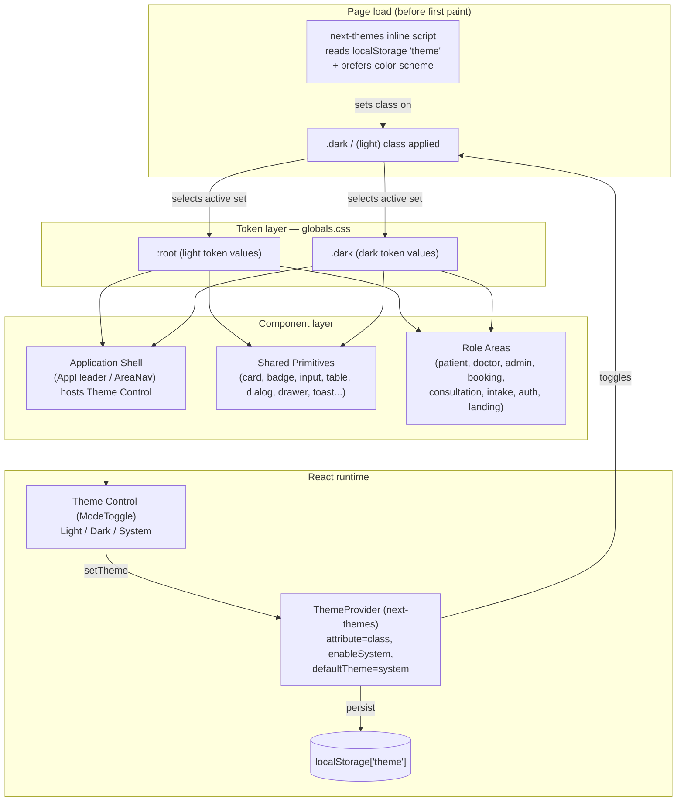

# Design Document

## Overview

This feature finishes the half-built theming system in the BayanHealth frontend (`frontend/bayan-health-mvp`, Next.js 16 App Router, Tailwind v4, `next-themes` 0.4) so that every surface renders legibly in both light and dark, components consume semantic tokens instead of hardcoded colors, the dark palette is corrected, and an in-app Theme Control lets users pick Light / Dark / System with persistence and no flash of incorrect theme.

The work is **presentation-only**. No backend, API contract, routing, or route-guard code changes (Requirement 7). The change is concentrated in four places:

1. **`globals.css`** — correct the broken dark `secondary` token (and verify every background/foreground pair meets contrast) while keeping the existing Tailwind v4 `:root`/`.dark` structure.
2. **Components** — replace hardcoded light-only color utilities (`text-gray-900`, `bg-white`, `text-[#111]`, etc.) with semantic token utilities (`text-foreground`, `bg-card`, `text-muted-foreground`, …) across the heaviest-offender surfaces, every Role Area, and every Shared Primitive.
3. **Theme Control** — fix the existing `ModeToggle` (it currently hardcodes its own colors and is mounted nowhere) and mount it in the shared Application Shell so authenticated users can reach it.
4. **Provider/script wiring** — confirm the `next-themes` configuration already in `layout.tsx` delivers persistence and pre-paint theme resolution (no flash), and remove any residual "force light" workaround.

### Current-state findings (grounding research)

Read from the repository while preparing this design:

- **Provider is already correct.** `src/app/layout.tsx` wraps the app in `ThemeProvider` (`attribute="class"`, `defaultTheme="system"`, `enableSystem`, `disableTransitionOnChange`) and sets `suppressHydrationWarning` on `<html>`. `next-themes` already injects its pre-paint inline script and persists to `localStorage` under the `theme` key. So Requirement 5 (persistence + no flash) is largely **already satisfied by configuration** and mainly needs verification, not new infrastructure. No active "force light" override (e.g. `forcedTheme`) is present in `layout.tsx`.
- **The Theme Control is orphaned.** `src/components/blocks/ModeToggle.tsx` exists and calls `useTheme().setTheme`, but it is not rendered in any layout/shell, and it hardcodes its own colors (`bg-[#0f0f0f] dark:bg-[#f0f0ec] text-[#f5f5f0] dark:text-[#111]`). It must be mounted and re-skinned with tokens.
- **The dark `secondary` token is inverted.** In `.dark`, `--secondary: oklch(84.551% 0.00146 285.388)` (a near-white, L≈0.85) is paired with `--secondary-foreground: oklch(0.71 0.04 256.79)` (L≈0.71) — the "background" is *lighter* than its "foreground," so `bg-secondary`/`text-secondary` surfaces look inverted and have very low contrast. The light `:root` `secondary` (L≈0.39) vs `secondary-foreground` (L≈0.48) pair is *also* low-contrast and needs correction.
- **Hardcoded colors are widespread.** A scan of `src/**/*.tsx` confirms the requirements' premise: many components use `text-gray-900`, `bg-white`, `bg-gray-*`, `text-black`, and arbitrary hex (`bg-[#438e82]`, `text-[#00B14F]`, `bg-[#0f0f0f]`). The patient `Header`, `NavBar`, `AreaNav` (which leans on the broken `text-secondary`), intake forms, `BookingDoctorDetails`, `DoctorList`, the advertisement carousel, and the doctor dashboard are the heaviest offenders called out in Requirement 2.2.
- **`sonner` toasts already token-aware.** `src/components/ui/sonner.tsx` maps `--normal-bg`/`--normal-text`/`--normal-border` to `--popover`/`--popover-foreground`/`--border` and forwards `theme` from `useTheme()`. Once those tokens are correct, toasts follow (Requirement 6.3).
- **Tooling.** Vitest 2 + Testing Library environment (`jsdom`), `fast-check` 3 available, `npm run test`, `npm run build`, `npm run lint`. An existing render-smoke suite (`src/app/route-render-smoke.test.tsx`) mounts every role-area route and is the baseline Requirement 7.3 must keep green.

### Goals

- Every text/background pairing meets WCAG 2.1 AA contrast in both resolved themes (Req 1, 3, 6).
- All theme-dependent colors flow through semantic tokens; retained brand colors are documented (Req 2).
- The dark palette is internally consistent (no inverted `secondary`) (Req 3).
- A reachable, legible in-app Theme Control with Light/Dark/System (Req 4).
- Persistence across navigation/reload and no flash of incorrect theme (Req 5).
- Consistent theming across all Role Areas and Shared Primitives (Req 6).
- Zero functional regression; build and test suite stay green (Req 7).

### Non-goals

- No backend, API, routing, or route-guard changes.
- No redesign of layout, spacing, or component behavior — only color/theming concerns.
- No new theming library or new token architecture; the existing Tailwind v4 `:root`/`.dark` approach is retained.

## Architecture

Theming is a layered, top-down concern. The token layer is the single source of truth; components consume tokens; `next-themes` toggles which token set is live by adding/removing the `.dark` class on `<html>`.



### Key architectural decisions

1. **Token-first, no per-component theme logic.** Components never read the current theme to pick a color. They reference a semantic token (`bg-card`, `text-foreground`, …) and the `.dark` class on `<html>` decides the value. This keeps the migration mechanical and the result maintainable (Req 2).
2. **Keep `next-themes` as the resolution + persistence + no-flash engine.** Its inline script runs before first paint and applies the correct class, which is exactly Requirement 5.4/5.6. We do not reimplement persistence or a custom no-flash script.
3. **Single Theme Control mounted in the shared shell.** Rather than scatter toggles, mount one `ModeToggle` in the Application Shell (header/nav) so it is reachable from every authenticated route (Req 4.1).
4. **Correct tokens at the source, not at call sites.** The inverted `secondary` is fixed once in `globals.css`; every `bg-secondary`/`text-secondary` consumer is fixed automatically (Req 3).
5. **Brand colors are explicit and few.** The BayanHealth teal is the one intentional theme-independent brand color; everything else theme-dependent migrates to tokens. Stray hardcoded hexes that are *not* brand colors (e.g. `#00B14F`, `#438e82`) are migrated to tokens or to the canonical brand teal, not preserved (Req 2.4, 2.5).

### Theme resolution flow (runtime change)

```mermaid
sequenceDiagram
    participant U as User
    participant TC as Theme Control
    participant NT as next-themes
    participant LS as localStorage
    participant DOM as <html> class
    participant OS as OS color-scheme

    U->>TC: open control, pick Light/Dark/System
    TC->>NT: setTheme(preference)
    NT->>LS: persist preference
    NT->>DOM: add/remove .dark (resolved theme)
    Note over DOM: CSS variable set swaps;<br/>surfaces re-render < 1s, no reload
    OS-->>NT: prefers-color-scheme change (when preference = system)
    NT->>DOM: update .dark to match new system theme
```

## Components and Interfaces

### 1. Token layer — `src/app/globals.css`

The single source of truth. Retains the existing Tailwind v4 structure (`@theme inline` maps `--color-*` to `--*`; `:root` holds light values; `.dark` holds dark values).

Changes:

- **Correct dark `secondary`** so its perceived lightness is lower than `secondary-foreground` and the pair meets ≥ 4.5:1 (Req 3.1, 3.3). Target: a dark surface (e.g. an L≈0.27 chroma-matched blue-gray consistent with `--muted`/`--card`) paired with the existing light `secondary-foreground` family.
- **Correct light `secondary`/`secondary-foreground`** so the pair also meets ≥ 4.5:1 (the current L≈0.39 vs L≈0.48 pair is too close) (Req 3.2).
- **Verify and, where needed, adjust** every background/foreground pair (`background`/`foreground`, `card`/`card-foreground`, `popover`/`popover-foreground`, `muted`/`muted-foreground`, `secondary`/`secondary-foreground`, `primary`/`primary-foreground`, `accent`/`accent-foreground`) to ≥ 4.5:1 in both themes (Req 3.2, 3.4).
- **Keep `--primary` brand teal** as the documented brand color (see Data Models → Brand Color Registry).

No tokens are added or removed; only values change. The `@theme inline`/`@custom-variant dark` machinery is untouched (Req 7.6).

### 2. Provider wiring — `src/app/layout.tsx` and `src/components/theme-provider.tsx`

Already correct; treated as **verify-and-preserve**:

- `ThemeProvider` props: `attribute="class"`, `defaultTheme="system"`, `enableSystem`, `disableTransitionOnChange`.
- `<html suppressHydrationWarning>` is required so the pre-paint class injection does not trip hydration warnings.
- Confirm no `forcedTheme` / "force light" workaround remains anywhere in the tree (Req 7.7).

No interface change. If a stray force-light wrapper is found during implementation, it is removed.

### 3. Theme Control — `src/components/blocks/ModeToggle.tsx`

Existing component; two fixes:

- **Re-skin with tokens.** Replace `bg-[#0f0f0f] dark:bg-[#f0f0ec] text-[#f5f5f0] dark:text-[#111]` and `border-black/10 dark:border-white/10` with token-based utilities (e.g. `bg-secondary text-secondary-foreground border-border`, using the `outline` button variant) so the trigger and menu are legible in both themes at the Contrast Standard (Req 4.6).
- **Keep behavior.** Continues to use `useTheme().setTheme` with exactly three options mapping 1:1 to `light` / `dark` / `system` (Req 4.2). The existing `mounted` guard (render nothing until mounted) is preserved to avoid SSR/hydration mismatch.

Interface (unchanged):

```ts
// ModeToggle: no props; reads/writes theme via next-themes useTheme()
export default function ModeToggle(): JSX.Element | null;
// Renders a DropdownMenu with items: Light -> setTheme('light'),
// Dark -> setTheme('dark'), System -> setTheme('system').
```

### 4. Application Shell — mount point for the Theme Control

The Theme Control must be reachable on authenticated routes (Req 4.1). The shared shell surfaces are `src/components/blocks/header/header.tsx` (`AppHeader`) and `src/components/blocks/navigation/AreaNav.tsx`. Decision: mount `<ModeToggle />` in `AppHeader` (rendered across areas), so a single instance covers all authenticated Role Areas. `AppHeader` itself is migrated off its hardcoded `border-white/10` / `dark:bg-gray-900/10` to token utilities (`border-border bg-background/80`).

### 5. Component migration set (token adoption)

Each component below is migrated from Hardcoded Colors to Semantic Tokens for theme-dependent foreground/background colors. Behavior, layout, and spacing are untouched.

| Mapping intent | Hardcoded (before) | Semantic token (after) |
|---|---|---|
| Page/app background | `bg-white`, `bg-[#f0f0ec]` | `bg-background` |
| Primary body text | `text-gray-900`, `text-black`, `text-[#111]` | `text-foreground` |
| Secondary/muted text | `text-gray-500/60`, `text-gray-400`, `text-gray-800/80` | `text-muted-foreground` |
| Panels / cards | `bg-white`, `bg-gray-50` | `bg-card text-card-foreground` |
| Muted surfaces | `bg-gray-100`, `bg-gray-900/20` | `bg-muted text-muted-foreground` |
| Borders/dividers | `border-gray-200`, `border-white/10` | `border-border` |
| Inputs | `bg-white`, `placeholder-gray-400` | `bg-input` / `bg-background`, `placeholder:text-muted-foreground` |
| Badges (status) | `bg-blue-100 text-blue-700` etc. | `bg-secondary text-secondary-foreground` / `bg-muted text-muted-foreground` (semantic intent) |
| Focus ring | `focus:ring-[#00B14F]/20` | `focus-visible:ring-ring` |
| Brand-teal accents | `bg-[#438e82]`, `text-[#00B14F]` | `bg-primary text-primary-foreground` (canonical brand teal) |

**Requirement 2.2 heaviest-offender surfaces** (explicit targets): intake forms (`CheckupSection`, `PersonDataSection`, `Teleconsult`, `AdditionalInfoSection`, `ServiceRequestSection`), `BookingDoctorDetails`, `DoctorList`, patient `Header` and `NavBar`, the advertisement carousel (`AdvertisementCarousel`), and the doctor dashboard.

**Requirement 6 coverage** — every Role Area (`patient`, `doctor`, `admin`, `booking`, `consultation`, `intake`, `auth`, `landing`) and every Shared Primitive in `src/components/ui/` (cards, badges, inputs, tables, dialogs, drawers, `empty`, `skeleton`/`spinner` loading states, error/alert states, `sonner` toasts) are audited and migrated. Shared Primitives generated by shadcn already use tokens for the most part; the audit fixes the exceptions found in the scan (e.g. `slider.tsx` `bg-white`, `sidebar.tsx` `bg-white`, `drawer.tsx` `bg-gray-900/40`).

### 6. `sonner` toasts — `src/components/ui/sonner.tsx`

No code change needed beyond confirmation: it already maps to `--popover`/`--popover-foreground`/`--border` and forwards `theme`. Once `popover` tokens are verified to meet contrast (Req 3.2), toast legibility (Req 6.3) follows. Replace the stray `text-black` in `ToastForTesting.tsx` with a token.

## Data Models

This is a presentation feature; "data" here means theme state and the token/brand inventory, not persisted domain entities.

### Theme Preference (persisted by `next-themes`)

| Field | Storage | Values | Notes |
|---|---|---|---|
| `theme` | `localStorage['theme']` | `"light"` \| `"dark"` \| `"system"` | The user's selected Theme Preference (Req 5.1). Managed entirely by `next-themes`; we do not read/write this key directly. |
| resolved theme | in-memory (`useTheme().resolvedTheme`) | `"light"` \| `"dark"` | Concrete appearance after resolving `system` against `prefers-color-scheme`. Applied as the `.dark` class (or its absence) on `<html>`. |

Fallback behavior (Req 5.6, 5.7): when no preference exists, `next-themes` resolves from `system`; when `localStorage` is unavailable, `next-themes` resolves from the System Theme for the session and renders without throwing.

### Semantic Token pairs (verified for contrast)

Background/foreground pairs that MUST meet ≥ 4.5:1 in both `:root` (light) and `.dark` (Req 3.2, 3.4):

| Token pair | Light source | Dark source |
|---|---|---|
| `background` / `foreground` | `:root` | `.dark` |
| `card` / `card-foreground` | `:root` | `.dark` |
| `popover` / `popover-foreground` | `:root` | `.dark` |
| `muted` / `muted-foreground` | `:root` | `.dark` |
| `secondary` / `secondary-foreground` | `:root` (corrected) | `.dark` (corrected) |
| `primary` / `primary-foreground` | `:root` | `.dark` |
| `accent` / `accent-foreground` | `:root` | `.dark` |

For `secondary` in `.dark`, the additional invariant (Req 3.1, 3.3): perceived lightness of `secondary` < perceived lightness of `secondary-foreground`.

### Brand Color Registry (Requirement 2.4 — required documentation)

Theme-independent colors intentionally retained, with exact values and rationale:

| Brand color | Exact value | Where used | Why exempt from token mapping | Contrast obligation |
|---|---|---|---|---|
| BayanHealth primary teal | `#09a68d` (light `--primary`); dark `--primary` resolves to `oklch(0.53 0.09 175.87)` | Primary buttons, active nav, brand accents, logo lockup accents | Core brand identity color; recognizability must be stable across themes. Exposed *through* the `--primary` token so its paired `--primary-foreground` keeps text legible, but the hue is intentionally fixed rather than remapped per theme. | Must remain legible against its background in both themes at the Contrast Standard (Req 2.3); paired with `--primary-foreground` ≥ 4.5:1. |
| Logotype / brand wordmark colors | as defined in `src/components/primitives/Logo/*` | App logo only | Logotypes are exempt from contrast requirements (Req 1.2) and are brand assets. | Exempt (logotype). |

Colors that look like brand hexes but are **not** in this registry — e.g. `#438e82`, `#00B14F`, `#0f0f0f`, `#f0f0ec` — are treated as accidental hardcodes and migrated to tokens or to the canonical teal (`--primary`). They are **not** retained (Req 2.5).

## Error Handling

Theming is resilient and degrades gracefully; there are no thrown-error paths introduced.

| Condition | Handling | Requirement |
|---|---|---|
| `localStorage` unavailable / unreadable / unwritable | `next-themes` falls back to resolving from the System Theme for the session and continues rendering without an unhandled error. No try/catch needed in app code — this is `next-themes` behavior we rely on and verify. | 5.7 |
| No persisted preference on first load | Resolve from System Theme (`defaultTheme="system"` + `enableSystem`) and apply before first paint. | 5.6, 5.4 |
| SSR/CSR hydration mismatch for theme-dependent UI | `<html suppressHydrationWarning>` plus the `mounted` guard in `ModeToggle` (render nothing until mounted) prevent mismatch warnings and a flash. | 5.4 |
| System theme changes while preference = `system` | `next-themes` listens to `prefers-color-scheme` and updates the resolved theme within ~1s without reload. | 4.5, 5.5 |
| A surface still shows a non-token background after migration | Caught by the static color-scan test (Req 2.5) and the contrast audit; treated as a defect to fix before completion. | 2.5, 7.5 |

No PHI, tokens, or sensitive data are involved in theming; nothing is logged.

## Testing Strategy

The strategy is **deterministic and dual**: exhaustive/automated checks for the computable invariants, plus component and integration tests for behavior, plus the existing baseline suite for non-regression.

### Why no property-based tests

This feature is **not** a candidate for property-based testing. The work is **UI rendering** (component color utilities), **CSS/configuration validation** (the `globals.css` token palette), and **theme-library integration** (`next-themes` persistence and pre-paint resolution) — categories PBT explicitly excludes. The one genuinely *computable* aspect, WCAG contrast between semantic token pairs, is defined over a **fixed, finite, enumerable set** of pairs across exactly two themes; running 100 randomized iterations adds nothing over deterministically enumerating every pair, so it is verified by an **exhaustive table-driven test** (stronger than random sampling here). "No hardcoded colors on the in-scope surfaces" (Req 2.5) is a **static-scan / lint-style** one-shot check, not an input-varying property. The deterministic checks below replace property-based tests.

### 1. Contrast audit (exhaustive, deterministic) — Requirements 1, 3, 6

A single Vitest test that:

- Parses the semantic token values from `globals.css` for both `:root` and `.dark`.
- Converts each `oklch(...)` / hex value to sRGB and computes WCAG relative luminance and contrast ratio (a small, well-known formula implemented in a test helper, e.g. `src/lib/contrast.ts` + tests).
- Asserts, for **every** background/foreground pair in the Data Models table, in **both** themes, contrast ≥ 4.5:1 (Req 3.2, 3.4).
- Asserts the dark `secondary` lightness < `secondary-foreground` lightness (Req 3.1, 3.3).

Because the token set is fixed and finite, the test enumerates all pairs (`it.each`) rather than sampling. The contrast helper itself gets a few unit tests (symmetry `contrast(a,b)===contrast(b,a)`, `contrast(c,c)===1`, range `[1,21]`, and a couple of known reference pairs such as black/white = 21:1).

### 2. Hardcoded-color static scan — Requirements 2.1, 2.5

A Vitest test that scans the in-scope source files (the Req 2.2 offender surfaces, every Role Area under `src/app/**` and `src/features/**`, and `src/components/ui/**`) for theme-dependent Hardcoded Color utilities (`text-gray-*`, `bg-white`, `bg-gray-*`, `text-black`, `text-[#...]`, `bg-[#...]`). The test passes only when the sole remaining matches are entries in an allowlist derived from the Brand Color Registry (the canonical teal / logotype). Any other match fails with the file and line, driving the migration to completion.

### 3. Theme Control behavior — Requirement 4

Testing-Library component tests (jsdom) rendering `ModeToggle` inside a `ThemeProvider`:

- The control renders a visible, activatable trigger (Req 4.1) and, when opened, presents exactly three options mapping 1:1 to Light/Dark/System (Req 4.2).
- Selecting an option calls `setTheme` with the expected value and updates `resolvedTheme` / the `<html>` class without a reload (Req 4.3, 4.4, 6.5).
- A test driving `setTheme('system')` with a mocked `matchMedia` dark/light result asserts the resolved theme matches `prefers-color-scheme` (Req 4.4) and updates when the mocked media query changes (Req 4.5, 5.5).

### 4. Persistence & no-flash — Requirement 5

- Unit test asserting selecting a preference writes `localStorage['theme']` via `next-themes` and that a remount reads it back and applies the corresponding class (Req 5.1, 5.2, 5.3).
- Test asserting that with `localStorage` access throwing (stubbed), rendering still succeeds and resolves from the (mocked) System Theme (Req 5.7).
- No-flash (Req 5.4) is primarily guaranteed by the `next-themes` inline script (a configuration guarantee); it is verified by asserting the provider config in `layout.tsx` (`attribute="class"`, `enableSystem`, `suppressHydrationWarning`) and documented for manual visual confirmation, since a true first-paint flash is not observable in jsdom.

### 5. Mounted-shell smoke — Requirements 4.1, 6.1

Extend / mirror the existing `route-render-smoke.test.tsx` pattern to assert the Application Shell renders the Theme Control trigger on an authenticated route, and that role-area routes still render as populated, non-blank layouts after migration.

### 6. Non-regression & scope boundary — Requirement 7

- `npm run test` (Vitest) MUST report every previously-passing test as passing, with zero new failures attributable to this feature (Req 7.3). The existing property/unit/render-smoke suites are the baseline.
- `npm run build` (Next.js) MUST complete with zero errors and the same deployable artifacts (Req 7.4).
- `npm run lint` MUST pass.
- Manual confirmation that non-theming flows (navigation, form submission, auth, data fetching) behave identically (Req 7.1, 7.2), and that no "force light" workaround remains and both themes are selectable (Req 7.7).
- Any failure introduced by this feature is corrected before completion (Req 7.5).

### Test tooling

- **Framework:** Vitest 2 + jsdom + Testing Library (already configured in `vitest.config.ts`).
- **Color math:** a small in-repo contrast helper (no new runtime dependency); `next-themes` mocked or driven via real provider with stubbed `matchMedia`/`localStorage` as needed.
- Tests live alongside existing suites under `src/` following the `*.test.ts(x)` convention.
