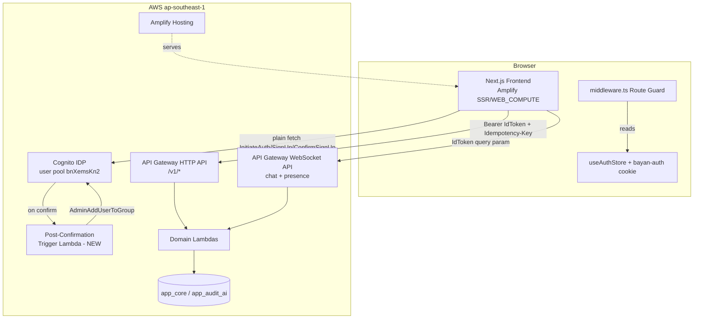
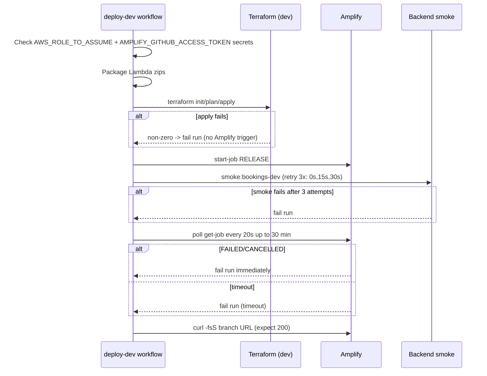
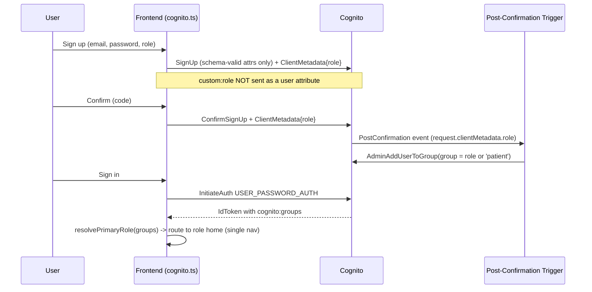

# Design Document

## Overview

This design makes the BayanHealth **dev** environment demo-ready: a stakeholder opens the dev Amplify URL, signs in once, and freely explores every patient, doctor, and admin area without hitting crashes or redirect loops. The work is the frontend half of the project ("Slice 10"), broken into ten incremental slices (0–9) that each leave the dev link shippable and strictly better, while the already-deployed backend (10 V1 slices) is treated as a fixed, non-regressable dependency.

The design is grounded in the existing codebase rather than greenfield:

- **Frontend** — Next.js (App Router) in `frontend/bayan-health-mvp/`, hosted on AWS Amplify. Auth is a plain-`fetch` Cognito wrapper (`src/lib/cognito.ts`, no Amplify SDK), a Zustand store with `persist` (`src/stores/useAuthStore.ts`) that mirrors a minimal `bayan-auth` cookie, a Next.js `middleware.ts` route guard, and a lightweight API client (`src/lib/api.ts`) that attaches the Cognito IdToken as a Bearer token and a UUID v4 `Idempotency-Key` on writes.
- **Backend** — API Gateway HTTP + WebSocket APIs over TypeScript Lambdas, contract-frozen in `contracts/openapi.yaml` (`/v1/` routes, `{data, meta}` success envelope, `{error}` error envelope). No backend route or envelope changes are permitted (Requirement 15).
- **Infrastructure** — Terraform under `infra/environments/dev/` with reusable modules (`infra/modules/cognito`, `amplify_hosting`, `http_api`, `data_stores`, `notifications`), all in `ap-southeast-1`. The only new server-side resource is a Cognito **Post-Confirmation Lambda trigger** (Requirement 4), plus seeded demo/role accounts (Requirement 5).
- **Pipeline** — the `deploy-dev` GitHub Actions workflow packages Lambdas, runs Terraform, triggers the Amplify build, runs the backend smoke test, and curls the Amplify URL.

The defining milestone is **Slice 2**: every role route renders (mock data acceptable), in-app navigation and sign-out exist, and one seeded demo account belongs to all role groups. Slices 0–1 make the deploy reliable and fix the auth role path; Slices 3–9 replace mock data with real backend wiring one flow at a time.

### Root-cause summary (what is actually broken today)

Three concrete defects, confirmed by reading the code, drive Slices 0–1:

1. **Sign-up schema-attribute error (Requirement 3).** `src/lib/cognito.ts#signUp` sends `UserAttributes: [{ Name: "custom:role", Value: role }]`, but `infra/modules/cognito/main.tf` defines **no** `custom:role` schema attribute. Cognito rejects the registration with a schema-attribute mismatch, so sign-up fails.
2. **Redirect loop for confirmed users (Requirement 4).** There is no Post-Confirmation trigger, so confirmed users land in **no Cognito group**. `cognito:groups` is empty → `useAuthStore` derives `roles: []` → `middleware.ts` cannot match any role prefix and falls back to `session.roles[0]` (`undefined`) → `/signIn`, which re-authenticates and loops.
3. **Admin area does not exist (Requirements 6, 7).** `src/app/` has `patient/`, `doctor/`, and `booking/` route trees but **no `admin/`** tree; the landing page (`src/app/page.tsx`) is a developer "Links" list, not a product entry point.

### Goals

- Reliable, idempotent dev deploy and a green pipeline that guarantees a usable Amplify URL.
- A correct auth role path: sign-up succeeds, confirmation assigns a group, sign-in resolves a role and routes once with zero `/signIn` bounces.
- Full render coverage across patient, doctor, and admin areas with defined loading / empty / error states.
- Progressive, one-flow-at-a-time replacement of mock data with real backend calls.
- Zero backend behavior regression.

### Non-Goals

- Changing any backend `/v1/` route, request field, or envelope.
- Building net-new backend endpoints (patient-home and doctor-metrics views are **composed from existing endpoints**, see Components).
- Production hardening beyond what the demo needs (no new WAF rules, no custom domain).

## Architecture

### System context



### Deployment / pipeline flow (Slice 0, Requirement 16)



### Auth role path (Slices 1–2, Requirements 3–5, 17)



### Architectural decisions

| Decision | Choice | Rationale |
|---|---|---|
| Convey sign-up role to the trigger | **Remove `custom:role` from registration attributes; pass role via Cognito `ClientMetadata` on `SignUp` and `ConfirmSignUp`** (Requirement 3.3 branch) | Fixes the immediate schema-attribute error with zero user-pool schema migration. `ClientMetadata` on `ConfirmSignUp` is delivered to the Post-Confirmation trigger as `event.request.clientMetadata`. Avoids Cognito's inability to enforce an enum on a custom string attribute. |
| Group assignment mechanism | Post-Confirmation Lambda calls `AdminAddUserToGroup` | Standard Cognito pattern; keeps role→group authoritative server-side, independent of client claims. |
| No-role destination | Add a defined `/no-access` (or sign-out-with-message) route; middleware routes role-less authenticated users there instead of `/signIn` | Breaks the redirect loop (Requirement 4.6) without weakening guards. |
| Patient-home / doctor-metrics data | Compose from existing endpoints (bookings list, intake-queue, payouts) | Requirement 15 forbids new backend routes; Requirement 14 only requires "request from Backend_API", not a dedicated endpoint. |
| Seeded accounts | Terraform-managed `aws_cognito_user` + `aws_cognito_user_in_group`, with a permanent-password + confirm step and a post-apply verification check | Requirement 5 wants provisioned, confirmed accounts and provisioning verification; ADR-20260514-03 mandates Terraform for long-lived resources. |
| Data fetching state machine | Every data-backed view implements explicit `loading → (data | empty | error)` states with a 10s timeout | Satisfies Requirements 7, 9, 10, 13, 14 uniformly. |

## Components and Interfaces

### 1. Deploy reliability & configuration (Slice 0)

- **`.gitignore`** — add `infra/environments/**/.terraform.tfstate.lock.info`, `tfplan`, `tfplan-s34` (and sibling stale plan files) so stale local artifacts cannot block a fresh apply (Requirement 1.1).
- **`infra/environments/dev/main.tf` import blocks** — audit each `import {}` against live AWS. Any block whose `id` references a non-existent resource (e.g., a PayRex SNS topic / log group that was never created in dev) is removed or corrected so `terraform plan` resolves imports with exit 0 (Requirement 1.4). After reconciliation, a second `plan` must report 0/0/0 (Requirement 1.5).
- **`.env.example`** — currently missing `NEXT_PUBLIC_COGNITO_USER_POOL_ID`. Add it with a non-empty placeholder so all four `NEXT_PUBLIC_*` variables are listed (Requirement 2.1).
- **`amplify.yml` preBuild guard** — add a step that fails the build *before* `npm run build` if any of the four `NEXT_PUBLIC_*` variables is empty, emitting the name of each missing/empty variable (Requirement 2.3). The four variables are already written to `.env.production`; the guard validates them.
- **`deploy-dev.yml` smoke gate** — the current retry loop `for i in 1 2 3; do ... && break; done` does not fail the run when all attempts fail. Change to capture success and exit non-zero after 3 failed attempts with a smoke-failure message (Requirements 16.2, 16.3). Wait windows (15s, 30s) and the Amplify poll/timeout/URL-check steps already match Requirement 16.4–16.7.

### 2. Cognito role resolution & Post-Confirmation trigger (Slice 1)

**`src/lib/cognito.ts` changes**

```ts
// signUp: drop custom:role from UserAttributes; pass role via ClientMetadata
export async function signUp(email, password, role: "patient" | "doctor") {
  await post("SignUp", {
    ClientId: CLIENT_ID,
    Username: email,
    Password: password,
    UserAttributes: [{ Name: "email", Value: email }], // schema-defined attrs only
    ClientMetadata: { role },
  });
}

// confirmSignUp: forward role so PostConfirmation can read it
export async function confirmSignUp(email, code, role: "patient" | "doctor") {
  await post("ConfirmSignUp", {
    ClientId: CLIENT_ID, Username: email, ConfirmationCode: code,
    ClientMetadata: { role },
  });
}
```

The confirm page (`src/app/(auth)/confirm/page.tsx`) reads `role` from the persisted `useSignUpStore` and passes it to `confirmSignUp`.

**New pure helper `resolvePrimaryRole(groups: string[]): AppRole | null`** — extracted/aligned with the existing `useAuthStore.primaryRole()` precedence. Precedence order required by Requirement 4.5 is **moderator → admin → doctor → patient**. (Note: the current `ROLE_PRIORITY` in `useAuthStore.ts` is `admin, moderator, doctor, patient`; this design corrects it to match the requirement.) Empty/absent groups → `null`.

**Post-Confirmation trigger** — new TypeScript Lambda `backend/src/handlers/post-confirmation.ts`, Node.js 24.x, in `ap-southeast-1`, provisioned through Terraform in the `cognito` module (Requirement 4.4).

```ts
// role -> group mapping; default patient (Req 4.2)
const ROLE_TO_GROUP = { patient: "patient", doctor: "doctor" } as const;
export const handler = async (event: PostConfirmationTriggerEvent) => {
  const requested = event.request.clientMetadata?.role;
  const group = requested === "doctor" ? "doctor" : "patient";
  await withRetry(() => cognito.adminAddUserToGroup({
    UserPoolId: event.userPoolId, Username: event.userName, GroupName: group,
  }), { attempts: 3 }); // Req 4.3
  return event;
};
```

Retries up to 3 total attempts; on exhaustion it throws so Cognito surfaces the failure rather than leaving the user partially assigned (Requirement 4.3).

**`middleware.ts` no-role fix** — when an authenticated session has an empty `roles` array, route to the defined no-role destination instead of computing `roles[0] → /signIn` (Requirement 4.6). The guard's role-area matching is otherwise preserved.

### 3. Seeded demo & role accounts (Slices 1–2)

A new Terraform sub-configuration (e.g., `infra/modules/cognito/seed.tf` or a `demo_seed` module gated to `var.environment == "dev"`):

- One **Demo_Account** in the `patient`, `doctor`, and `admin` groups (Requirement 5.1).
- At least one **Role_Account** per role `patient`/`doctor`/`admin` (Requirement 5.4), including the smoke-test users `testpatient@example.com` (patient) and `testdoctor@example.com` (doctor) (Requirement 2.6).
- Each user created with `aws_cognito_user` (message_action SUPPRESS) + a `null_resource`/local-exec setting a **permanent** password and confirming, then `aws_cognito_user_in_group` attachments.
- A **provisioning verification** local-exec (or pipeline step) that asserts each required account exists, is `CONFIRMED`, and has its required groups; on any miss it exits non-zero identifying the account, leaving no partially seeded account active (Requirement 5.6).

### 4. Landing page, navigation, and sign-out (Slice 2)

- **`src/app/page.tsx`** — replace the developer "Links" list with a real product entry page. No user-facing control links to a "Links" page (Requirement 6.1). Unauthenticated render within 3s (Requirement 6.7).
- **Navigation component** (extend `features/patient/components/NavBar.tsx` / `doctor` header / a shared app shell) — render links only for areas permitted by the current session's roles, computed by a pure `permittedAreas(roles)` function (Requirements 6.2, 6.3).
- **Sign-out control** — calls `useAuthStore.clearSession()` (clears persisted store + deletes `bayan-auth` cookie) and routes to `/signIn` within 2s (Requirements 6.4, 6.5). On failure, show an error and retain the session (Requirement 6.6).

### 5. Render coverage & data-state contract (Slice 2, Requirement 7)

A shared **`AsyncView`** wrapper (or a `useAsyncResource` hook) standardizes the four states for every data-backed region:

```
loading  -> defined loading state until resolve or 10s timeout
data      -> populated content
empty     -> defined empty state when 0 records
error     -> defined error state (layout + nav stay interactive) on error or 10s timeout
```

Routes without a connected backend render fully populated **mock/placeholder** data (no undefined/null/empty-template values) (Requirement 7.2). The **Admin area is created** with user-management, platform-settings, and KYC-supervision pages, each reachable from admin navigation (Requirements 6, 7.6).

### 6. Backend-wired flows (Slices 3–9)

All calls go through `src/lib/api.ts` (`api.get/post/put/delete`), which already attaches `Authorization: Bearer <idToken>` and a UUID v4 `Idempotency-Key` on writes, and parses the `{data, meta}` / `{error}` envelopes into `ApiResponse<T>` / `ApiError`.

| Slice | View | Endpoint(s) (existing contract) |
|---|---|---|
| 3 | Patient booking create | `POST /v1/bookings` (Idempotency-Key, reuse on retry) |
| 3 | Doctor intake queue | `GET /v1/doctors/me/intake-queue`; accept via `POST /v1/doctors/me/intake-queue/{bookingId}/process` (confirm action) |
| 4 | Doctor search | doctor list + `GET /v1/doctors/{doctorId}/schedules` (no bundled mock source) |
| 5 | Patient bookings list/detail | `GET /v1/bookings` (cursor in `meta`), `GET /v1/bookings/{bookingId}` |
| 6 | Consultation session + chat | `POST /v1/otl/{token}/activate`; WebSocket with IdToken query token; HTTP fallback `GET/POST /v1/bookings/{bookingId}/messages` |
| 7 | Post-consultation docs/media/CDS | `POST/GET /v1/consultations/{consultationId}/documents`, media upload-url/confirm, `GET /v1/cds/consultations/{consultationId}/drafts` |
| 8 | Admin panel | `GET /v1/admin/users`, `GET /v1/admin/settings`, `GET /v1/admin/kyc-applications` |
| 9 | Patient home / doctor metrics | Composed from `GET /v1/bookings`, `GET /v1/doctors/me/intake-queue`, `GET /v1/doctors/me/payouts` |

**Booking status display** — a pure `displayBookingStatus(status)` maps the lifecycle values `pending_payment, payment_submitted, confirmed, in_progress, completed, cancelled` to labels, with a defined fallback for unknown/missing values (Requirements 10.7, 10.8).

**Pagination** — a pure `hasNextPage(meta)` returns true iff `meta.pagination.cursor` is a non-empty string; the next-page control renders iff it returns true (Requirements 10.9, 10.10).

**Chat message validation** — a pure `validateChatMessage(text)` accepts 1–4096 characters and rejects empty / >4096 (Requirements 11.4, 11.5).

### 7. Backend non-regression guard (Requirement 15)

No backend handler, route, or envelope is modified. The only Terraform additions are the Post-Confirmation trigger and seed accounts; `terraform plan` must show no create/update/replace/destroy on existing deployed Lambdas (Requirement 15.4), and the smoke test must continue to pass 100%.

## Data Models

These are **frontend-side** models (the backend `app_core` single-table layout is unchanged). Types live under `src/types/` and `src/stores/`.

### Auth session (existing, `useAuthStore.ts`)

```ts
type AppRole = "patient" | "doctor" | "admin" | "moderator";
interface AuthSession {
  idToken: string; accessToken: string; refreshToken: string;
  email: string; userId: string;
  roles: AppRole[];        // derived from cognito:groups
  expiresAt: number;       // epoch ms
}
// bayan-auth cookie payload (server-readable, NO tokens):
// { state: { session: { roles: AppRole[], expiresAt: number } } }
```

### API envelopes (existing, `api.ts`)

```ts
interface ApiResponse<T> {
  data: T;
  meta: { requestId: string; timestamp?: string; pagination?: { cursor?: string } };
}
class ApiError { code: string; message: string; status: number }
```

### Booking lifecycle (Requirement 10.7)

```ts
type BookingStatus =
  | "pending_payment" | "payment_submitted" | "confirmed"
  | "in_progress" | "completed" | "cancelled";
// displayBookingStatus(s: string): { label: string; tone: string }  // fallback for unknown/missing
```

### Sign-up role conveyance (Requirement 3)

```ts
// Registration payload built by cognito.ts#signUp — only schema-defined attributes
interface RegistrationAttributes { email: string }      // custom:role intentionally excluded
interface SignUpClientMetadata { role: "patient" | "doctor" }
```

### Async resource state (Requirement 7)

```ts
type AsyncState<T> =
  | { status: "loading" }
  | { status: "data"; value: T }
  | { status: "empty" }
  | { status: "error"; code?: string; message: string };
```

### Post-Confirmation trigger event (Requirement 4)

```ts
interface PostConfirmationRole { role?: string }         // from event.request.clientMetadata
// mapRoleToGroup(role?: string): "patient" | "doctor"   // default "patient"
```

## Correctness Properties

*A property is a characteristic or behavior that should hold true across all valid executions of a system — essentially, a formal statement about what the system should do. Properties serve as the bridge between human-readable specifications and machine-verifiable correctness guarantees.*

This feature is mostly a frontend migration, IaC, deploy-pipeline reliability, and UI render coverage — the bulk of the acceptance criteria are best validated by example, integration, and smoke tests (see Testing Strategy). Property-based testing is reserved for the pure, input-varying logic the migration depends on: role resolution, the route-guard decision, the async-view state machine, idempotency-key handling, status/pagination/message helpers, navigation gating, the trigger's role mapping, and the build-time env-var guard. The properties below were derived from the prework analysis and consolidated to remove redundancy.

### Property 1: Primary role resolution follows precedence

*For any* array of Cognito group strings, `resolvePrimaryRole(groups)` returns the highest-precedence role present using the order moderator > admin > doctor > patient, and returns `null` when the array contains none of the four roles (including the empty array).

**Validates: Requirements 4.5, 4.6**

### Property 2: Post-confirmation role-to-group mapping defaults to patient

*For any* string or absent value supplied as the requested role, `mapRoleToGroup(role)` returns `"doctor"` if and only if the value is exactly `"doctor"`, and otherwise returns `"patient"`.

**Validates: Requirements 4.2**

### Property 3: Sign-up sends only schema-defined attributes

*For any* selected role (`patient` or `doctor`) and profile input, the registration attribute set built for the Cognito `SignUp` call contains only attribute names defined in the user-pool schema (i.e. `email`) and never includes `custom:role` or any attribute name not in the schema.

**Validates: Requirements 3.1**

### Property 4: Route-guard authorization is correct and loop-free

*For any* request path and stored session, the route-guard decision satisfies all of: (a) a public path is always allowed; (b) an absent or expired session on a protected path redirects to `/signIn`; (c) a valid session whose roles authorize the path's area is allowed with no redirect; (d) a valid session that lacks the required role for a protected area is redirected to an area the session's roles *do* permit, and never to `/signIn`; (e) a valid but role-less authenticated session is redirected to the defined no-role destination, never to `/signIn`. In all cases the decision is reached without producing a redirect back to the same protected path.

**Validates: Requirements 4.6, 4.7, 5.2, 5.3, 13.4, 17.1, 17.2, 17.3**

### Property 5: Navigation controls match the user's roles

*For any* set of roles held by an authenticated session, the set of navigation targets rendered equals `permittedAreas(roles)` — every permitted area is present and no non-permitted area is present.

**Validates: Requirements 6.2, 6.3**

### Property 6: Async view resolves to exactly one defined state

*For any* data-dependency outcome and elapsed time, the async-view reducer yields exactly one state: `loading` while the dependency is pending and elapsed time is below the 10s timeout; `data` when it resolves with one or more records; `empty` when it resolves with zero records; and `error` when it errors or when the 10s timeout elapses before resolution.

**Validates: Requirements 7.3, 7.4, 7.5, 8.4, 9.3, 9.4, 9.5, 10.2, 10.3, 10.6, 12.8, 13.5, 13.6, 14.3, 14.4, 14.5**

### Property 7: Writes carry a valid idempotency key, reused on retry

*For any* write request issued through the API client, the attached `Idempotency-Key` header is a syntactically valid UUID v4, and any automatic retry of the same logical request carries an `Idempotency-Key` identical to the original attempt.

**Validates: Requirements 8.1, 8.5, 12.1**

### Property 8: Booking status always renders a defined label

*For any* status value, `displayBookingStatus(value)` returns a defined, non-empty label: a specific label for each of the six lifecycle values (`pending_payment`, `payment_submitted`, `confirmed`, `in_progress`, `completed`, `cancelled`), and a defined fallback label for any other value or a missing value.

**Validates: Requirements 10.7, 10.8**

### Property 9: Next-page control is gated by cursor presence

*For any* response `meta`, `hasNextPage(meta)` returns `true` if and only if `meta.pagination.cursor` is a non-empty string; the next-page control is rendered exactly when this is `true`.

**Validates: Requirements 10.9, 10.10**

### Property 10: Chat message length validation

*For any* input string, `validateChatMessage(text)` accepts the message if and only if its length is between 1 and 4096 characters inclusive; empty messages and messages longer than 4096 characters are rejected.

**Validates: Requirements 11.4, 11.5**

### Property 11: Build env-var guard flags exactly the missing variables

*For any* assignment of the four `NEXT_PUBLIC_*` variables to present-or-empty, `validateEnv(env)` reports success if and only if all four are present and non-empty, and otherwise reports failure listing exactly the variables that are absent or empty.

**Validates: Requirements 2.3**

## Error Handling

### Frontend data fetching

- All backend calls go through `src/lib/api.ts`, which throws a typed `ApiError(code, message, status)` on any non-2xx, parsed from the `{ error: { code, message } }` envelope. UI surfaces map `ApiError.code`/`message` to a defined error state (Requirements 8.7, 10.x, 13.5, 14.5).
- Every data-backed region uses the AsyncView contract (Property 6): a 10s timeout converts a non-resolving dependency into the `error` state while keeping surrounding layout and navigation interactive (Requirement 7.4).
- `404` on booking detail maps to a dedicated not-found state that does not reveal whether the booking exists (Requirement 10.5). This is distinct from the generic error state.
- Write failures retain user-entered input and never crash the view (Requirements 8.7, 12.2).

### Auth & routing

- Sign-in/sign-up/confirm map `CognitoError` to user-readable messages (existing pattern in the auth pages).
- A role-less authenticated session is routed to the defined no-role destination rather than `/signIn`, eliminating the redirect loop (Requirement 4.6, Property 4).
- Sign-out failure surfaces an error and retains the session (Requirement 6.6).
- Session expiry detected by the guard redirects to `/signIn` with a session-ended indication (Requirement 17.3).

### Post-Confirmation trigger

- `AdminAddUserToGroup` is wrapped in a bounded retry (3 total attempts). On persistent failure the handler throws so the error is surfaced and the user is not left partially assigned (Requirement 4.3).
- An unrecognized/absent role maps to `patient` rather than failing (Requirement 4.2, Property 2).

### Real-time chat

- WebSocket connect failure or a 10s connect timeout triggers fallback to the HTTP chat endpoints, and the current conversation state is shown (Requirement 11.6).
- Oversized/empty messages are rejected client-side with the entered text retained and a length error shown (Requirements 11.5, Property 10).

### Media upload

- The presign → upload → confirm chain treats a failure at any step as a failure of the whole operation: an error is shown and the media is not marked uploaded (Requirement 12.6).

### Pipeline & infrastructure

- Missing CI secrets, empty `NEXT_PUBLIC_*` variables, Terraform apply failure, smoke failure after 3 attempts, Amplify `FAILED`/`CANCELLED`/timeout, and a non-200 Amplify URL each fail the run with a specific message (Requirements 2.3, 2.5, 16.2–16.7, Property 11).
- An active Terraform lock halts apply with the lock-holder identified and no remote-state mutation (Requirement 1.3).

## Testing Strategy

### Property-based testing (applicable to the pure logic layer)

PBT applies to this feature's pure, input-varying helpers (Properties 1–11). It does **not** apply to the Terraform/IaC, Amplify build, render coverage, or backend-behavior criteria — those use the alternative strategies below.

- **Library**: `fast-check` with the existing test runner in the frontend workspace (`frontend/bayan-health-mvp`). The Post-Confirmation trigger (Properties 2; trigger-side of others) and env guard are tested in the `backend`/CI tooling workspace with `fast-check` as well. Do not hand-roll generators or a PBT engine.
- **Iterations**: minimum 100 runs per property test (fast-check `numRuns: 100`).
- **Tagging**: each property test is tagged with a comment referencing the design property, in the format:
  `// Feature: demo-readiness-frontend, Property {number}: {property text}`
- **Mapping**: exactly one property-based test implements each of Properties 1–11.
  - P1 `resolvePrimaryRole` — generate arbitrary subsets/permutations of the four role strings plus noise strings.
  - P2 `mapRoleToGroup` — generate arbitrary strings + `undefined`.
  - P3 sign-up attribute builder — generate role ∈ {patient, doctor} and arbitrary profile objects; assert attribute-name set ⊆ schema set and excludes `custom:role`.
  - P4 route-guard decision — generate (roles subset, expiresAt relative to now, requested path from the route map); assert the five-part decision contract and absence of self-redirect.
  - P5 `permittedAreas` + nav render — generate role subsets; compare rendered nav targets to the function output.
  - P6 async-view reducer — generate (outcome ∈ pending/resolved-nonempty/resolved-empty/error, elapsedMs); assert single correct state.
  - P7 idempotency key — spy on `fetch`; generate arbitrary write payloads and retry counts; assert UUIDv4 format and identical key across retries.
  - P8 `displayBookingStatus` — generate arbitrary strings incl. the six lifecycle values and empty/undefined; assert non-empty label and correct fallback.
  - P9 `hasNextPage` — generate `meta` with arbitrary cursor (absent/empty/non-empty); assert iff non-empty.
  - P10 `validateChatMessage` — generate strings of varied length incl. 0, 1, 4096, 4097; assert acceptance iff 1..4096.
  - P11 `validateEnv` — generate the four vars each present/empty; assert exact missing list.

### Example-based unit tests

Used for concrete UI behaviors and error paths that are not universal: landing page render and absence of the Links control (6.1, 6.7), sign-out clear/route/failure (6.4–6.6), booking id+status render (8.2), intake-queue render and item removal (8.3, 8.6), write-error rendering with input retention (8.7, 12.2), 404 not-found mapping (10.5), OTL activation success/failure (11.1, 11.2), finalized-document and already-finalized behavior (12.3, 12.4), media upload-failure (12.6), CDS drafts render (12.7), admin pages render (13.1–13.3), patient-home/doctor-metrics render (14.1, 14.2), ClientMetadata role conveyance (3.3), trigger retry-then-fail (4.3), seed verifier missing-account failure (5.6), and pipeline branch examples (2.5, 15.3, 16.2, 16.3, 16.5, 16.6, 16.7).

### Render-smoke suite (Requirement 7, 17.4)

A test that mounts every route registered in the patient/doctor/admin navigation maps with a mock-backed provider and asserts each renders its primary layout without throwing and without a blank screen. This is the executable form of the Slice 2 render-coverage milestone.

### Integration tests

Used for external/transport behavior that does not vary meaningfully with input or cannot be exercised as a pure function: end-to-end signup→confirm→signin and group assignment (3.4, 4.1, 5.5), WebSocket connect and HTTP fallback (11.3, 11.6), media presign/upload/confirm chain (12.5), backend authorization 200/401/403 (15.5–15.7), backend smoke pass (15.2), and the full pipeline orchestration (16.1, 16.4). The backend smoke test (`npm run smoke:bookings-dev`) is the authority for non-regression.

### Smoke / configuration checks (single execution)

`.gitignore` patterns (1.1), `.env.example` completeness (2.1), secret-precedence step ordering (2.4), Terraform import resolution and 0/0/0 re-plan (1.4, 1.5), trigger Lambda runtime/region in plan (4.4), seed-account presence/status/groups (5.1, 5.4), contract stability and no-change-to-existing-Lambdas plan diff (15.1, 15.4), and region pinning (16.8).

### Backend non-regression gate

No backend handler, route, request field, or envelope is changed. CI runs `npm run typecheck`, `npm run lint`, and the dev smoke test; the deploy pipeline halts on any smoke failure and retains the previously deployed backend (Requirements 15.2, 15.3, 16.3).
