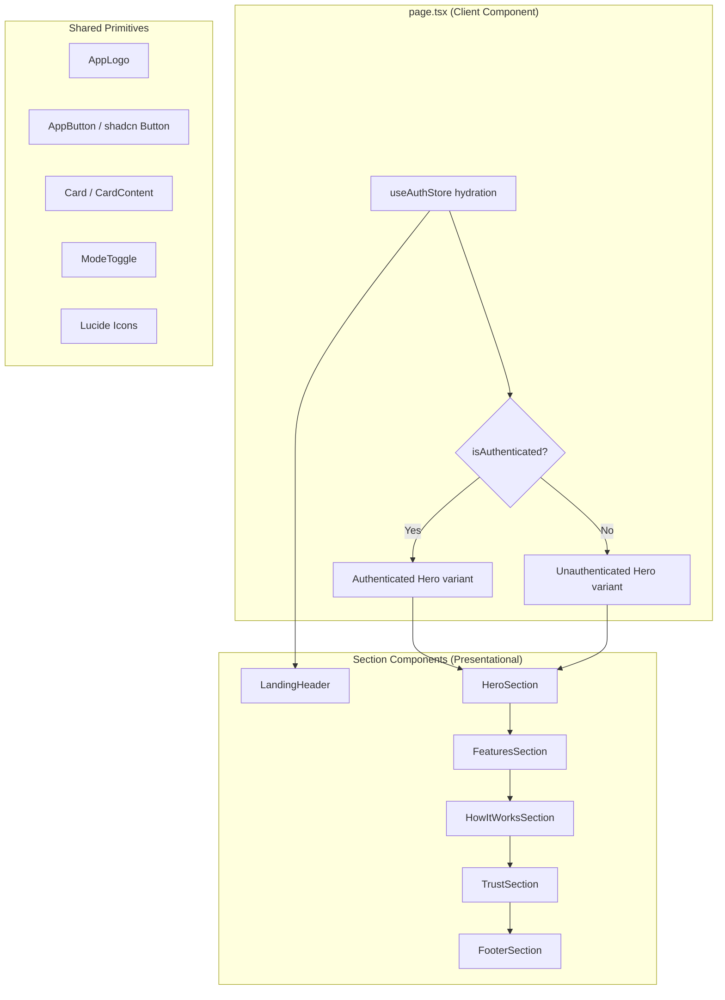

# Design Document: Landing Page Redesign

## Overview

This design covers the full redesign of the BayanHealth landing page (`/`) to implement a professional, responsive, and accessible layout with proper brand alignment. The redesign expands the current minimal page (Hero + Feature Cards) into a complete marketing landing page with six sections: Header, Hero, Features, How It Works, Trust & Security, and Footer.

The implementation stays entirely within the existing Next.js App Router + Tailwind CSS + shadcn/ui stack. All content is static and renders without backend API calls for unauthenticated visitors, preserving sub-2-second first contentful paint on fast 3G.

### Key Design Decisions

1. **Section-per-component architecture**: Each page section becomes a standalone React component under `src/components/blocks/landing/` for separation of concerns and testability.
2. **Semantic color tokens only**: All color usage references CSS custom properties (`--primary`, `--foreground`, etc.) via Tailwind utility classes (`text-primary`, `bg-muted`). No hex literals in component code.
3. **Responsive via Tailwind breakpoints**: Mobile-first approach using `sm:`, `lg:` prefixes mapping to the defined breakpoints (640px, 1024px).
4. **Client component at page level only**: Individual section components are pure presentational (props-driven). The page-level component handles auth state hydration and passes the appropriate view variant to children.
5. **Smooth-scroll navigation**: Desktop header nav links use `scroll-behavior: smooth` (already on `<body>`) with `id` anchors on section elements.

## Architecture



### Component Tree

```
page.tsx
├── LandingHeader (sticky, backdrop-blur)
│   ├── AppLogo (icon on mobile, withText on tablet+)
│   ├── NavLinks (desktop only: Features, How It Works)
│   ├── SignInLink (unauthenticated only)
│   └── ModeToggle
├── <main>
│   ├── HeroSection
│   │   ├── AppLogo (large, withText)
│   │   ├── Headline (h1)
│   │   ├── Subheadline (p)
│   │   └── CTAGroup (auth-variant-aware)
│   ├── FeaturesSection (id="features")
│   │   ├── SectionHeading (h2)
│   │   └── FeatureCard × 4
│   ├── HowItWorksSection (id="how-it-works")
│   │   ├── SectionHeading (h2)
│   │   └── StepCard × 3-4
│   └── TrustSection
│       ├── SectionHeading (h2)
│       └── TrustIndicator × 3-6
└── FooterSection
    ├── Logo + Tagline
    ├── SocialLinks (Messenger, Viber, WhatsApp)
    └── Copyright (dynamic year)
```

## Components and Interfaces

### LandingHeader

| Prop | Type | Description |
|------|------|-------------|
| `isAuthenticated` | `boolean` | Controls visibility of "Sign In" link |

Behavior:
- Fixed position, `z-50`, `backdrop-blur-sm`, bottom border
- Mobile: icon-only logo, no nav links
- Desktop (≥1024px): logo with text, "Features" and "How It Works" anchor links
- Right side: "Sign In" link (if unauthenticated) + ModeToggle

### HeroSection

| Prop | Type | Description |
|------|------|-------------|
| `variant` | `"authenticated" \| "unauthenticated"` | Determines CTA content |
| `displayName` | `string \| undefined` | User email/name for authenticated greeting |
| `roleLabel` | `string \| undefined` | User's primary role |
| `dashboardHref` | `string \| undefined` | Link to role-specific dashboard |

Behavior:
- Centered flexbox column layout
- Background: gradient mesh using `primary/10` and `secondary/10` (≤20% opacity)
- Logo at 180px (mobile) / 220px (desktop) width
- `h1` at `text-4xl` (mobile) / `text-5xl` (desktop), `font-bold`
- Subheadline in `text-muted-foreground`, `max-w-[36rem]`
- Unauthenticated: two CTA buttons (primary "Create an account", outlined "Sign in")
- Authenticated: greeting + role badge + single dashboard CTA

### FeaturesSection

| Prop | Type | Description |
|------|------|-------------|
| `features` | `FeatureItem[]` | Array of feature data (icon, title, description) |

```typescript
interface FeatureItem {
  icon: LucideIcon;
  title: string;       // max 40 chars
  description: string; // max 120 chars
}
```

Behavior:
- `id="features"` for anchor navigation
- Section heading: "What we offer", `text-2xl font-bold`
- Grid: 1 col (mobile) → 2 col (sm) → 4 col (lg)
- Cards use shadcn `Card`/`CardContent` with equal height (`h-full`)
- Icon container: rounded, `bg-primary/10`, 24×24px icon minimum
- Max width `72rem`, centered, `px-4` mobile / `px-8` tablet+

### HowItWorksSection

| Prop | Type | Description |
|------|------|-------------|
| `steps` | `StepItem[]` | Array of step data |

```typescript
interface StepItem {
  number: number;
  title: string;       // max 30 chars
  description: string; // max 120 chars
}
```

Behavior:
- `id="how-it-works"` for anchor navigation
- Section heading: "How it works", `text-2xl font-bold`
- Layout: vertical stack (mobile) → 2-col grid (sm) → horizontal row (lg)
- Step indicator: numbered circle with `bg-primary text-primary-foreground`
- Connector: horizontal dashed line between steps on desktop, vertical on mobile
- Max width `72rem`, centered

### TrustSection

| Prop | Type | Description |
|------|------|-------------|
| `indicators` | `TrustItem[]` | Array of trust indicator data |

```typescript
interface TrustItem {
  icon: LucideIcon;
  label: string; // max 80 chars
}
```

Behavior:
- Background uses `bg-secondary` or a dark blue accent via CSS custom property
- Layout: vertical stack (mobile) → horizontal row/grid (desktop)
- Each indicator: icon + descriptive label
- Max width `72rem`, centered

### FooterSection

No props (all content is static).

Behavior:
- Background: `bg-muted` token
- Mobile: vertically stacked, center-aligned
- Desktop: 3-column layout (branding | social | copyright)
- Logo: icon variant, 32px height minimum
- Social links: open in new tab with `rel="noopener noreferrer"`, `aria-label` per link
- Copyright: dynamic year via `new Date().getFullYear()`
- Tagline: ≤120 characters

## Data Models

This feature is entirely frontend and uses no persistent data models beyond the existing `AuthSession` from `useAuthStore`. All landing page content is statically defined.

### Static Content Constants

```typescript
// src/components/blocks/landing/content.ts

export const FEATURES: FeatureItem[] = [
  { icon: Stethoscope, title: "See a doctor online", description: "..." },
  { icon: CalendarCheck, title: "Manage your bookings", description: "..." },
  { icon: MessageSquareText, title: "Real-time consultations", description: "..." },
  { icon: ShieldCheck, title: "Private and secure", description: "..." },
];

export const STEPS: StepItem[] = [
  { number: 1, title: "Create your account", description: "..." },
  { number: 2, title: "Book a consultation", description: "..." },
  { number: 3, title: "Connect with a doctor", description: "..." },
  { number: 4, title: "Get your care summary", description: "..." },
];

export const TRUST_INDICATORS: TrustItem[] = [
  { icon: Lock, label: "End-to-end encryption for all consultations" },
  { icon: ShieldCheck, label: "Role-based access — only your doctor sees your data" },
  { icon: Server, label: "Data stored in secure, compliant cloud infrastructure" },
];
```

### Auth-Derived Props

The page component derives the hero variant from `useAuthStore`:

```typescript
const variant = showAuthed ? "authenticated" : "unauthenticated";
const displayName = session?.email;
const roleLabel = primaryRole; // "patient" | "doctor" | "admin"
const dashboardHref = `/${roleLabel}`; // maps to /patient, /doctor, /admin
```

## Correctness Properties

*A property is a characteristic or behavior that should hold true across all valid executions of a system — essentially, a formal statement about what the system should do. Properties serve as the bridge between human-readable specifications and machine-verifiable correctness guarantees.*

**Property-based testing does not apply to this feature.** This is a UI rendering and layout redesign — the acceptance criteria describe visual appearance, responsive breakpoints, dark mode theming, and accessibility. The input space is a small set of fixed viewport widths and a single boolean auth state, not a combinatorial domain where random generation reveals edge cases.

### Verifiable Invariants (enforced via linting and unit tests)

Although formal PBT is not appropriate, the following invariants can be verified deterministically:

1. **No hardcoded color literals** — All component source files under `src/components/blocks/landing/` SHALL contain zero hex (`#rrggbb`), `rgb()`, or `hsl()` color literals. Colors must reference CSS custom property tokens exclusively. *(Validates: Requirement 8.1)*

2. **Heading hierarchy correctness** — The rendered landing page SHALL contain exactly one `h1` element, and heading levels SHALL be sequential with no skipped levels (no `h1` → `h3` without an intervening `h2`). *(Validates: Requirement 10.4)*

3. **Auth-variant CTA correctness** — When `variant="unauthenticated"`, HeroSection SHALL render sign-up and sign-in CTAs and SHALL NOT render a dashboard link. When `variant="authenticated"`, HeroSection SHALL render exactly one dashboard CTA and SHALL NOT render sign-up/sign-in buttons. *(Validates: Requirements 2.5, 2.6)*

4. **WCAG contrast compliance** — All semantic token pairs (`background`/`foreground`, `card`/`card-foreground`, `primary`/`primary-foreground`, `muted`/`muted-foreground`) SHALL maintain ≥4.5:1 contrast ratio for normal text and ≥3:1 for large text in both light and dark themes. *(Validates: Requirements 8.2, 10.6)*

5. **Social link security attributes** — Every `<a>` element in FooterSection linking to an external domain SHALL include `target="_blank"` and `rel="noopener noreferrer"`. *(Validates: Requirement 6.2)*

These invariants are tested via the unit test suite (hardcoded color scan, axe-core integration, component rendering assertions) described in the Testing Strategy section below.

### Property 1: Auth-variant rendering exclusivity

*For any* auth state (authenticated or unauthenticated), the HeroSection component SHALL render exactly one set of CTAs corresponding to that state and SHALL NOT render any elements belonging to the opposite state.

**Validates: Requirements 2.5, 2.6, 1.6, 1.7**

### Property 2: No hardcoded color literals in landing components

*For any* source file under the landing components directory, the file content SHALL contain zero occurrences of hardcoded color values (hex, rgb, rgba, hsl, hsla literals), ensuring all color usage flows through CSS custom property tokens.

**Validates: Requirements 8.1**

### Property 3: Heading hierarchy integrity

*For any* rendered state of the landing page (light or dark mode, authenticated or unauthenticated), the DOM SHALL contain exactly one `h1` element and all heading elements SHALL follow sequential order with no skipped levels.

**Validates: Requirements 10.4**

## Error Handling

This feature has minimal error surface since it renders static content without backend calls.

### Auth Store Hydration Failures

| Scenario | Behavior |
|----------|----------|
| `session` is `null` | Render unauthenticated view (default) |
| `session.expiresAt` < `Date.now()` | Treat as unauthenticated — show sign-in/sign-up CTAs |
| Zustand `persist` throws during rehydration | Catch at store level; `session` stays `null` → unauthenticated view |
| `mounted` remains `false` (SSR/first paint) | Always show unauthenticated view to avoid hydration mismatch |

### Image/Asset Loading

| Scenario | Behavior |
|----------|----------|
| Logo SVG fails to load | `alt` text displays; layout remains stable due to explicit `width`/`height` |
| Font (Inter) fails to load | Fallback stack (`system-ui, sans-serif`) kicks in via `font-display: swap` |

### Theme Toggle

| Scenario | Behavior |
|----------|----------|
| `localStorage` is unavailable (private browsing) | `next-themes` defaults to system preference; toggle still functions in-memory |
| `prefers-color-scheme` not supported | Falls back to light mode (the `defaultTheme="system"` resolves to light) |

### No Loading States or Error Boundaries Needed

Since all content is bundled at build time and there are no data-fetching operations, no loading spinners, skeleton screens, or error boundaries are required for the landing page sections.

## Testing Strategy

### Why Property-Based Testing Does Not Apply

This feature is a **UI rendering and layout redesign**. The acceptance criteria describe:
- Visual appearance (colors, spacing, typography)
- Responsive layout behavior (grid columns at breakpoints)
- Dark mode theming (CSS custom property usage)
- Accessibility (semantic HTML, contrast ratios, keyboard navigation)
- Static content rendering

None of these criteria have pure function input/output behavior where varying inputs across a large space would reveal edge cases. The "inputs" are fixed viewport widths and a boolean auth state — not a combinatorial space suitable for property-based testing.

### Testing Approach

#### 1. Unit Tests (Vitest + React Testing Library)

Focus on component rendering and conditional logic:

- **Auth-variant rendering**: Verify that `HeroSection` renders sign-up/sign-in CTAs when `variant="unauthenticated"` and dashboard CTA when `variant="authenticated"`
- **Header nav visibility**: Verify desktop nav links render at `lg` breakpoint and are absent below it
- **Sign-in link visibility**: Verify the header shows "Sign In" link when `isAuthenticated=false` and hides it when `true`
- **Footer dynamic year**: Verify copyright displays the current year
- **Social links**: Verify `target="_blank"` and `rel="noopener noreferrer"` on social links
- **Heading hierarchy**: Verify single `h1`, sequential `h2`/`h3` with no skipped levels

#### 2. Visual/Snapshot Tests

- **Component snapshots**: Capture rendered HTML of each section component in light and dark mode
- **Responsive snapshots**: Capture at mobile (375px), tablet (768px), and desktop (1280px) widths

#### 3. Accessibility Tests

- **axe-core integration**: Run `@axe-core/react` or `jest-axe` on rendered page to catch WCAG violations
- **Contrast ratio audit**: Use the existing `theme-contrast-audit.test.ts` pattern to verify all semantic token pairs meet 4.5:1 (normal text) and 3:1 (large text/UI) in both themes
- **Hardcoded color scan**: Use the existing `theme-hardcoded-color-scan.test.ts` to ensure no hex/rgb literals in component source

#### 4. Integration Tests (Browser)

- **Smooth scroll**: Verify clicking "Features" header link scrolls the viewport to `#features`
- **Dark mode toggle**: Verify toggling adds/removes `.dark` class and all sections reflect the change
- **Keyboard navigation**: Tab through all interactive elements, verify focus indicators visible

#### 5. Performance Validation

- **Lighthouse CI**: Assert FCP < 2s on simulated fast 3G
- **No network calls**: Intercept fetch/XHR in test; assert zero API requests when no auth session exists

### Test File Organization

```
src/
├── components/blocks/landing/
│   ├── __tests__/
│   │   ├── LandingHeader.test.tsx
│   │   ├── HeroSection.test.tsx
│   │   ├── FeaturesSection.test.tsx
│   │   ├── HowItWorksSection.test.tsx
│   │   ├── TrustSection.test.tsx
│   │   └── FooterSection.test.tsx
│   └── ...
├── app/
│   ├── page.test.tsx (integration: full page render)
│   ├── theme-contrast-audit.test.ts (existing)
│   └── theme-hardcoded-color-scan.test.ts (existing)
```

